# 1. SAA-C02 Notes


> These are my personal notes from Adrian Cantrill's (SAA-C02) course.Learning Aids from [aws-sa-associate-saac02](https://github.com/acantril/aws-sa-associate-saac02). There may be errors, so please purchase his course to get the original content and show support https://learn.cantrill.io

# Table of contents

- [1.1. Cloud Computing Fundamentals](#11-cloud-computing-fundamentals)
  - [1.1.1. Public vs Private vs Multi Cloud](#111-public-vs-private-vs-multi-cloud)
  - [1.1.2. Cloud Service Models](#112-cloud-service-models)
- [1.2. AWS-Fundamentals](#12-aws-fundamentals)
  - [AWS Support Plans](#aws-support-plans)
  - [1.2.1. Public vs Private Services](#121-public-vs-private-services)
  - [1.2.2. AWS Global Infrastructure](#122-aws-global-infrastructure)
  - [1.2.3. Regions and AZs](#123-regions-and-azs)
  - [1.2.4. AWS Default VPC](#124-aws-default-vpc)
  - [1.2.5. Elastic Compute Cloud (EC2)](#125-elastic-compute-cloud-ec2)
  - [1.2.6. S3 (Default Storage Service)](#126-s3-default-storage-service)
  - [1.2.7. CloudFormation Basics](#127-cloudformation-basics)
  - [1.2.8. Resources](#128-resources)
  - [1.2.9. CloudWatch Basics](#129-cloudwatch-basics)
  - [1.2.10. Shared Responsibility Model](#1210-shared-responsibility-model)
  - [1.2.11. High Availability (HA), Fault-Tolerance (FT) and Disaster Recovery (DR)](#1211-high-availability-ha-fault-tolerance-ft-and-disaster-recovery-dr)
  - [1.2.12. Domain Name System (DNS)](#1212-domain-name-system-dns)
  - [1.2.13. Route53 Fundamentals](#1213-route53-fundamentals)
  - [1.2.14. DNS Record](#1214-dns-record)
- [1.3. IAM-Accounts-AWS-Organizations](#13-iam-accounts-aws-organizations)
  - [1.3.1. IAM Identity Policies](#131-iam-identity-policies)
  - [1.3.2. IAM Users](#132-iam-users)
  - [1.3.3. IAM Groups](#133-iam-groups)
  - [1.3.4. IAM Roles](#134-iam-roles)
  - [1.3.5. When to use IAM Roles](#135-when-to-use-iam-roles)
  - [1.3.6. AWS Organizations](#136-aws-organizations)
  - [1.3.7. Service Control Policies](#137-service-control-policies)
  - [1.3.8. CloudWatch Logs](#138-cloudwatch-logs)
  - [1.3.9. CloudTrail Essentials](#139-cloudtrail-essentials)
- [1.4. Simple-Storage-Service-(S3)](#14-simple-storage-service-s3)
  - [1.4.1. S3 Security](#141-s3-security)
  - [1.4.2. S3 Static Hosting](#142-s3-static-hosting)
  - [1.4.3. Object Versioning and MFA Delete](#143-object-versioning-and-mfa-delete)
  - [1.4.4. S3 Performance Optimization](#144-s3-performance-optimization)
  - [1.4.5. Encryption 101](#145-encryption-101)
  - [1.4.6. Key Management Service (KMS)](#146-key-management-service-kms)
  - [1.4.7. KMS Key Demo](#147-kms-key-demo)
  - [1.4.8. Object Encryption](#148-object-encryption)
  - [1.4.9. S3 Object Storage Classes](#149-s3-object-storage-classes)
  - [1.4.10. Object Lifecycle Management](#1410-object-lifecycle-management)
  - [1.4.11. S3 Replication](#1411-s3-replication)
  - [1.4.12. S3 Presigned URL](#1412-s3-presigned-url)
  - [1.4.13. S3 Select and Glacier Select](#1413-s3-select-and-glacier-select)
- [1.5. Virtual-Private-Cloud-VPC](#15-virtual-private-cloud-vpc)
  - [1.5.1. Networking Refresher](#151-networking-refresher)
  - [1.5.2. VPC Sizing and Structure](#152-vpc-sizing-and-structure)
  - [1.5.3. Custom VPC](#153-custom-vpc)
  - [1.5.4. VPC Subnets](#154-vpc-subnets)
  - [1.5.5. VPC Routing and Internet Gateway](#155-vpc-routing-and-internet-gateway)
  - [1.5.6. Network Access Control List (NACL)](#156-network-access-control-list-nacl)
  - [1.5.7. Security Groups](#157-security-groups)
  - [1.5.8. Network Address Translation (NAT) Gateway](#158-network-address-translation-nat-gateway)
- [1.6. Elastic-Cloud-Compute-EC2](#16-elastic-cloud-compute-ec2)
  - [1.6.1. Virtualization 101](#161-virtualization-101)
  - [1.6.2. EC2 Architecture and Resilience](#162-ec2-architecture-and-resilience)
  - [1.6.3. EC2 Instance Types](#163-ec2-instance-types)
  - [1.6.4. Storage Refresher](#164-storage-refresher)
  - [1.6.4. Root Device Storage](#164-root-device-storage)
  - [1.6.5. Elastic Block Store (EBS)](#165-elastic-block-store-ebs)
  - [1.6.6. EC2 Instance Store](#166-ec2-instance-store)
  - [1.6.7. EBS vs Instance Store](#167-ebs-vs-instance-store)
  - [1.6.8. EBS Snapshots, restore, and fast snapshot restore](#168-ebs-snapshots-restore-and-fast-snapshot-restore)
  - [1.6.9. EC2 Network Interfaces, Instance IPs and DNS](#169-ec2-network-interfaces-instance-ips-and-dns)
  - [1.6.10. Amazon Machine Image (AMI)](#1610-amazon-machine-image-ami)
  - [1.6.11. EC2 Pricing Models](#1611-ec2-pricing-models)
  - [1.6.12. Instance Status Checks and Autorecovery](#1612-instance-status-checks-and-autorecovery)
  - [1.6.13. Horizontal and Vertical Scaling](#1613-horizontal-and-vertical-scaling)
  - [1.6.14. Instance Metadata](#1614-instance-metadata)
- [1.7. Containers-and-ECS](#17-containers-and-ecs)
  - [1.7.1. Intro to Containers](#171-intro-to-containers)
  - [1.7.2. Elastic Container Service (ECS) Concepts](#172-elastic-container-service-ecs-concepts)
  - [1.7.3. ECS Cluster Types](#173-ecs-cluster-types)
- [1.8. Advanced-EC2](#18-advanced-ec2)
  - [1.8.1. Bootstrapping EC2 using User Data](#181-bootstrapping-ec2-using-user-data)
  - [1.8.2. AWS::CloudFormation::Init](#182-awscloudformationinit)
  - [1.8.3. EC2 Instance Roles](#183-ec2-instance-roles)
  - [1.8.4. AWS System Manager Parameter Store](#184-aws-system-manager-parameter-store)
  - [1.8.5. System and Application Logging on EC2](#185-system-and-application-logging-on-ec2)
  - [1.8.6. EC2 Placement Groups](#186-ec2-placement-groups)
  - [1.8.7. EC2 Dedicated Hosts](#187-ec2-dedicated-hosts)
  - [1.8.8. Enhanced Networking](#188-enhanced-networking)
- [1.9. Route-53](#19-route-53)
  - [1.9.1. Public Hosted Zones](#191-public-hosted-zones)
  - [1.9.2. Private Hosted Zones](#192-private-hosted-zones)
  - [1.9.3. CNAME](#192-cname)
  - [1.9.4. Route 53 Health Checks](#192-route-53-health-checks)
  - [1.9.5. Route 53 Routing Policies Examples](#193-route-53-routing-policies-examples)
- [1.10. Relational-Database-Service-RDS](#110-relational-database-service-rds)
  - [1.10.1. Database Refresher](#1101-database-refresher)
  - [1.10.2. ACID and BASE](#1102-acid-and-base)
  - [1.10.2. Databases on EC2](#1102-databases-on-ec2)
  - [1.10.3. Relational Database Service (RDS)](#1103-relational-database-service-rds)
  - [1.10.4. RDS Multi AZ (High-Availability)](#1104-rds-multi-az-high-availability)
  - [1.10.5. RDS Backup and Restores](#1105-rds-backup-and-restores)
  - [1.10.6. RDS Read-Replicas](#1106-rds-read-replicas)
  - [1.10.7. Amazon RDS security](#1107-amazon-rds-security)
  - [1.10.7. Enhanced Monitoring](#1107-enhanced-monitoring)
  - [1.10.8. Amazon Aurora](#1108-amazon-aurora)
  - [1.10.9. Aurora Serverless](#1109-aurora-serverless)
  - [1.10.10. Aurora Global Database](#11010-aurora-global-database)
  - [1.10.11. Aurora Multi-Master Writes](#11011-aurora-multi-master-writes)
  - [1.10.12. Database Migration Service (DMS)](#11012-database-migration-service-dms)
- [1.11. Network-Storage-EFS](#111-network-storage-efs)
  - [1.11.1. EFS Architecture](#1111-efs-architecture)
- [1.12. HA-and-Scaling](#112-ha-and-scaling)
  - [1.12.1. Regional and Global AWS Architecture](#1121-regional-and-global-aws-architecture)
  - [1.12.1. Load Balancing Fundamentals](#1121-load-balancing-fundamentals)
  - [1.12.2. Application Load Balancer (ALB)](#1122-application-load-balancer-alb)
  - [1.12.3. Launch Configuration and Templates](#1123-launch-configuration-and-templates)
  - [1.12.5. ASG Lifecycle Hooks](#1125-asg-lifecycle-hooks)
  - [1.12.5. ASG Health Check](#1125-asg-health-check)
  - [1.12.4. Autoscaling Groups](#1124-autoscaling-groups)
  - [1.12.5. Network Load Balancer (NLB)](#1125-network-load-balancer-nlb)
  - [1.12.6. ALB vs NLB](#alb-vs-nlb)
  - [1.12.7. SSL Offload and Session Stickiness](#1126-ssl-offload-and-session-stickiness)
- [1.13. Serverless-and-App-Services](#113-serverless-and-app-services)
  - [1.13.1. Architecture Evolution](#1131-architecture-evolution)
  - [1.13.2. AWS Lambda](#1132-aws-lambda)
  - [1.13.3. CloudWatch Events and EventBridge](#1133-cloudwatch-events-and-eventbridge)
  - [1.13.4. Application Programming Interface (API) Gateway](#1134-application-programming-interface-api-gateway)
  - [API Gateway Authorisation](#api-gateway-authorisation)
  - [API Gateway Endpoint types](#api-gateway-endpoint-types)
  - [API Gateway Stages](#api-gateway-stages)
  - [API Gateway Errors](#api-gateway-errors--good-to-remember)
  - [API Gateway Caching](#api-gateway-caching)
  - [1.13.5. Serverless](#1135-serverless)
  - [1.13.6. Simple Notification Service (SNS)](#1136-simple-notification-service-sns)
  - [1.13.7. AWS Step Functions](#1137-aws-step-functions)
  - [1.13.8. Simple Queue Service (SQS)](#1138-simple-queue-service-sqs)
  - [1.13.9. Kinesis](#1139-kinesis)
  - [1.13.10. Kinesis Data Analyticsn](#kinesis-data-analyticsn)
  - [1.13.11. SQS vs Kinesis](#11310-sqs-vs-kinesis)
  - [1.13.12. Cognito](#11310-cognito)
- [1.14. CDN-and-Optimization](#114-cdn-and-optimization)
  - [1.14.1. Architecture Basics](#1141-architecture-basics)
  - [1.14.2. AWS Certificate Manager (ACM)](#1142-aws-certificate-manager-acm)
  - [1.14.3. CloudFront and SSL/TLS](#cloudfront-and-ssltls)
  - [1.14.4. Origin Access Identity (OAI)](#1143-origin-access-identity-oai)
  - [1.14.5. Secure Custom Origins](#secure-custom-origins)
  - [1.14.6. Lambda@Edge](#114312-lambdaedge)
  - [1.14.7. AWS Global Accelerator](#1144-aws-global-accelerator)
- [1.15. Advanced-VPC](#115-advanced-vpc)
  - [1.15.1. VPC Flow Logs](#1151-vpc-flow-logs)
  - [1.15.2. Egress-Only Internet Gateway](#1152-egress-only-internet-gateway)
  - [1.15.3. VPC Gateway Endpoints](#1153-vpc-gateway-endpoints)
  - [1.15.4. VPC Interface Endpoints](#1154-vpc-interface-endpoints)
  - [1.15.5. VPC Peering](#1155-vpc-peering)
- [1.16. Hybrid-and-Migration](#116-hybrid-and-migration)
  - [1.16.1. AWS Site-to-Site VPN](#1161-aws-site-to-site-vpn)
  - [1.16.2. AWS Direct Connect (DX)](#1162-aws-direct-connect-dx)
  - [DX and resilence](#dx-and-resilence)
  - [1.16.3. AWS Transit Gateway (TGW)](#1163-aws-transit-gateway-tgw)
  - [1.16.4. Storage Gateway](#1164-storage-gateway)
  - [1.16.5. Snowball / Edge / Snowmobile](#1165-snowball--edge--snowmobile)
  - [1.16.6. AWS Directory Service](#1166-aws-directory-service)
  - [1.16.7. AWS DataSync](#1167-aws-datasync)
  - [1.16.8. FSx for Windows File Server](#1168-fsx-for-windows-file-server)
  - [FSx for Lustre](#fsx-for-lustre)
- [1.17. Security-Deployment-Operations](#117-security-deployment-operations)
  - [1.17.1. AWS Secrets Manager](#1171-aws-secrets-manager)
  - [1.17.2. AWS Shield and WAF (Web Application Firewall)](#1172-aws-shield-and-waf-web-application-firewall)
  - [1.17.3. CloudHSM](#1173-cloudhsm)
- [AWS Config](#aws-config)
- [Amazon Macie](#amazon-macie)
- [Amazon Inspector](#amazon-inspector)
- [Amazon Guardduty](#amazon-guardduty)
- [1.17 CloudFormation](#117-cloudformation)
  - [Cloudformation Logical and Physical Resources](#cloudformation-logical-and-physical-resources)
  - [CloudFormation Template and Pseudo Parameters](#cloudformation-template-and-pseudo-parameters)
  - [CloudFormation Intrinsic Functions](#cloudformation-intrinsic-functions)
  - [CloudFormation Mappings](#cloudformation-mappings)
  - [CloudFormation Outputs](#cloudformation-outputs)
  - [CloudFormation Conditions](#cloudformation-conditions)
  - [CloudFormation DependsOn](#cloudformation-dependson)
  - [CloudFormation Wait Conditions & cfn-signal](#cloudformation-wait-conditions--cfn-signal)
  - [CloudFormation Nested Stacks](#cloudformation-nested-stacks)
  - [CloudFormation Cross-Stack References](#cloudformation-cross-stack-references)
  - [CloudFormation Stack Sets](#cloudformation-stack-sets)
  - [CloudFormation Deletion Policy](#cloudformation-deletion-policy)
  - [CloudFormation Stack Roles](#cloudformation-stack-roles)
  - [CloudFormation Init (CFN-INIT)](#cloudformation-init-cfn-init)
  - [CloudFormation cfn-hup](#cloudformation-cfn-hup)
  - [CloudFormation ChangeSets](#cloudformation-changesets)
  - [CloudFormation Custom Resources](#cloudformation-custom-resources)
- [1.18. NoSQL-and-DynamoDB](#118-nosql-and-dynamodb)
  - [1.18.1. DynamoDB Architecture](#1181-dynamodb-architecture)
  - [1.18.2. DynamoDB Operations, Consistency, and Performance](#1182-dynamodb-operations-consistency-and-performance)
  - [1.18.3. DynamoDB Streams and Triggers](#1183-dynamodb-streams-and-triggers)
  - [1.18.4. DynamoDB Local (LSI) and Global (GSI) Secondary Indexes](#1184-dynamodb-local-lsi-and-global-gsi-secondary-indexes)
  - [1.18.5. DynamoDB Global Tables](#1185-dynamodb-global-tables)
  - [1.18.6. DynamoDB Accelerator (DAX)](#1186-dynamodb-accelerator-dax)
  - [1.18.7. Amazon Athena](#1187-amazon-athena)
- [1.19. Network-fundamentals](#119-network-fundamentals)
---

## 1.1. Cloud Computing Fundamentals

Cloud computing provides

1. On-Demand Self-Service: Provision and terminate using a UI/CLI without
human interaction.
2. Broad Network Access: Access services over any networks on any devices using
standard protocols and methods.
3. Resource Pooling: Economies of scale, cheaper service.
4. Rapid Elasticity: Scale up and down automatically in response to system load.
5. Measured Service: Usage is measured. Pay only for what you consume.

### 1.1.1. Public vs Private vs Multi Cloud


- Public Cloud: using 1 public cloud such as AWS, Azure, Google Cloud.
- Private Cloud: using on-premises real cloud. Must meet 5 requirements.
- Multi-Cloud: using more than 1 public cloud in one deployment.
- Hybrid Cloud: using public and private clouds in one environment
  - This is **NOT** using Public Cloud and Legacy on-premises hardware.

### 1.1.2. Cloud Service Models


The *Infrastructure Stack* or *Application Stack* contains multiple components
that make up the total service. There are parts that **you** manage as well
as portions the **vendor** manages. The portions the vendor manages and you
are charged for is the **unit of consumption** (in green).

1. On-Premises: The individual manages all components from data to facilities.
Provides the most flexibility, but also most IT intensive.
2. Data Center Hosting: Place equipment in a building managed by a vendor.
You pay for the facilities only.
3. Infrastructure as a Service (IaaS): Vendor manages facilities and everything
else related to servers up to the OS. You pay per second or minute for the OS
used to the vendor. Lose some flexibility, but big risk reductions.
4. Platform as a Service (PaaS): Good for running an application only. The
unit of consumption is the runtime environment. You manage the application
and the data, but the vendor manges all else.
5. Software as a Service (SaaS): You consume the software as a service. This
can be Gmail or Netflix. There are almost no risks or additional costs, but
very little control.

There are additional services such as *Function as a Service*,
*Container as a Service*, and *DataBase as a Service* which be explained later.

---

## 1.2. AWS-Fundamentals

### AWS Support Plans

- Basic (free)
- Developer (one user, general guidance)
- Business (multiple users, personal guidance)
- Enterprise (Technical account manager)

### 1.2.1. Public vs Private Services


Refers to the networking only, not permissions.

- Public Internet: AWS is a public cloud platform and connected to the public
internet. It is not on the public internet, but is next to it.
- AWS Public Zone: Attached to the Public Internet.
S3 Bucket is hosted in the Public Zone, not all services are.
Just because you connect to a public service,
that does not mean you have permissions to access it.
- AWS Private Zone: No direct connectivity is allowed between the AWS Private
Zone and the public cloud unless this is configured for that service.
This is done by taking a part of the private service and projecting it into the
AWS public zone which allows public internet to make inbound or outbound
connections.

### 1.2.2. AWS Global Infrastructure

#### 1.2.2.1. Regions

AWS Region is an area of the world they have selected for a full deployment of
AWS infrastructure.

Areas such as countries or states

- Ohio
- California
- Singapore
- Beijing
- London
- Paris

AWS can only deploy regions as fast as their planning allows.
Regions are often not near their customers.

#### 1.2.2.2. AWS Edge Locations

Local distribution points. Useful for services such as Netflix so they can store
data closer to customers for low latency high speed transfers.

If a customer wants to access data stored in Brisbane, they will stream data
from the Sydney Region through an Edge Location hosted in Brisbane.

#### 1.2.2.3. AWS Management

Regions are connected together with high speed networking.
Some services such as EC2 need to be selected in a region.
Some services are global such as IAM

#### 1.2.2.4. Region's 3 Benefits

- Geographical Separation
  - Useful for natural disasters
  - Provide isolated fault domain
  - Regions are 100% isolated
- Geopolitical Separation
  - Different laws change how things are accessed
  - Stability from political events
- Location Control
  - Tune architecture for performance
  - Duplicate infrastructure at closer points to customers

### 1.2.3. Regions and AZs


Region Name: Asia Pacific (Sydney)
Region Code: ap-southeast-2

AWS will provide between 2 and 6 AZs per region.
AZs are isolated compute, storage, networking, power, and facilities.
Components are allowed to distribute load and resilience by using multiple zones.

AZs are connected to each other with high speed redundant networks.

#### 1.2.3.1. Service Resilience


1. Globally Resilient: IAM or Route 53. No way for them to go down. Data is
replicated throughout multiple regions.
2. Region Resilient: Operate as separate services in each region. Generally
replicate data to multiple AZs in that region.
3. AZ Resilient: Run from a single AZ. It is possible for hardware to fail in an
AZ and the service to keep running because of redundant equipment, but should
not be relied on.

### 1.2.4. AWS Default VPC

VPC is a virtual network inside of AWS.
A VPC is within 1 account and 1 region which makes it regionally resilient.
A VPC is private and isolated until decided otherwise.

One default VPC per region. Default VPC can be deleted and recreated if you want.
Can have many custom VPCs which are all private
by default.

#### 1.2.4.1. Default VPC Facts


VPC CIDR - defines start and end ranges of the VPC.
IP CIDR of a default VPC is always: **172.31.0.0/16**

Configured to have one subnet in each AZ in the region by default.

Subnets are given one section of the IP ranges for the default service. 
They are configured to provide anything that is deployed inside those subnets with public IPv4 addresses. 

In general do not use the Default VPC in a region because it is not flexible.

Default VPC is large because it uses the /16 range.
A subnet is smaller such as /20
The higher the / number is, the smaller the grouping.

Two /17's will fit into a /16, sixteen /20 subnets can fit into one /16.

- /17 = 1 subnet
- /18 = 2 subnets
- /19 = 4 subnets
- /20 = 16 subnets (2 **x)

To calculate number of IP adddress:
/20 example
(32-20= 12)
Number of IPs = 2**12

### 1.2.5. Elastic Compute Cloud (EC2)

Default compute service. Provides access to virtual machines called instances. Private by default.

#### 1.2.5.1. Infrastructure as as Service (IaaS)

The unit of consumption is an instance.
An EC2 instance is configured to launch into a single VPC subnet.
Private service by default, public access must be configured.
The VPC needs to support public access. If you use a custom VPC then you must
handle the networking on your own.

EC2 deploys into one AZ. If the AZ fails, the instance fails.

Different sizes and capabilities. All use On-Demand Billing - Per second.
Only pay for what you consume.

Local on-host storage or **Elastic Block Storage**

Pricing based on the four categories:

- CPU
- Memory
- Storage (EBS)
- Networking

Extra cost for any commercial software the instance deploys with.


#### 1.2.5.2. Running State


Charged for all four categories.

- Running on a physical host using CPU.
- Using memory even with no processing.
- OS and its data are stored on disk, which is allocated to you.
- Networking is always ready to transfer information.

#### 1.2.5.3. Stopped State

Charged for EBS storage  only.

- No CPU resources are being consumed
- No memory is being used
- Storage is allocated to the instance for the OS together with any applications so you will still be charged for this.
- Networking is not running


#### 1.2.5.4. Terminated State

No charges, deletes the disk and prevents all future charges.

#### 1.2.5.5. AMI (Server Image)

AMI can be used to create an instance or can be created from an instance.
AMIs in one region are not available from other regions.

Contains:

- Permissions: controls which accounts can and can't use the AMI.

  - Public - Anyone can launch it.

  - Owner - Implicit allow, only the owner can use it to spin up new instances

  - Explicit - Owner grants access to AMI for specific AWS accounts

- Root Volume: contains the **Boot Volume**

- Block Device Mapping: links the volumes that the AMI has and
how they're presented to the operating system. Determines which volume is a
boot volume and which volume is a data volume.


#### 1.2.5.6. Connecting to EC2

AMI Types:

- Amazon Quick Start AMIs
- AWS Marketplace AMIs
- Community AMIs
- Private AMIs

- Windows using RDP (Remote Desktop Protocol), Port 3389
- Linux SSH protocol, Port 22


Login to the instance using an SSH key pair.
Private Key - Stored on local machine to initiate connection.
Public Key - AWS places this key on the instance.

If the instance has a public IPv4, you can login in the console with 'EC2 Instance Connect' or 'SSH Client'. If your instance
has a private IPv4, then you can login using 'Session Manager' assuming you have configured IAM permissions.

### 1.2.6. S3 (Default Storage Service)

Global Storage platform. Runs from all regions and is a public service.
Can be accessed anywhere from the internet with an unlimited amount of users.

This should be the default storage platform

S3 is an object storage, not file, or block storage.
You can't mount an S3 Bucket.

#### 1.2.6.1. Objects


Can be thought of a file. Two main components:

- **Object Key**: File name in a bucket
- **Value**: Data or contents of the object
  - Zero bytes to 5 TB

Other components:

- Version ID
- Metadata
- Access Control
- Sub resources

#### 1.2.6.2. Buckets


- Created in a specific AWS Region.
- Data has a primary home region. Will not leave this region unless told.
- Blast Radius = Region
- Unlimited number of Objects
- Name is globally unique
- All objects are stored within the bucket at the same level.

If the objects name starts with a slash such as `/old/Koala1.jpg` the UI will
present this as a folder. In actuality this is not true, there are no folders. Each file in this case just starts with the prefix 'old/'

### 1.2.7. CloudFormation Basics

CloudFormation templates can be used to create, update, modify, and delete infrastructure.

They can be written in YAML or JSON. An example is provided below.


```YAML
## This is not mandatory unless a description is added
AWSTemplateFormatVersion: "version date"

## Give details as to what this template does.
## If you use this section, it MUST immediately follow the AWSTemplateFormatVersion.
Description:
  A sample template

## Can control the command line UI. The bigger your template, the more likely
## this section is needed
Metadata:
  template metadata

## Prompt the user for more data. Name of something, size of instance,
## data validation
Parameters:
  set of parameters

## Another optional section. Allows lookup tables, not used often
Mappings:
  set of mappings

## Decision making in the template. Things will only occur if a condition is met.
## Step 1: create condition
## Step 2: use the condition to do something else in the template
Conditions:
  set of conditions

Transform:
  set of transforms

## The only mandatory field of this section
Resources:
  set of resources

## Once the template is finished it can return data or information.
## Could return the admin or setup address of a word press blog.
Outputs:
  set of outputs
```

### 1.2.8. Resources

An example which creates an EC2 instance

```YAML
Resources:
  Instance: ## Logical Resource
    Type: 'AWS::EC2::Instance' ## This is what will be created
    Properties: ## Configure the resources in a particular way
      ImageId: !Ref LatestAmiId
      Instance Type: !Ref Instance Type
      KeyName: !Ref Keyname
```

Once a template is created, AWS will make a stack. This is a living and active
representation of a template. One template can create infinite amount of stacks.


For any **Logical Resource** in the stack,
CF will make a corresponding **Physical Resource** in your AWS account.

It is cloud formations job to keep the logical and physical resources in sync.

A template can be updated and then used to update the same stack, adding or removing resources.


### 1.2.9. CloudWatch Basics

Collects and manages operational data on your behalf.


Three products in one

- Metrics: data relating to AWS products, apps, on-prem solutions
- Logs: collection, monitoring
- Events: event hub
  - If an AWS service does something, CW events can perform another action
  - Generate an event to do something at a certain time of day or time of week.

#### 1.2.9.1. Namespace

Container for monitoring data.
Naming can be anything so long as it's not `AWS/service` such as `AWS/EC2`.
This is used for all metric data of that service

#### 1.2.9.2. Metric

Time ordered set of data points such as:

- CPU Usage
- Network IN/OUT
- Disk IO

This is not for a specific server. This could get things from different servers.

Anytime CPU Utilization is reported, the **datapoint** will report:

- Timestamp = 2019-12-03
- Value = 98.3


**Dimensions** could be used to get metrics for a specific instance or type of instance, among others. They separate data points for different **things** or
**perspectives** within the same metric.


#### 1.2.9.3. Alarms

Has two states `ok` or `alarm`. A notification could be sent to an SNS topic or an action could be performed based on an alarm state.
Third state can be insufficient data state. Not a problem, just wait.

### 1.2.10. Shared Responsibility Model


AWS: Responsible for security **OF** the cloud

Customer: Responsible for security **IN** the cloud

### 1.2.11. High Availability (HA), Fault-Tolerance (FT) and Disaster Recovery (DR)

#### 1.2.11.1. High Availability (HA)


- Aims to **ensure** an agreed level of operational **performance**, usually
**uptime**, for a **higher than normal period**
- Instead of diagnosing the issue, if you have a process ready to replace it, it can be fixed quickly and probably in an automated way.
- Spare infrastructure ready to switch customers over to in the event of a disaster to minimize downtime
- User disruption is not ideal, but is allowed
  - The user might have a small disruption or might need to log back in.
- Maximizing a system's uptime
  - 99.9% (Three 9's) = 8.7 hours downtime per year.
  - 99.999 (Five 9's) = 5.26 minutes downtime per year.

#### 1.2.11.2. Fault-Tolerance (FT)


- System can **continue operating properly**
in the event of the **failure of some** (one or more faults within) of its
**components**
- Fault tolerance is much more complicated than high availability and more
expensive. Outages must be minimized and the system needs levels of
redundancy.
- An airplane is an example of system that needs Fault Tolerance. It has
more engines than it needs so it can operate through failure.

Example:
A patient is waiting for a life saving surgery and is under anesthetic.
While being monitored, the life support system is dosing medicine.
This type of system cannot only be highly available, even a movement of
interruption is deadly.

#### 1.2.11.3. Disaster Recovery (DR)


- Set of policies, tools and procedures to **enable the recovery** or
**continuation** of **vital** technology infrastructure and systems
**following a natural or human-induced disaster**.
- DR can largely be automated to eliminate the time for recovery and errors.

This involves:

- Pre-planning
  - Ensure plans are in place for extra hardware
  - Do not store backups at the same site as the system
- DR Processes
  - Cloud machines ready when needed

This is designed to keep the crucial and non replaceable parts of the
system in place.

Used when HA and FT don't work.

### 1.2.12. Domain Name System (DNS)

DNS is a discovery service. Translates machines addresses into language humans can understand and vice-versa.
It is a huge database and has to be distributed.

Parts of the DNS system

- DNS Client: Piece of software running on the OS for a device you're using.
- Resolver: Software on your device or server which queries DNS on your behalf.
- Zone: A part of the DNS database.
  - This would be amazon.com
  - What the data is, its substance
- Zone file: physical database for a zone
  - How physically that data is stored
- Nameserver: where zone files are hosted

Steps:

Find the Nameserver which hosts a particular zone file.
Query that Nameserver for a record that is in that zone file.
It then passes the information back to the DNS client.


In this example, the user types www.amazon.com into the browser. This queries the name server that has the zone file that contains the DNS record for www.amazon.com. It returns 104.98.34.131. This is what the webserver uses to return the website www.amazon.com.


#### 1.2.12.1. DNS Root

The starting point of DNS.
DNS names are read right to left with multiple parts separated by periods.

`www.netflix.com.`

The last period is assumed to be there in a browser when it's not present.
The DNS Root is hosted on one of 13 DNS Root Servers. These are hosted
by 12 major companies.

**Root Hints** is a pointer to the DNS Root servers provided by the OS vendor

Process

1. DNS client asks DNS Resolver for IP address of a given DNS name.
2. Using the Root Hints file, the DNS Resolver communicates with one or
more of the root servers to access the root zone and begin the process
of finding the IP address.

The Root Zone is organized by IANA (Internet Assigned Numbers Authority).
Their job is to manage the contents of the root zone. IANA is in charge
of the DNS system because they control the root zone.


#### 1.2.12.2. DNS Hierarchy

Assuming a laptop is querying DNS directly for www.amazon.com and using
a root hints file to know how to access a root server and query the root zone.

- When something is trusted in DNS, it is an **authority**.
- One piece can be authoritative for the root.
- One piece can be authoritative for amazon.com
- The root zone is the start and the only thing trusted in DNS. It is hosted on a root server (there are 13 worldwide)
- The root zone can delegate its authority to another zone or entity.
- That someone else then becomes authoritative for just the part that's delegated.
- The root zone is just a database of the top level domains.

The top level domains are the only thing immediately to the left of the root in a DNS name.

- `.com` or `.org` are generic top level domains (gTLD)
- `.uk` is a country code top level domain (ccTLD)

**Registry** maintains the zones for a TLD (e.g .ORG)
**Registrar** has relationships with the .org TLD zone manager
allowing domain registration

### 1.2.13. Route53 Fundamentals

- Registers domains
- Can host zone files on managed nameservers
- This is a global service, no need to pick a region
- Globally Resilience
  - Can operate with failure in one or more regions

#### 1.2.13.1. Register Domains


Has relationships with all major registries.

- Route 53 will check the top level domain to see if the name is available
- Route 53 creates a zone file for the domain to be registered
- Allocates nameservers for that zone
  - Generally four of these for one individual zone
  - This is a hosted zone
  - The zone file will be stored on these four managed nameservers
- Route 53 will communicate with the `.org` registry and add the nameserver records 
into the zone file for that top level domain.
  - This is done with a nameserver record (NS).

#### 1.2.13.2. Route53 Details

**Zone files** in AWS
Hosted on four managed name servers

- Can be **public** or **private** (linked to one or more VPCs)

### 1.2.14. DNS Record

- Nameserver (NS): Allows delegation to occur in the DNS.
- 


- A and AAAA Records: Maps the host to a IPv4(A) or IPv6(AAAA) host type respectively. Most of the time
you will make both types of record, A and AAAA.
- CNAME Record Type: Allows DNS shortcuts to reduce admin overhead.
CNAMES cannot point directly to an IP address, only another name.
- MX records: How emails are sent. They have two main parts:
  - Priority: Lower values for the priority field are higher priority.
  - Value
    - If it is just a host, it will not have a dot on the right. It is assumed
to be part of the same zone as the host.
    - If you include a dot on the right, it is a ***fully qualified domain name***
- TXT Record: Allows you to add arbitrary text to a domain.
One common usage is to prove domain ownership.

#### 1.2.14.1. TTL - Time To Live


This is a numeric setting on DNS records in seconds.
Allows the admin to specify how long the query can be stored
at the resolver server.
If you need to upgrade the records, it is smart to lower the TTL value first to ensure that previous copies of the record can be removed in minimal time.

Getting the answer from an Authoritative Source is known as an
**Authoritative Answer**.

If another client queries the same thing, they will get back a
**Non-Authoritative** response.

---

## 1.3. IAM-Accounts-AWS-Organizations

### 1.3.1. IAM Identity Policies

Identity Policies are attached to AWS Identities which are
IAM users, IAM groups, and IAM roles. These are a set of security statements
that ALLOW or DENY access to AWS resources.

When an identity attempts to access AWS resources, that identity needs
to prove who it is to AWS, a process known as **Authentication**.
Once authenticated, that identity is known as an **authenticated identity**

#### 1.3.1.1. Statement Components


- Statement ID (SID): Optional field that should help describe
  - The resource you're interacting
  - The actions you're trying to perform
- Effect: is either `allow` or `deny`.
  - It is possible to be allowed and denied at the same time
- Action are formatted `service:operation`. There are three options:
  - specific individual action
  - wildcard as an action
  - list of multiple independent actions
- Resource: similar to action except for format `arn:aws:s3:::catgifs`

#### 1.3.1.2. Priority Level


- Explicit Deny: Denies access to a particular resource cannot be overruled.
- Explicit Allow: Allows access so long there is not an explicit deny.
- Default Deny (Implicit): IAM identities start off with no resource access.

#### 1.3.1.3. Inline Policies and Managed Policies

- Inline Policy: grants access and assigned on each accounts individually.
- Managed Policy (best practice): one policy is applied to all users at once.


### 1.3.2. IAM Users

Identity used for anything requiring **long-term** AWS access

- Humans
- Applications
- Service Accounts

If you can name a thing to use the AWS account, this is an IAM user.

When a **principal** wants to **request** to perform an action,
it will **authenticate** against an identity within IAM. An IAM user is an
identity which can be used in this way.

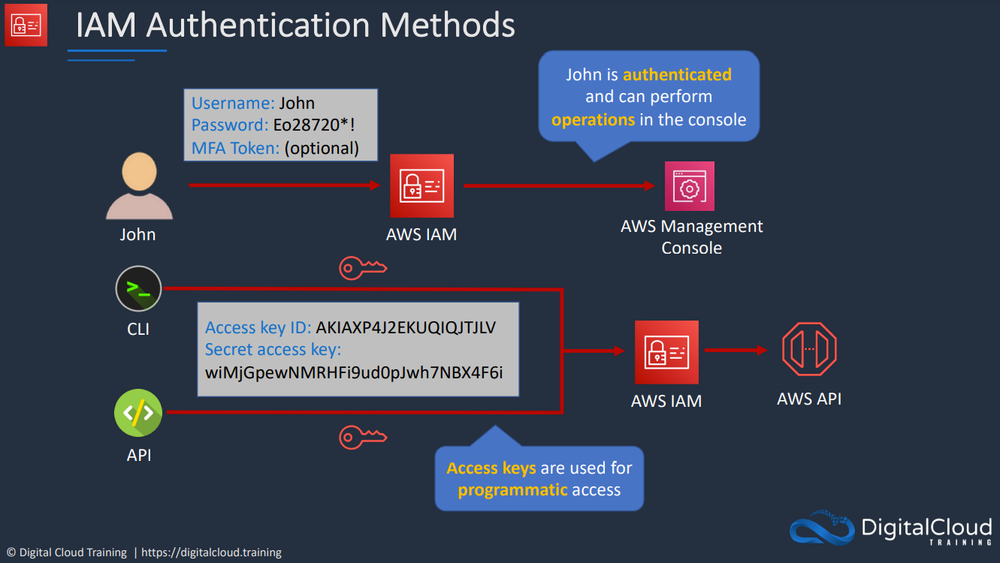  


There are two ways to authenticate:

- 1 Username and 1 Password (Password is optional if you only want to give CLI/API access)
- 0-2 Access Keys (CLI)

Once the **Principal** has authenticated, it becomes an **authenticated identity**


Access keys are long-term credentials used to authenicate users. They do not automatically update, you as the owner of the credentials have to explicitly update them. 


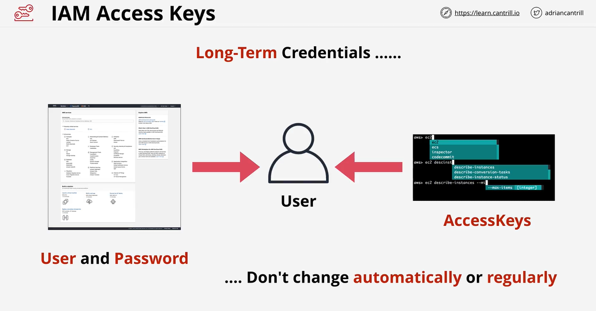  

Access keys can be created, deleted, made active or made inactive. Default when created is active. The secret access key can only be seen once. You tend to use two sets of Access Keys when you rotate your credientials. You make a new set, update your applications then when you verify that they are working correctly you can delete your old set. 

**IAM roles do not use access keys as they do not offer long-term access**


#### 1.3.2.1. Amazon Resource Name (ARN)


Uniquely identify resources within any AWS accounts.

This allows you to refer to a single or group of resources.
This prevents individual resources from the same account but in
different regions from being confused.

ARN generally follows the same format:

```bash
arn:partition:service:region:account-id:resource-id
arn:partition:service:region:account-id:resource-type/resource-id
arn:partition:service:region:account-id:resource-type:resource-id
```

- partition: almost always `aws` unless it is china `aws-cn`
- region: can be a double colon (::) if that doesn't matter
- account-id: the account that owns the resource
  - EC2 needs this
  - S3 does not need region and account-id because its globally unique
- resource-type/id: changes based on the resource

An example that leads to confusion:

- arn:aws:s3:::catgifs
  - This references an actual bucket and not the objects inside
- arn:aws:s3:::catgifs/*
  - This refers to objects in that bucket, but not the bucket itself.

These two ARNs do not overlap

#### 1.3.2.2. IAM FACTS

- 5,000 IAM users per account
- IAM user can be a member of 10 groups maximum

### 1.3.3. IAM Groups


IAM Groups are containers for users. **You cannot login to IAM groups** They have no
credentials of their own. Used solely for management of IAM users.

Groups bring two benefits

1. Effective administrative style management of users based on the team
2. Groups can have Inline and Managed policies attached.

AWS merges all of the policies from all groups the user is in together. It then uses deny, allow, deny approach to grant permissions.

- The 5000 IAM user limit applies to groups.
- There is **no all users** IAM group.
  - You can create a group and add all users into that group, but it needs to be
created and managed on your own.
- No Nesting: You cannot have groups within groups.
- 300 Group Limit per account. This can be fixed with a support ticket.

**Resource Policy** A bucket can have a policy associated with that bucket.
It does so by referencing the identity using an ARN (Amazon Reference Name).
A policy on a resource can reference IAM users and IAM roles by the ARN.
A bucket can give access to one or more users or one or more roles.

**GROUPS ARE NOT A TRUE IDENTITY**
**THEY CAN'T BE REFERENCED AS A PRINCIPAL IN A POLICY**

A S3 Resource cannot grant access to a group, it is not an identity.
Groups are only used to allow permissions to be assigned to IAM users.

### 1.3.4. IAM Roles


A single thing that uses an identity is an IAM User. It can be a person, application or service, but it must just be one thing.

IAM Roles are also identities that are used by large groups of individuals.
If have more than 5000 principals, it could be a candidate for an IAM Role due to limit of 5000 users per account.

IAM Roles are **assumed**, you become that role.

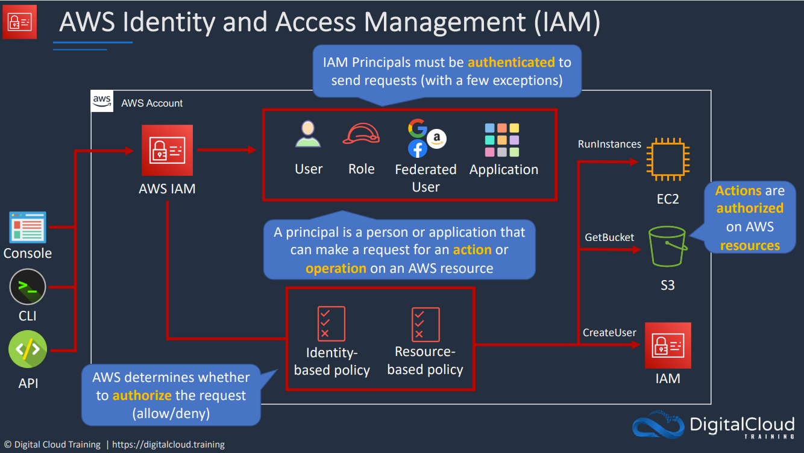  


This can be used short term by other identities.

IAM Users can have inline or managed policies which control which permissions
the identity gets within AWS

Policies which grant, allow or deny, permissions based on their associations.


IAM Roles have two types of roles can be attached.

- Trust Policy: Specifies which identities are allowed to assume the role.
- Permissions Policy: Specifies what the role is allowed to do.

If an identity is allowed on the **Trust Policy**, it is given a set
of **Temporary Security Credentials**. Similar to access keys except they
are time limited to expire. The identity will need to renew them by
reassuming the role.

Every time the **Temporary Security Credentials** are used, the access
is checked against the **Permissions Policy**. If you change the policy, the
permissions of the temp credentials also change.


Roles are real identities and can be referenced within resource policies.

Secure Token Service (sts:AssumeRole) this is what generates the temporary
security credentials (TSC).

### 1.3.5. When to use IAM Roles


Lambda Execution Role.
For a given lambda function, you cannot determine the number of principals
which suggested a Role might be the ideal identity to use.

- Trust Policy: to trust the Lambda Service
- Permission Policy: to grant access to AWS services.

When this is run, it uses the sts:AssumeRole to generate keys to
CloudWatch and S3.

It is better when possible to use an IAM Role versus attaching a policy.

#### 1.3.5.1. Emergency or out of the usual situations

Break Glass Situation - There is a key for something the team does not
normally have access to. When you break the glass, you must have a reason
to do.
A role can have an Emergency Role which will allow further access if
its really needed.

#### 1.3.5.2. Adding AWS into existing corp environment


You may have an existing identity provider you are trying to allow access to.
This may offer SSO (Single Sign On) or over 5000 identities.
This is useful to reuse your existing identities for AWS.
External accounts can't be used to access AWS directly.
To solve this, you allow an IAM role in the AWS account to be assumed
by one of the active directories.
**ID Federation** allowing an external service the ability to assume a role.

#### 1.3.5.3. Making an app with 1,000,000 users


**Web Identity Federation** uses IAM roles to allow broader access.
These allow you to use an existing web identity such as google, facebook, or
twitter to grant access to the app.
We can trust these web identities and allow those identities to assume
an IAM role to access web resources such as DynamoDB.
No AWS Credentials are stored on the application.
Can scale quickly and beyond.

#### 1.3.5.4. Cross Account Access


You can use a role in the partner account and use that to upload objects
to AWS resources.

### 1.3.6. AWS Organizations

Without an organization, each AWS account needs it's own set of IAM users
as well as individual payment methods.
If you have more than 5 to 10 accounts, you would want to use an org.

Take a single AWS account **standard AWS account** and create an org.
The standard AWS account then becomes the **management account** (the one with the crown in the image below).
The management account can invite other existing standard AWS accounts. They will
need to approve their joining to the org.

When standard AWS accounts become part of the org, they
become **member accounts**.
Organizations can only have one **management account** and zero or more
**member accounts**. Good practice is to consolidate billing of all the accounts under the management account, but otherwise not use it. Log into one account and role switch into the other accounts. In the image below users on-prem login into one account (bottom left) and rolw switch into the other three accounts.


#### 1.3.6.1. Organization Root

This is a container that can hold AWS member accounts or the management account.
It could also contain **organizational units** which can contain other
units or member accounts inside.

#### 1.3.6.2. Consolidated billing

The individual billing for the member accounts is removed and they pass their
billing to the management account.
Inside an AWS organization, you get a single monthly bill for the master
account which covers all the billing for each users.
Can offer a discount with consolidation of reservations and volume discounts due to pooling of resources.

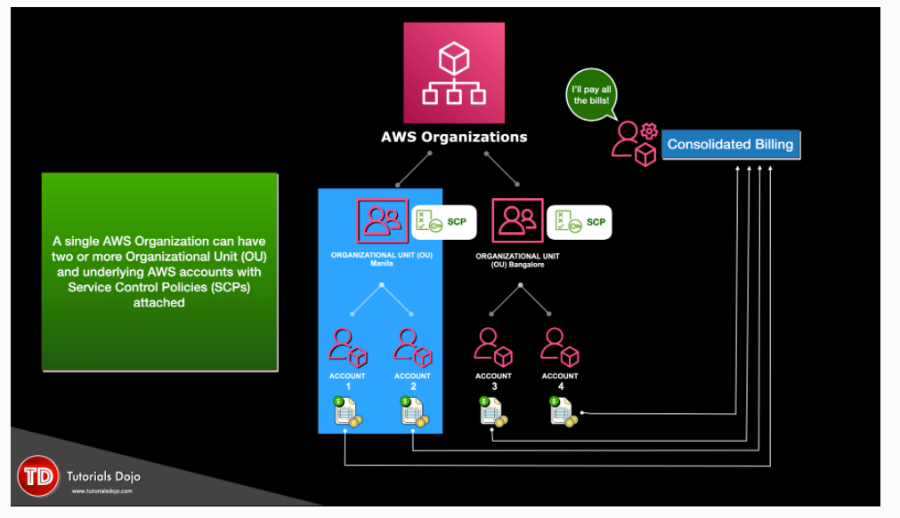  


#### 1.3.6.3. Create new accounts in an org

Adding accounts in an organization is easy with only an email needed.
You no longer need IAM users in each accounts. You can use IAM roles
to change these.
It is best to have a single AWS account only used for login.
Some enterprises may use an AWS account while smaller ones may use the master.

#### 1.3.6.4. Role Switching

Allows you to switch between accounts from the console or command line.

### 1.3.7. Service Control Policies

Can be used to restrict what member accounts in an organisation can do.

JSON policy document that can be attached:

- To the org as a whole by attaching to the root container.
- A specific Organizational Unit
- A specific member only.

The management account cannot be restricted by SCPs which means this
should not be used because it is a security risk.

SCPs limit what the account, **including root user** can do inside that account.
They don't grant permissions themselves, just act as a barrier. For access to a service both IAM and SCP must permit use. In this image below, only the three green services in the middle of the venn diagram would be accessible.


#### 1.3.7.1. Allow List vs Deny List

**Deny list is the default.**

When you enable SCP on your org, AWS applies `FullAWSAccess`. This means
SCPs have no effect because nothing is restricted. It has zero influence
initially.

```json
{
  "Version": "2012-10-17",
  "Statement": {
    "Effect": "Allow",
    "Action": "*",
    "Resource": "*"
  }
}
```

SCPs by themselves don't grant permissions. When SCPs are enabled,
all services are implicitly allowed as services by default are denied. To have access to an service both IAM and SCP must grant permissions (see venn diagram above).

You must then add any services you want to Deny such as `DenyS3`

```json
{
  "Version": "2012-10-17",
  "Statement": {
    "Effect": "Deny",
    "Action": "s3:*",
    "Resource": "*"
  }
}
```

**Deny List** is a good default because it allows for the use of growing
services offered by AWS. A lot less admin overhead.

**Allow List** allows you to be conscience of your costs.

- To begin, you must remove the `FullAWSAccess` list
- Then, specify which services need to be allowed access.
- Example `AllowS3EC2` is below

```json
{
  "Version": "2012-10-17",
  "Statement": [
    {
        "Effect": "Allow",
        "Action": [
            "s3:*",
            "ec2:*"
        ],
    "Resource": "*"
    }
  ]
}
```

### 1.3.8. CloudWatch Logs

This is a public service, which can be used from AWS VPC or on-premise
environment.

This allows the user to **store**, **monitor** and **access** logging data.

- This is a piece of data and a timestamp
- Can be more fields, but at least these two

Comes with some AWS Integrations.
Security is provided with IAM roles or Service roles.
Can generate metrics based on **metric filters**

#### 1.3.8.1. Architecture of CloudWatch Logs


It is a regional service, for example, `us-east-1`

Need logging sources such as external APIs or databases. This sends
information as **log events**. These are stored in **log streams**. This is a
sequence of log events from the same source.

**Log Groups** are containers for multiple logs streams of the same
type of logging. This also stores configuration settings such as
retention settings and permissions.

Once the settings are defined on a log group, they apply to all log streams
in that log group. Metric filters are also applied on the log groups.

### 1.3.9. CloudTrail Essentials

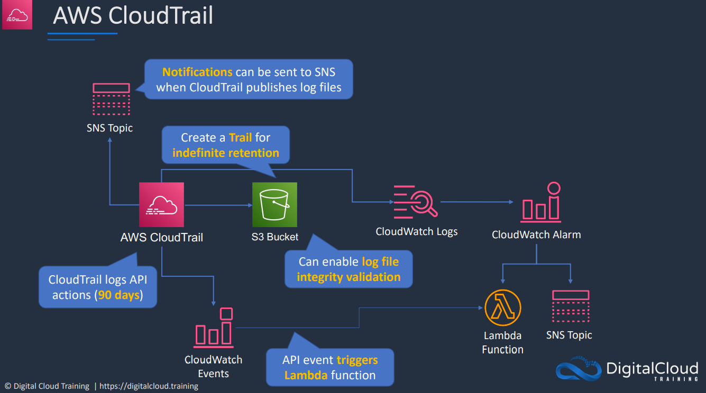  


Concerned with who did what.

Logs API calls or activities as **CloudTrail Event**

Stores the last 90 days of events in the **Event History**. This is enabled
by default and is no additional cost.

To customize the service you need to create a new **trail**.
Two types of events. Default only logs Management Events

- **Management Events**:
Provide information about management operations performed on resources
in the AWS account. Ex: Create an EC2 instance or terminating one.

- **Data Events**:
Objects being uploaded to S3 or a Lambda function being invoked. This is not
enabled by default and must be enabled for that trail.

#### 1.3.9.1. CloudTrail Trail


Logs events for the AWS region it is created in. It is a regional service.

Once created, it can operate in two ways

- One region trail
- All region trail
  - Collection of trails in all regions
  - When new regions are added, they will be added to this trail automatically

Most services log events in the region they occur. The trail then must be
a one region trail in that region or an all region trail to log that event.

A small number of services log events globally to one region. Global services
such as IAM or STS or CloudFront always log their events to `us-east-1`

A trail must have this enabled to have this logged.

AWS services are largely split into regional services or global services.

When the services log, they log in the region they are created or
to `us-east-1` if they are a global service.

A trail can store events in an S3 bucket as a compressed JSON file. It can
also use CloudWatch Logs to output the data.

CloudTrail products can create an organizational trail. This allows a single
management point for all the APIs and management events for that org.

#### 1.3.9.2. CloudTrail Exam PowerUp

- It is enabled by default for 90 days without configuartion.
- It can be configured to store data indefinitely in S3 or CloudWatch Logs.
- Management events are only saved by default
- IAM, STS, CloudFront are Global Service events and log to `us-east-1`
  - Trail must be enabled to do track these global services
- NOT REALTIME - There is a delay. Approximately 15 minute delay

#### 1.3.9.3. CloudTrail Pricing

<https://aws.amazon.com/cloudtrail/pricing/>

---

## 1.4. Simple-Storage-Service-(S3)

### 1.4.1. S3 Security

**S3 is private by default!** The only identity which has any initial
access to an S3 bucket is the account root user of the account which owns that
bucket.

#### 1.4.1.1. S3 Bucket Policy


This is a **resource policy**

- controls who has access to that resource
- can allow or deny access from different accounts
- can allow or deny anonymous principals
  - this is explicitly declared in the bucket policy itself.

Different from an **identity policy**

- controls what that identity (user, group or role) can access
- can only be attached to identities in your own account
  - no way of giving an identity in another account access to a bucket.

Each bucket can only have one policy, but it can have multiple statements.

#### 1.4.1.2. ACLs (Legacy)

A way to apply a subresource to objects and buckets.
These are legacy and AWS does not recommend their use.
They are inflexible and allow simple permissions.

#### 1.4.1.3. S3 Exam PowerUp

When to use Identity Policy or Bucket Policy:

Identity

- Controlling high mix of different resources.
  - Not every service supports resource policies.
- Want to manage permissions all in one place, use IAM.
- Must have access to all accounts accessing the information.

Bucket

- Managing permissions on a specific product.
- If you need anonymous or cross account access.

ACLs: NEVER - unless you must.

### 1.4.2. S3 Static Hosting

Normal access is via AWS APIs.
This allows access via HTTP using a web browser.

When you enable static website hosting you need two HTML files:

- index document
  - default page returned from a website
  - entry point for most websites
- error document
  - similar to index, but only when something goes wrong

Static website hosting creates a **website endpoint**.

This is influenced by the bucket name and region it is in.
This cannot be changed.

You can use a custom domain name for a website hosted on a bucket, but then the bucket name matters.
The name of the bucket must match the domain name you have registered.


#### 1.4.2.1. Offloading

Instead of using EC2 to host an entire website, the compute service
can generate a HTML file which points to the resources hosted on a static
bucket. This ensures the media is retrieved from S3 and not EC2.

#### 1.4.2.2. Out-of-band pages

This may be an error page to display maintenance if the server goes offline.
We could then change our DNS and move customers to a backup website on S3.

#### 1.4.2.3. S3 Pricing

- Cost to store data, per GB / month fee
  - Pro-rated for less than a GB or month.
- Data transfer fee
  - Data in is always free
  - Data out is a per GB charge
- Each operation has a cost per 1000 operations.
  - Can add up for static website hosting with many requests.

### 1.4.3. Object Versioning and MFA Delete


Without Versioning:

- Each object is identified solely by the object key, its name.
- If you modify an object, the original of that object is replaced.
- The attribute, **ID of object**, is set to **null**.

Versioning


- This is off by default.
- Once it is turned on, it cannot be turned off. 
- Versioning can be suspended and enabled again.
- This is important to remember as you pay for storage for all previous copies you made, even if versioning is suspended and not making any more copies.
- This allows for multiple versions of objects within a bucket.
- Objects which would modify objects **generate a new version** instead.

The latest or current version is always returned when an object version
is not requested.

When an object is deleted, AWS puts a **delete marker** on the object
and hides all previous versions. To the user, it looks like all copies have been deleted. You could delete this marker to re-enable
the item.

To delete an object, you must delete all the versions of that object
using their version marker.


#### 1.4.3.1. MFA Delete

Enabled within version configuration in a bucket.
This means MFA is required to change bucket versioning state.
MFA is required to delete versions of an object.

In order to change a version state or delete a particular version of an object,
you need to provide the serial number of your MFA token as well as the code
it generates. These are concatenated and passed with any API calls.

### 1.4.4. S3 Performance Optimization

Single PUT Upload


- Objects uploaded to S3 are sent as a single stream by default.
- If the stream fails, the upload fails and requires a restart of the transfer.
- Single PUT upload up to  a maximum of 5GB

Multipart Upload


- Data is broken up into smaller parts.
- The minimum data size is 100 MB.
- Upload can be split into maximum of 10,000 parts.
  - Each part can range between 5MB and 5GB.
  - Last leftover part can be smaller than 5MB as needed.
- Parts can fail in isolation and restart in isolation.
- The risk of uploading large amounts of data is reduced.
- Improves transfer rate to be the speed of all parts.

S3 Accelerated Transfer

**S3 without Accelerated Transfer**


**S3 with Accelerated Transfer**


- Off by default.
- Uses the network of AWS edge locations to speed up transfer (reduces the number of hops between source and destination).
- Bucket name cannot contain periods.
- Name must be DNS compatible.
- Benefits improve the larger the location and distance.
  - The worse the start, the better the performance benefits.

### 1.4.5. Encryption 101


#### 1.4.5.1. Encryption at Rest

- An example is a password on a laptop
  - If the laptop is stolen, the data is already encrypted and useless.
- Commonly within cloud environments. Even if someone could
find and access the base storage device, they can't do anything with it.
- Only one entity involved

#### 1.4.5.2. Encryption in Transit

- An encryption tunnel outside the raw data.
- Anyone looking from the outside will only see a stream of scrambled data.
- Used when there are multiple parties or systems at play.

#### 1.4.5.3. Terms

- plaintext: unencrypted data not limited to text (document, text, app etc)
- Algorithm: mathematical operation which turns plaintext into ciphertext
- key: a password
- ciphertext: encrypted data generated by an algorithm from plaintext and a key


#### 1.4.5.4. Symmetric Encryption

The key is handed from one entity to another before the data.
This is difficult because the key needs to be transferred securely.
If the data is time sensitive, the key needs to be arranged beforehand.


#### 1.4.5.5. Asymmetric Encryption

- public key: cannot decrypt data but can generate ciphertext
- private key: can decrypt data encrypted by the public key

The public key is uploaded to cloud storage.
The data is encrypted and sent back to the original entity.
The private key can decrypt the data.


This is secure because stolen public keys can only encrypt data.
Private keys must be handled securely.

#### 1.4.5.6. Signing


Encryption by itself does not prove who encrypted the data.

1. An entity can sign a message with their private key
2. Their public key is hosted in an accessible location.
3. The receiving party can use the public key to confirm who sent the message.

#### 1.4.5.7. Steganography

Encryption is obvious when used. There is no denying that the
data was encrypted. Someone could force you to decrypt the data packet.

A file can be hidden in an image or other file. If it difficult
to find the message unless you know what to look for.

One party would take another party's public key and encrypt some data to create
ciphertext. That ciphertext can be hidden in another file so long as both
parties know how the data will be hidden. In this case, there is a hidden pixelation in the dog's nose, which can serve as a hidden message.


### 1.4.6. Key Management Service (KMS)

- Regional service
  - Every region is isolated when using KMS.
- Public service
  - Occupies the AWS public zone and can be connected to from anywhere.
- Create, store, and manage keys.
  - Can handle both symmetric and asymmetric keys.
- KMS can perform cryptographic operations itself.
- Main key never leaves KMS.
- Keys use **Federal Information Processing Standard (FIPS) 140-2 (L2)** security standard.
  - Some features are compliant with Level 3.
  - All features are compliant with Level 2.


#### 1.4.6.1. CMKs - Customer Master Keys

- Managed by KMS and used within cryptographic operations.
- AWS services, applications, and the user can all use them.
- Think of them as a container for the actual physical main keys.
- These are all backed by **physical** key material.
- You can generate or import the key material.
- CMKs can be used for up to **4KB of data**.

It is logical and contains

- Key ID: unique identifier for the key
- Creation Date
- Key Policy: a type of resource policy
- Description
- State of the Key: active or not


#### 1.4.6.2. Data Encryption Key (DEK)

- Generated by KMS using the CMK and `GenerateDataKey` operation.
- Used to encrypt data larger than 4KB in size.
- Linked to a specific CMK so KMS can tell that a specific DEK was
generated with a specific CMK.

KMS does not store the DEK, once provided to a user or service, it is
discarded. KMS doesn't actually perform the encryption or decryption
of data using the DEK or anything past generating them.

When the DEK is generated, KMS provides two version.

- Plaintext Version - This can be used immediately.
- Ciphertext Version - Encrypted version of the DEK.
  - This is encrypted by the CMK that generated it.
  - In the future it can be decrypted by KMS using the CMK assuming
  you have the permissions.

Architecture

1. DEK is generated right before something is encrypted.
2. The data is encrypted with the plaintext version of the DEK.
3. Discard the plaintext data version of the DEK.
4. The encrypted DEK is stored next to the ciphertext generated earlier so that the CMK knows which Main Key belongs to which ciphertext.

#### KMS Key Encryption 

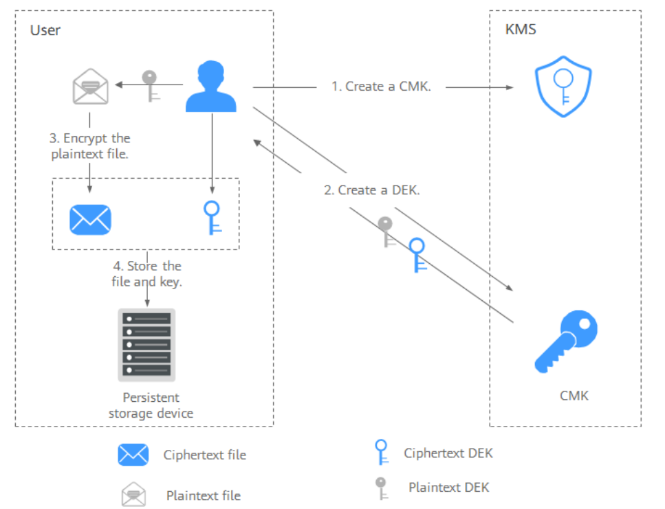  

The process is as follows:
1. Create a CMK on KMS.
2. Call the create-datakey operation of KMS to create a DEK. Then you get a plaintext DEK and a ciphertext DEK. The ciphertext DEK is generated when you use a CMK to encrypt the plaintext DEK.
3. Use the plaintext DEK to encrypt the file. A ciphertext file is generated.
4. Save the ciphertext DEK and the ciphertext file together in a persistent storage device or a storage service.

#### KMS Key Decryption 

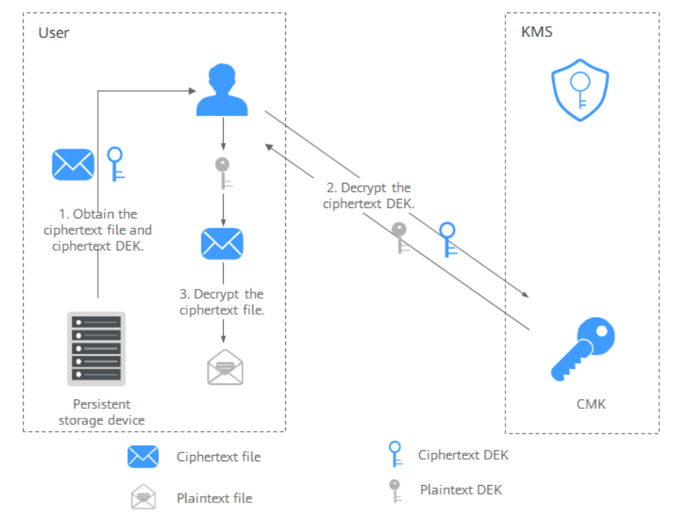  

The process is as follows:
1. Obtain the ciphertext DEK and file from the persistent storage device or the storage service.
2. Call the decrypt-datakey operation of KMS and use the corresponding CMK (the one used for encrypting the DEK) to decrypt the ciphertext DEK. Then you get the plaintext DEK. If the CMK is deleted, the decryption fails. Therefore, properly keep your CMKs.

3. Use the plaintext DEK to decrypt the ciphertext file.

#### 1.4.6.3. KMS Key Concepts

- Customer Master Keys (CMK) are isolated to a region.
  - Never leave the region or KMS.
  - Cannot extract a CMK.
- AWS managed CMKs
  - Created automatically by AWS when using a service such
  as S3 which uses KMS for encryption.
- Customer managed CMKS
  - Created explicitly by the customer.
  - Much more configurable, for example the key policy can be edited.
  - Can allow other AWS accounts access to CMKs

All CMKs support key rotation.

- AWS managed CMKs automatically rotate every 1095 days (3 years)
- Customer managed keys rotate every year.

CMK itself contains:

- Current backing key, physical material used to encrypt and decrypt
- Previous backing keys created from rotating that material

KMS can create an alias which is a shortcut to a particular CMK.
Aliases are also per region. You can create a `MyApp1` alias in all regions
but they would be separate aliases, and in each region it would be pointing
potentially at a different CMK.

#### 1.4.6.4. Key Policy (resource policy)

- Every CMK has one.
- Customer managed CMKs can adjust the policy.
- Unlike other policies, KMS has to be explicitly told that keys trust the AWS
account that they're in.
- The trust isn't automatic so be careful when adjusting key policies.
- You always need a key policy in place so the key trusts the account and so
that the account can manage it by applying IAM permission policies to IAM users
in that account.
- In order for IAM to work, IAM is trusted by the account, and the account
needs to be trusted by the key.
- It sets up this chain of trust from the key to the account to IAM and then
to an IAM user, if they're granted any identity permissions.

### 1.4.7. KMS Key Demo

Linux/macOS commands

```bash
aws kms encrypt \
    --key-id alias/catrobot \
    --plaintext fileb://battleplans.txt \
    --output text \
    --query CiphertextBlob \
    --profile iamadmin-general | base64 \
    --decode > not_battleplans.enc
```

```bash
aws kms decrypt \
    --ciphertext-blob fileb://not_battleplans.enc \
    --output text \
    --profile iamadmin-general \
    --query Plaintext | base64 --decode > decryptedplans.txt
```

### 1.4.8. Object Encryption

Buckets aren't encrypted, **objects are**.
Multiple objects in a bucket can use a different encryption methods.

Two main methods of encryption S3 is capable of supporting.
Both types are encryption at rest. Data sent from a user to S3 is automatically
encrypted in transit outside of these methods.


Client-Side encryption

- Data is encrypted in transit using HTTPS
- Data inside the tunnel is in encrypted form.
- Objects encrypted by the client before they are sent to S3.
- Data being sent the whole time is sent as ciphertext.
- AWS has no way to see into the data.
- The encryption burden is on the customer and not AWS.

Server-Side encryption

- Data is encrypted in transit using HTTPS
- Data inside the tunnel is still in its original unencrypted form.
- Data reaches S3 server in plain text form.
- After S3 sees the data, it is then encrypted.
- AWS will handle some or all of these processes.


#### 1.4.8.1. SSE-C (Server-side encryption with customer provided keys)

- Customer is responsible for the keys themselves.
- S3 services manages the actual encryption and decryption
  - Offloads CPU requirements for encryption.
- Customer still needs to generate and manage the key.
- S3 will see the unencrypted object throughout this process.

SSE-C Encryption Steps

1. When placing an object in S3, you provide encryption key and plaintext object
2. Once the key and object arrive, it is encrypted.
3. A hash of the key is taken and attached to the object.
The hash can identify if the specific key was used to encrypt the object.
4. The key is then discarded after the hash is taken.
5. The encrypted and one-way hash are stored persistently on storage.


To decrypt the object, you must tell S3 which object to decrypt and provide
it with the key used to encrypt it. If the key that you supply is correct, S3 will decrypt the object, discard the key, and return the
plaintext version of the object.

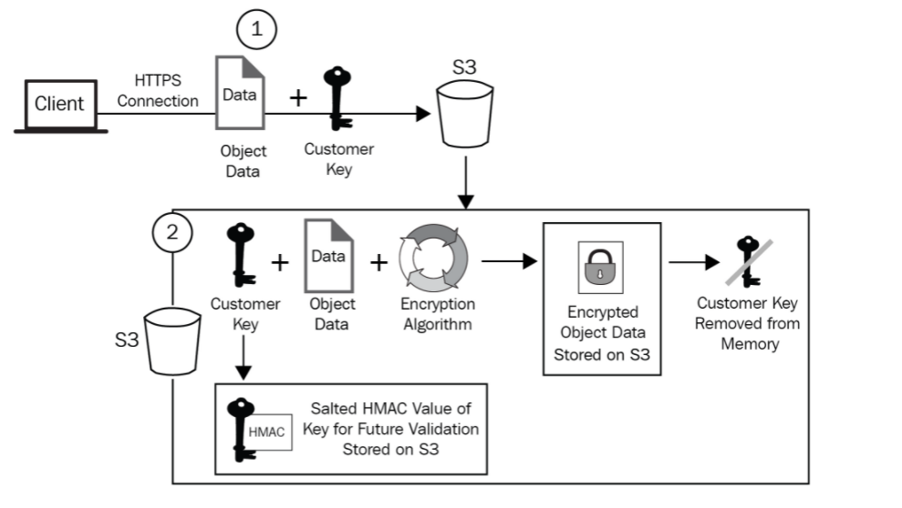  


#### 1.4.8.2. SSE-S3 AES256 (Server-side encryption w/ Amazon S3 managed keys)

AWS handles both the encryption and decryption process as well as the
key generation and management. This provides very little control over how
the keys are used, but has little admin overhead.

SSE-S3 Encryption Steps

1. When putting data into S3, customer only needs to provide plaintext.
2. S3 generates fully managed and rotated **master key** automatically.
3. Object generates a key specific for each object that is uploaded.
4. The master key is used to encrypt the specific object key, and the
unencrypted version of that key is discarded.
5. The encrypted file and encrypted key are stored side by side in S3.


Three Problems with this method:

- Not good for regulatory environment where keys and access must be controlled.
- No way to control key material rotation.
- No role separation. Anyone with S3 admin permissions can decrypt data and open objects.

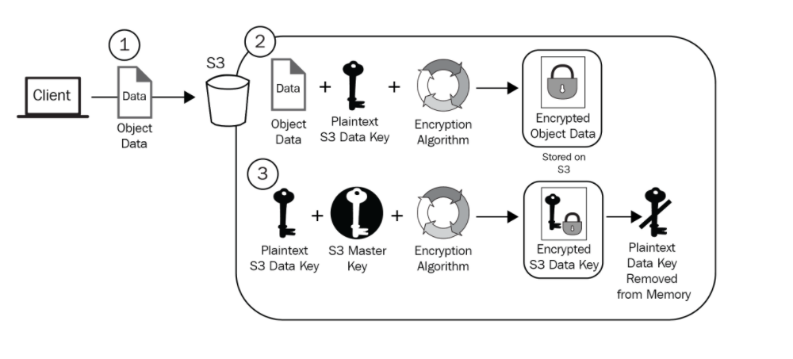  


#### 1.4.8.3. SSE-KMS (Server-side encryption w/ customer master keys stored in AWS KMS)

Much like SSE-S3, where AWS handles both the keys and encryption process.
KMS handles the master key and not S3. The first time an object is uploaded,
S3 works with KMS to create an AWS managed CMK. This is the default key
which gets used in the future.

Every time an object is uploaded, S3 uses a dedicated key to encrypt that object
and that key is a data encryption key which KMS generates using the CMK.
The CMK does not need to be managed by AWS and can be a customer managed CMK.

SSE-KMS Encryption Steps

1. S3 is provided a plaintext version of the data encryption key as well
as an encrypted version.
2. The data is encrypted with the plaintext key and the key discarded.
3. The encrypted key is stored alongside the encrypted object.


When uploading an object, you can create and use a customer managed CMK. This
allows the user to control the permissions and the usage of the key material.
In regulated industries, this is reason enough to use SSE-KMS
You can also add logging and see any calls against this key from CloudTrail.

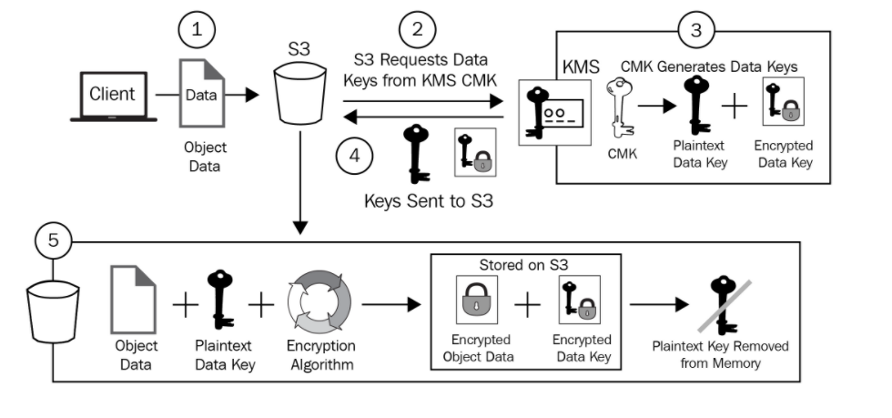  


The best benefit is the role separation. To decrypt any object, you need
access to the CMK that was used to generate the unique key that encrypted them.
The CMK is used to decrypt the data encryption key for that object.
That decrypted data encryption key is used to decrypt the object itself.
If you don't have access to KMS, you don't have access to the object.


#### SSL and TLS (Optional section)

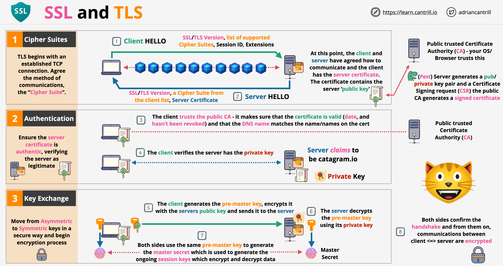  


### 1.4.9. S3 Object Storage Classes

Picking a storage class can be done while uploading a specific object.
The default is S3 standard. Once an object is uploaded to a specific class,
it can be easily changed as long as some conditions are met.

Objects in S3 are stored in a specific region.

#### 1.4.9.1. S3 Standard


- Default AWS storage class that's used in S3, should be user default as well.
- S3 Standard is region resilient, and can tolerate the failure of an AZ.
- Objects are replicated to at least 3+ AZs when they are uploaded.
- 99999999999% durability
- 99.99% availability
- Offers low latency and high throughput.
- No minimums, delays, or penalties.
- Billing is storage fee, data transfer fee, and request based charge.

All of the other storage classes trade some of these compromises for another.

#### 1.4.9.2. S3 Standard-IA


- Designed for less frequent rapid access when it is needed.
- Cheaper rate to store data you will rarely need, but if you do need it, you
need it quickly.
- ~54% cheaper than S3 standard.
- Minimum 128KB charge for each object.
  - Cost benefits might be negated for smaller objects.
- 30 days minimum duration charge per object.
- Retrieval fee for every GB of data retrieved from this class.
- 99.9% availability, slightly lower than standard S3.

Designed for data that isn't accessed often, long term storage, backups,
disaster recovery files. The requirement for data to be safe is most important.

#### 1.4.9.3. One Zone-IA


- Designed for data that is accessed less frequently but needed quickly.
- 80% of the base cost of Standard-IA.
- Same minimum size and duration fee as Standard-IA
- Data is only stored in a single AZ, no 3+ AZ replication.
- 99.5% availability, lower than Standard-IA

Great choice for secondary copies of primary data or backup copies.

If data is easily creatable from a primary data set, this would be a great
place to store the output from another data set.

#### 1.4.9.4. S3 Glacier


- No immediate access to objects, retrieval in minutes or hours.
- Make a request to access objects then after a duration, you get access.
  - Retrieval time anywhere from 1 min - 12 hrs
- Secure, durable, and low cost storage for archival data.
- 17% of the base cost of S3 standard
- 99999999999% durability
- 99.99% availability
- 3+ AZ replication
- 40KB minimum object capacity charge
- 90 days minimum storage duration charge.

Retrieval methods:

- Expedited: 1 - 5 minutes, but is the most expensive
- Standard: 3 - 5 hours to restore.
- Bulk: 5 - 12 hours. Has the lowest cost and is good for a large set of data.

#### 1.4.9.5. S3 Glacier Deep Archive


- Designed for long term backups and as a tape-drive replacement.
- 4.3% of the base cost of S3 standard
- 180 days minimum storage duration charge.
- Standard retrieval within 12 hours, bulk retrieval in 48 hours.
- Cannot use to make data public or download normally.

#### 1.4.9.6. S3 Intelligent-Tiering


- Combination of standard and standard IA.
- Uses automation to remove overhead of moving objects.
- Additional fee of $0.0025 per 1,000 objects tracked.
- If an object is not accessed for 30 days, it will move into Standard-IA.

This is good for objects that have unknown or unpredictable access patterns.

### 1.4.10. Object Lifecycle Management

Intelligent-Tiering is used for objects where access patterns is unknown.
A lifecycle configuration is a set of **rules** that consists of **actions**.

#### 1.4.10.1. Transition Actions

Change the storage class over time such as:

- Move an object from S3 to IA after 90 days
- After 180 days move to Glacier
- After one year move to Deep Archive

Objects must flow downwards, they can't flow in the reverse direction.


#### 1.4.10.2. Expiration Actions

Once an object has been uploaded and changed, you can purge older versions
after 90 days to keep costs down.

### 1.4.11. S3 Replication

There are two types of S3 replication available.

- Cross-Region Replication (CRR)
  - Allows the replication of objects from a source bucket to a destination
bucket in **different** AWS regions.
- Same-Region Replication (SRR)
  - Allows the replication of objects from a source bucket to a destination
bucket in the **same** AWS region.

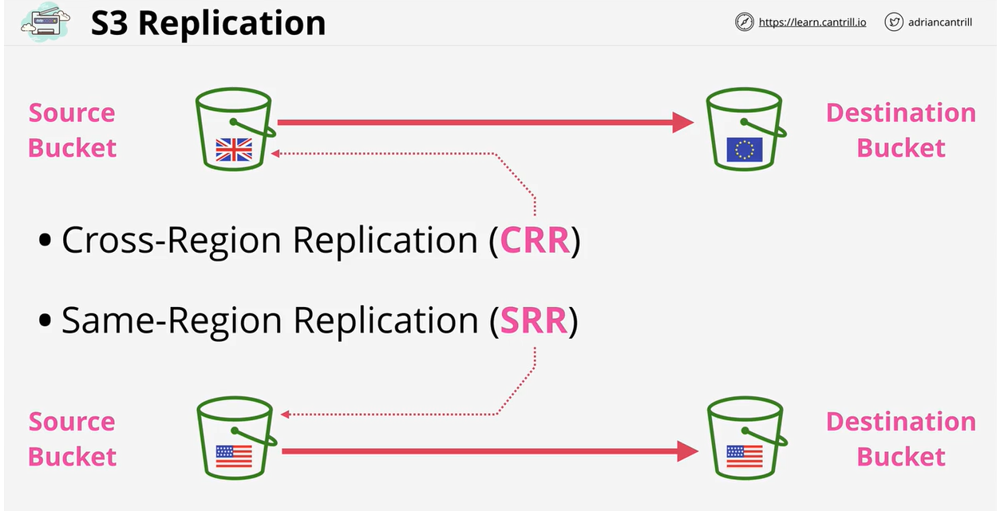  

Architecture for both is similar, only difference is if both buckets are
in the same account or different accounts.

The replication configuration is applied to the source bucket and configures
S3 to replicate from this source bucket to a destination bucket.
It also configures the IAM role to use for the replication process.
The role is configured to allow the S3 service to assume it based on
its trust policy. The role's permission policy allows it to read objects on the
source bucket and replicate them to the destination bucket.

When different accounts are used, the role is not by default trusted
by the destination account. If configuring between accounts, you must
add a bucket policy on the destination account to allow the IAM role from
the destination account access to the bucket.

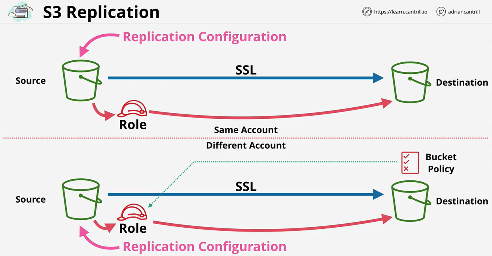  


#### 1.4.11.1. S3 Replication Options

- Which objects are replicated.
  - Default is all source objects in the bucket, but you can select a smaller subset of objects if you want.
- Select which storage class the destination bucket will use.
  - Default is the same type of storage, but this can be changed.
- Define the ownership of the objects.
  - The default is they will be owned by the same account as the source bucket.
  - If the buckets are in different accounts, the objects in the destination
  could be owned by the source account and not allowed access.
- Replication Time Control (RTC)
  - Adds a guaranteed level of SLA within 15 minutes for extra cost.
  - This is useful for buckets that must be in sync the whole time.

#### 1.4.11.2. Important Replication Tips

- Replication is not retroactive.
  - If you enable replication on a bucket that already has objects, the old
  objects will not be replicated.
- Both buckets must have versioning enabled.
- It is a one way replication process only (from source to destination).
- Replication by default can handle objects that are unencrypted or SSE-S3.
  - With configuration it can handle SSE-KMS, but KMS requires more
configuration to work.
  - It cannot replicate objects with SSE-C because AWS does not have the keys
necessary.
- Source bucket owner needs permissions to objects. If you grant cross-account
access to a bucket. It is possible the source bucket account will not own
some of those objects.
- Will not replicate system events, glacier, or glacier deep archive.
- No deletes are replicated.

#### 1.4.11.3. Why use replication

Same Region Replication - Log Aggregation
Same Region Replication - Sync production and test accounts
Same Region Replication - Resilience with strict sovereignty requirements
Cross Region Replication - Global resilience improvements
Cross Region Replication - Latency reduction

### 1.4.12. S3 Presigned URL


A way to give another person or application access to a object inside an S3
bucket using your credentials in a safe way.

IAM admin can make a request to S3 to generate a presigned URL by providing:

- security credentials
- bucket name
- object key
- expiry date and time
- indicate how the object or bucket will be accessed

S3 will create a presigned URL and return it. This URL will have encoded inside
it the details that IAM admin provided. It will be configured to expire at
a certain date and time as requested by the IAM admin user.

  


#### 1.4.12.1. S3 Presigned URL Exam PowerUp


- You can still create a presigned URL for an object you have do not have access to (not prevented from doing so).
The object will not allow access because you do not have access.
- When using the URL the permission that you have access to, matches the identity
permissions that generated it at the moment the item is being accessed (not at the time it was generated). If you as the creator lose access, then the user of the presigned url
immediately loses access as well.
- If you get an access deny it means the ID never had access, or lost it.
- Don't generate presigned URLs with an IAM role.
  - The role will likely expire before the URL does.

### 1.4.13. S3 Select and Glacier Select

This provides a ways to retrieve parts of objects and not the entire object.

If you retrieve a 5TB object, it takes time and consumes 5TB of data.
Filtering at the client side doesn't reduce this cost (you pay for the amount of data that leaves S3).

S3 and Glacier select lets you use SQL-like statements to select part of the
object which is returned in a filtered way.
The filtering happens at the S3 service itself saving time and data.


---

## 1.5. Virtual-Private-Cloud-VPC

### 1.5.1. Networking Refresher


#### 1.5.1.1. IPv4 - RFC 791 (1981)

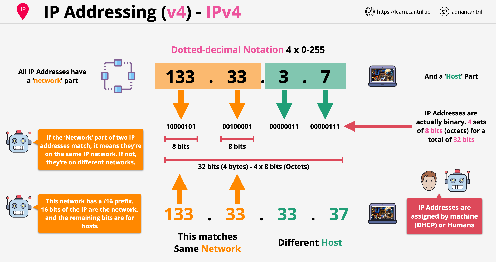  


Dotted decimal notation for human readability.

- 4 numbers from 0 to 255 separated by a period.
- Octet are the numbers between the period.

There are just over 4 billion addresses.
This was not very flexible because it was either too small or large for
some corporations. Some IP addresses was always left unused.

#### 1.5.1.2. Classful Addressing

- Class A range
  - Starts at `0.0.0.0` and ends at `127.255.255.255`.
  - Split into 128 class A networks
  - Handed out to large companies
- Class B Range
  - Half the range of class A.
  - Starts at `128.0.0.0` and ends at `191.255.255.255`.
- Class C Range
  - Half of range class B
  - Starts at `192.0.0.0` and ends at `223.255.255.255`.

#### 1.5.1.3. Internet / Private IPs - RFC1918

These can't communicate over the internet and are used internally only (Private IPs)

- One class A network: `10.0.0.0` - `10.255.255.255`
- 16 Class B networks: `172.16.0.0` - `172.31.255.255`
- 256 Class C networks: `192.168.0.0` - `192.168.255.255`

#### 1.5.1.4. Classless inter-domain routing (CIDR)

CIDR networks are represented by the starting IP address of the network
called the network address and the prefix.

CIDR Example: `10.0.0.0/16`

- `10.0.0.0` is the first address on the network
- /16 is the size of the network called the prefix.
  - The bigger the prefix, the smaller the network
  - The smaller the prefix, the bigger the network.
- /16 provides 65,536 addresses.
- `10.0.0.0/17` and `10.0.128.0/17` are each half of the original example.
  - This is called **subnetting**

#### 1.5.1.5. IP address notations to remember

- `0.0.0.0/0` means all IP addresses
- `10.0.0.0/8` means 10.ANYTHING - Class A
- `10.0.0.0/16` means 10.0.ANYTHING - Class B
- `10.0.0.0/24` means 10.0.0.ANYTHING - Class C
- `10.0.0.0/32` means only 1 IP address

`10.0.0.0/16` is the equivalent of `1234` as a password. You should consider
other ranges that people might use to ensure it does not overlap.

  


#### 1.5.1.6. Packets

Contains:

- source IP address
- destination IP address
- data the source IP wants to communicate with the destination IP.

TCP and UDP are protocols built on top of IP.

- TCPIP means TCP running with IP
- UDPIP means UDP running with IP

TCP/UDP Segment has a source and destination port number.
This allows devices to have multiple conversations at the same time.
In AWS when data goes through network devices, filters can be set based on
IP addresses and port numbers.

#### 1.5.1.7. IPv6 - RFC 8200 (2017)

`2001:0db8:28ac:0000:0000:82ae:3910:7334`

The value is hex and there are two octets per spacing or one hextet.
The redundant zeros can be removed to create:

`2001:0db8:28ac:0:0:82ae:3910:7334`

or you can remove them all entirely once per address

`2001:0db8:28ac::82ae:3910:7334`

Each address is 128 bits long. They are addressed by the start of the network
and the prefix.
Since each grouping is 16 values, we can multiple the groups by this to achieve
the prefix.

`2001:0db8:28ac::/48` really means the network starts at
`2001:0db8:28ac:0000:0000:0000:0000:0000` and finishes at
`2001:0db8:28ac:ffff:ffff:ffff:ffff:ffff`

`::/0` represents all IPv6 addresses

### 1.5.2. VPC Sizing and Structure

VPC Consideration

- What size should the VPC be? This will limit the use.
- Are there any networks we can't use?
- Be mindful of ranges other VPCs use or are used in other cloud environments
- Try to predict the future uses.
- VPC structure with tiers and resilience (availability) zones
- VPC min /28 network (16 IP)
- VPC max /16 (65456 IP)
- Avoid common range 10.0 or 10.1, include up to 10.10
  - Suggest starting at 10.16 for a nice clean base 2 number.

Reserve 2+ network ranges per region being used per account.
Think of the highest region you will operate in and add extra as a buffer.

An example using 4 AWS accounts.


- Regions
  - 3 regions in US
  - 1 region in Europe
  - 1 region in AUS

= 5 regions

Reserve 2 network ranges per region= 5*2=10 ranges
Allocate these ranges for each account=10*4=40 ranges

- Total of 40 ranges, 10 ranges for each account.

#### 1.5.2.1. How to size VPC

A subnet is located in one availability zone.
Try to split each subnet into tiers (web, application, db, spare).
Since each Region has at least 3 AZ's, it is a good practice to start
splitting the network into 4 different AZs.
This allows for at least one subnet in each AZ, and one spare.
Taking a /16 subnet and splitting it 16 ways will make each a /20.

### 1.5.3. Custom VPC

- Regional Isolated and Resilient Service.
  - Operates from all AZs in that region
- Allows isolated networks inside AWS.
- Nothing IN or OUT of a VPC without explicit configuration.
  - Isolated blast radius. Any problems are limited to that VPC or anything
  connected to it.
- Flexible configuration
- Is configured to give a public ipv4 address to any resource deployed into the public subnets.
- Hybrid networking to allow connection to other cloud or on-prem networking.
- Default or Dedicated Tenancy. This refers to how the hardware is configured.
  - Default allows on a per resource decision later on.
  - Dedicated locks any resourced created in that VPC to be on dedicated
  hardware which comes at a cost premium.

#### 1.5.3.1. Custom VPC Facts

IPv4 private and public IPs

- Allocated 1 mandatory private IPv4 CIDR blocks
  - Min /28 prefix (16 IP)
  - Max /16 prefix (65,536 IP)
- Can add secondary IPv4 Blocks after creation.
  - Max of 5, can be increased with a support ticket
  - When thinking of VPC, it has a pool of private IPv4 addresses and can
  use public addresses when needed.

Single assigned IPv6 /56 CIDR block

- Still being matured, not everything works the same as IPv4.
- With increasing use of IPv6, this should be added as a default
- Range is either allocated by AWS as in you have no choice on which range
to use, or you can select to use your own IPv6 addresses which you own.
- IPv6 does not have private addresses, they are all routed as public by
default.

#### 1.5.3.2. DNS provided by R53

Available on the base IP address of the VPC + 2.
If the VPC is `10.0.0.0` then the DNS IP will be `10.0.0.2`

Two options that manage how DNS works in a VPC:

- Edit DNS hostnames
  - If true, instances with public IPs in a VPC are given public DNS hostnames.
  - If false, this is not available.

- Edit DNS resolution
  - If true, instances in the VPC can use the DNS IP address.
  - If false, this is not available.

### 1.5.4. VPC Subnets

- AZ Resilient subnetwork of a VPC.
  - If the AZ fails, the subnet and services also fail.
  - High availability needs multiple components into different AZs.
- 1 subnet can only have 1 AZ.
- 1 AZ can have zero or many subnets.
- IPv4 CIDR is a subset of the VPC CIDR block.
  - Cannot overlap CIDR range with any other subnets in that VPC
- Subnet can optionally be allocated IPv6 CIDR block.
  - (256 /64 subnets can fit in the /56 VPC)
- Subnets can freely communicate with other subnets in the VPC by default. No configuration required. 

#### 1.5.4.1. Reserved IP addresses

There are five IP addresses within every VPC subnet that you cannot use.
Whatever size of the subnet, the IP addresses are five less than you expect.

If using `10.16.16.0/20` (`10.16.16.0` - `10.16.31.255`)

- Network address: `10.16.16.0`
- Network + 1: `10.16.16.1` - VPC Router
- Network + 2: `10.16.16.2` - Reserved for DNS
- Network + 3: `10.16.16.3` - Reserved for future AWS use
- Broadcast Address: `10.16.31.255` (Last IP in subnet)

#### 1.5.4.2. DHCP Options Set

This is how computing devices receive IP addresses automatically. There is
one options set applied to a VPC at one time and this configuration flows
through to subnets.

- This can be changed, can create new ones, but you cannot edit one.
- If you want to change the settings doing the following three steps:
  - 1. Create a new one
  - 2. Change the VPC allocation to the new one
  - 3. Delete the old one

#### 1.5.4.3. IP allocation Options

- Auto Assign public IPv4 address
  - This will create a public IP address in addition to their private subnet.
  - This is needed to make a subnet public.
- Auto Assign IPv6 address
  - For this to work, the subnet and VPC need an allocation of addresses.

### 1.5.5. VPC Routing and Internet Gateway

VPC Router is a highly available device available in every VPC which moves
traffic from somewhere to somewhere else.
Router has a network interface in every subnet in the VPC.
Routes traffic between subnets.

Route tables defines what the VPC router will do with traffic
when data leaves that subnet.
A VPC is created with a main route table. If you don't associate a custom
route table with a subnet, it uses the main route table of the VPC.

If you do associate a custom route table you create with a subnet, then the
main route table is disassociated. A subnet can only have one route table
associated at a time, but a route table can be associated by many subnets.

#### 1.5.5.1. Route Tables


**Higer prefix=higher priority except for local routes, they are always top priority.**

When traffic leaves the subnet that this route table is associated with, the
VPC router reviews the IP packets looking for the destination address.
The traffic will try to match the route against the route table. If there
are more than one routes found as a match, the prefix is used as a priority.
The higher the prefix, the more specific the route, thus higher priority.
If the target says local, that means the destination is in the VPC itself.
Local route can never be updated, they're always present and the local route
always takes priority. This is the exception to the prefix rule.

#### 1.5.5.2. Internet Gateway


A managed service that allows gateway traffic between the VPC and the internet
or AWS Public Zones (S3, SQS, SNS, etc.)

- Regional resilient gateway attached to a VPC.
- One IGW will cover all AZ's in a region the VPC is using.
- A VPC can have either:
  - No IGW and be entirely private.
  - One IGW
- IGW can be created and attached to no VPC.
- Runs from within the AWS public zone.

#### 1.5.5.3. Using IGW


In this example, an EC2 instance has:

- Private IP address of 10.16.16.20
- Public address of 43.250.192.20

The public address is not public and connected to the EC2 instance itself.
Instead, the IGW creates a record that links the instance's private IP
to the public IP. This is why when an EC2 instance is created it only
sees the private IP address. This is IMPORTANT. For IPv4 it is not configured
in the OS with the public address.


When the linux instance wants to communicate with the linux update service,
it makes a packet of data.
The packet has a source address of the EC2 instance and a destination address
of the linux update server. At this point the packet is not configured with
any public addressing and could not reach the linux update server.

The packet arrives at the internet gateway.

The IGW sees this is from the EC2 instance and analyzes the source IP address.
It changes the packet source IP address from the linux EC2 server and puts
on the public IP address that is routed from that instance. The IGW then
pushes that packet on the public internet.

On the return, the inverse happens. As far as it is concerned, it does not know
about the private address and instead uses the instance's public IP address.

If the instance uses an IPv6 address, that public address is good to go. The IGW
does not translate the packet and only pushes it to a gateway.

IGW handles **Static Network Address Translation** where a private IP address is changed to a public IP address to route the packet of data out to the public internet. On return, it changes the public IP address back to the private IP address.

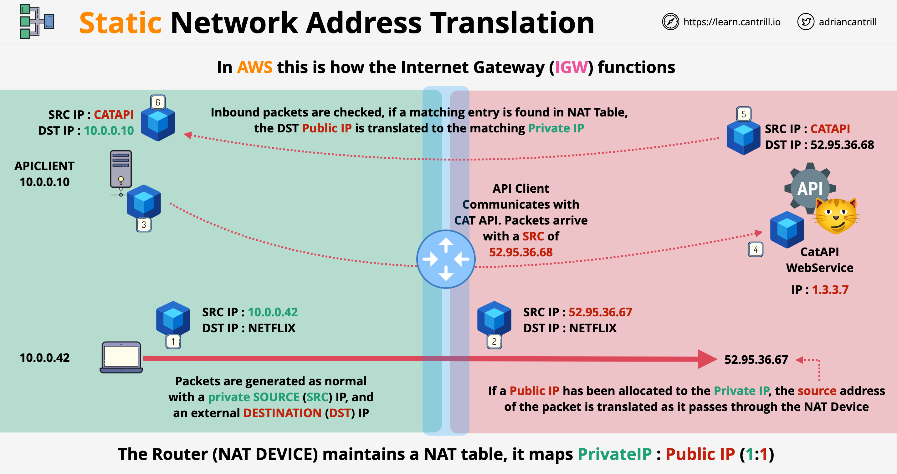  


#### 1.5.5.4. Bastion Host / Jumpbox

It is an instance in a public subnet inside a VPC.
These are used to allow incoming management connections.
Once connected, you can then go on to access internal only VPC resources.
Used as a management point or as an entry point for a private only VPC.

This is an inbound management point. Can be configured to only allow
specific IP addresses or to authenticate with SSH. It can also integrate
with your on premise identification service.

### 1.5.6. Network Access Control List (NACL)

Network Access Control Lists (NACLs) are a type of security filter
(like firewalls) which can filter traffic as it enters or leaves a subnet.


All VPCs have a default NACL, this is associated with all subnets of that VPC
by default.
NACLs are used when traffic enters or leaves a subnet.
Since they are attached to a subnet and not a resource, they only filter
data as it crosses in or out.
If two EC2 instances in a VPC communicate, the NACL does nothing because
it is not involved with resources communicating within a subnet.

NACLs have an inbound and outbound sets of rules as they are **stateless**.

When a specific rule set has been called, the one with the lowest
rule number first.
As soon as one rule is matched, the processing stops for
that particular piece of traffic.

The action can be for the traffic to **allow** or **deny** the traffic.

Each rule has the following fields related to traffic

- type
- protocol: tcp, udp, or icmp
- port range
- Inbound rule: Source - who traffic is from
- Outbound rule: Destination - who traffic is destined to

Examples:

- ssh: tcp port 22
- http: tcp port 80
- https: tcp port 443
- ping traffic: icmp

If all of those fields match, then the first rule will either allow or deny.

The rule at the bottom with `*` is the **implicit deny**
This cannot be edited and is defaulted on each rule list.
If no other rules match the traffic being evaluated, it will be denied.

#### 1.5.6.1. NACLs example below
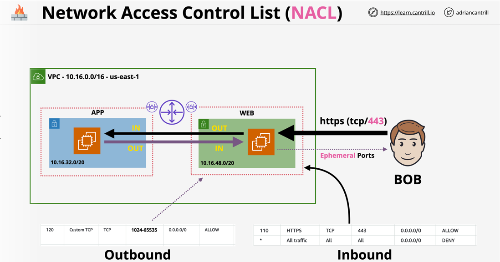  


- Bob wants to view a blog using https(tcp/443)
- We need a NACL rule to allow TCP on port 443.
- All IP communication has two parts
  - Initiation
  - Response
- Bob is initiating a connection to the server to ask for a webpage
- Server will respond with an **Ephemeral** port
- Bob talks to the webserver connecting to a port on that server (tcp/443)
  - This is a well known port number
- Bob's PC tells the server it can talk to back to Bob on a specific port
  - Wide range from port 1024, 65535
  - That response is outbound traffic
- When using NACLs, you must add an outbound port for the response traffic
as well as the inbound port. This is the ephemeral port.
- If the webserver is not managing the apps server, it may communicate
back on a different port.
- This back and forth communication can be hard to configure for.

#### 1.5.6.2. NACL Exam PowerUp

NACLs require rules to allow inbound **and** outbound traffic. They are therefore stateless.

**Stateless Firewalls**


- Initiation and response traffic are separate streams requiring two rules. The request (green) can be initated by the client to a server (top half) or a server to another server (bottom half). The resposne is in orange.
- NACLs are attached to subnets and only filter data as it crosses the
subnet boundary. Two EC2 instances in the same subnet will not check against
the NACLs when moving data.
- Can explicitly allow and deny traffic. If you need to block one particular
thing, you need to use NACLs.
- They only see IPs, ports, protocols, and other network connections.
No logical resources can be changed with them.
- NACLs cannot be assigned to specific AWS resources.
- NACLs can be used with security groups to add explicit deny (Bad IPs/nets)
- One subnet can only be assigned to one NACL at a time.

NACLs are processed in order starting at the lowest rule number until
it gets to the catch all. A rule with a lower rule number will be processed
before another rule with a higher rule number.

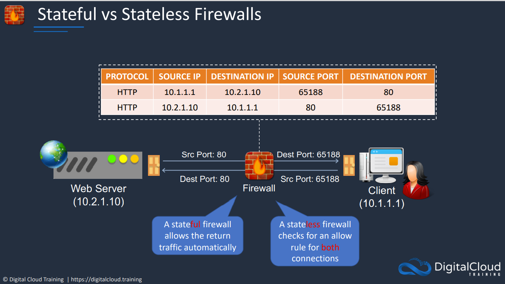 


### 1.5.7. Security Groups

Security Groups only require rules to allow inbound traffic (outbound traffic is automatically allowed). They are therefore stateful. 


**Stateful Firewalls**


Logical references allow you to scale your applications. In this situation, the left subnet is allowing traffic from the right using a logical reference.


If you use logical references, yo can add more instances to the subnet without needing to update the network configuration.


- SGs are boundaries which can filter traffic.
- Attached to a resource and not a subnet.
- SGs have two sets of rules like NACLs.
- SGs are stateful.
  - Only one inbound rule is needed.
  - They see traffic and response as the same thing.


In the example above, using a self-reference to a security group means that you can continue to add instances to the subnet (scale up) without needing to update the network configuration. All instances with this security group attached will be able to communicate with each other.

- Understand AWS logical resources so they're not limit to IP traffic only.
  - Can have a source and destination referencing the instance and not the IP.
- Default SG is created in a VPC to allow all traffic.
  - Does so by referencing itself. Anything this SG is attached to is matched
  by this rule.
- SGs have a hidden implicit **Deny**.
  - Anything that is not allowed in the rule set for the SG is implicitly denied.
- **SG cannot explicitly deny anything.**
  - NACLs are used in conjunction with SGs to do explicit denys.

#### 1.5.7.1. SGs vs NACL

- NACLs are used when products cannot use SGs, e.g. NAT Gateways.
- NACLs are used when adding explicit deny, such as bad IPs or bad actors.
- SGs is the default almost everywhere because they are stateful.
- NACLs are associated with a subnet and only filter traffic that crosses
that boundary. It does not direct traffic within the subnet.

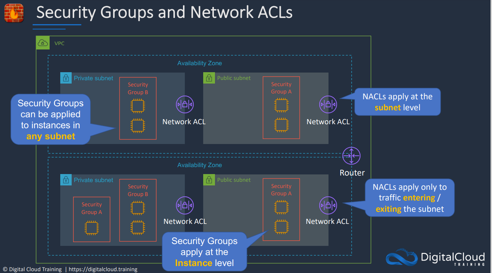  


### 1.5.8. Network Address Translation (NAT) Gateway

Set of different processes that can address IP packets to public internet, via IGW, by changing
their source or destination addresses.


**IP masquerading**, hides CIDR block behind one IP. This allows many IPv4
addresses to use one public IP for **outgoing** internet access.
Incoming connections don't work. Outgoing connections can get a response
returned.

- Must run from within a public subnet to allow for public IP address.
  - Internet Gateway subnets configure to allocate public IPv4 addresses
  and default routes for those subnets pointing at the IGW.
- Uses Elastic IPs (Static IPv4 Public)
  - Don't change
  - Allocated to your account
- AZ resilient service , but HA in that AZ.
  - If that AZ fails, then the NATGW will fail as well
- For a fully region resilient service, you must deploy one NATGW in each AZ
with a Route Table in each private subnet AZ pointing to the NATGW as target.


- NAT instance is limited by capabilities of the instance it is running on and that instance is also general purpose, so won't offer the same level of custom design performance as NAT Gateway.
- NAT instance is single instance running in single AZ it'll fail if EC2 hardware fails, network fails, storage fails or AZ itself fails.
- NAT Gateway has benefit over NAT instance, inside one AZ it is highly available.
- You can connect to NAT instance just like any other instance, you can use them as Bastion host or can use them for port forwarding.
- With NAT Gateway it is not possible, it is managed service. NAT Gateway cannot be used as Bastion host and it cannot do port forwarding.
- **You cannot use SG with NAT instance, you can only use NACLs.**

- NAT Gateway handles **Port Translation** using a **Nat Table**


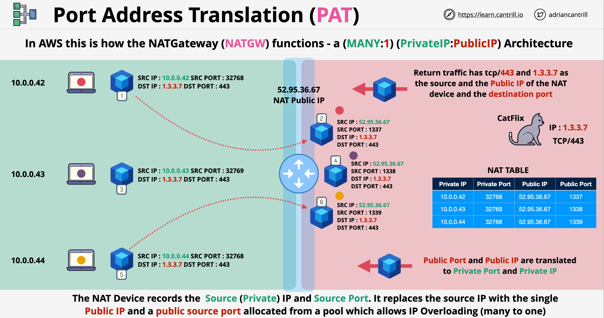  


- NAT is not required for IPv6. Inside AWS all IPv6 addresses are publicly routable. IG works with all IPv6 addresses directly.
- That means if you choose to make an instance in private subnet that have a default IPv6 route to IG, it'll become public instance.
- Managed service, scales automatically up to 45 Gbps. Can deploy multiple NATGW to increase
bandwidth.
- AWS charges on (1) usage per hour and (2) data volume processed. Partial use is still charged on an hourly basis.

NATGW cannot do port forwarding or be a bastion server. In that case it might
be necessary to run a NAT EC2 instance instead.


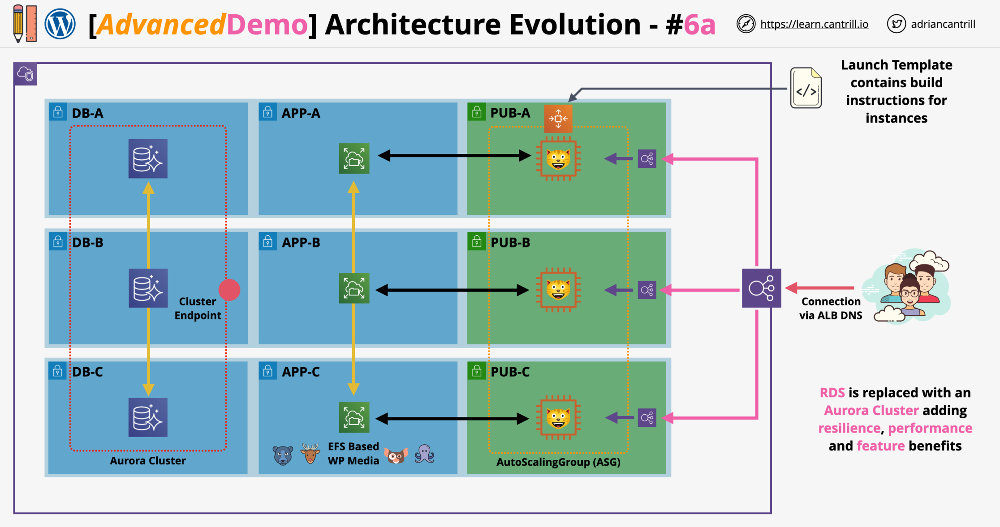  


---

## 1.6. Elastic-Cloud-Compute-EC2

EC2 provides Infrastructure as a Service (IaaS Product)

### 1.6.1. Virtualization 101

Servers are configured in three sections without virtualization.

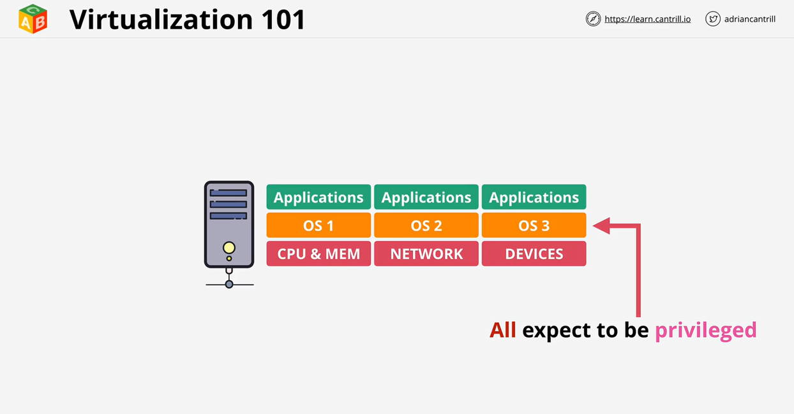  


- CPU hardware
- Kernel
  - Operating system
  - Runs in **privileged mode** and can interact with the hardware directly.
- User Mode
  - Runs applications.
  - Can make a **system call** to the Kernel to interact with the hardware.
  - If an app tries to interact with the hardware without a system call, it
  will cause a system error and can crash the server or at minimum the app.

#### 1.6.1.1. Emulated Virtualization - Software Virtualization

Host OS operated on the HW and included a hypervisor (HV).
SW ran in privileged mode and had full access to the HW.
Guest OS wrapped in a VM and had devices mapped into their OS to emulate real
HW. Drivers such as graphics cards were all SW emulated to allow the process
to run properly.

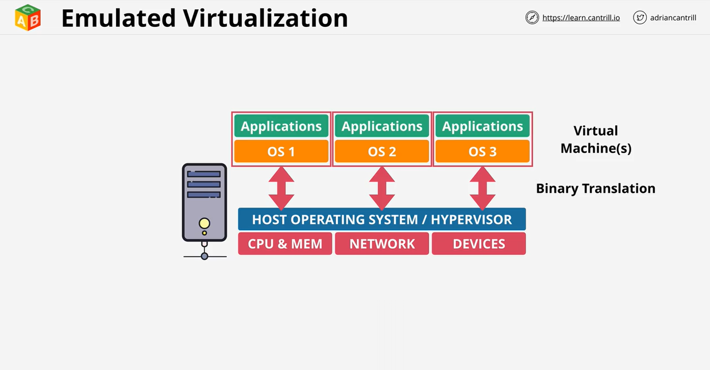  


The guest OS still believed they were running on real HW and tried
to take control of the HW. The areas were not real and only allocated
space to them for the moment.

The HV performs **binary translation**.
System calls are intercepted and translated in SW on the way. The guest OS needs
no modification, but slows down a lot.

#### 1.6.1.2. Para-Virtualization

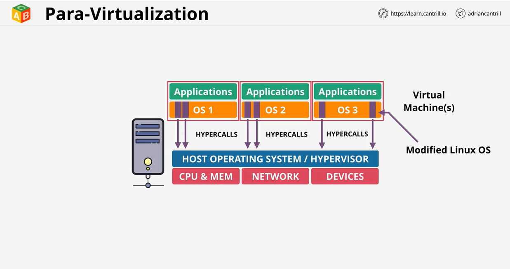  


Guest OS are modified and run in HV containers, except they do not use slow
binary translation. The OS is modified to change the **system calls** to
**user calls**. Instead of calling on the HW, they call on the HV using
**hypercalls**. Areas of the OS call the HV instead of the HW.

#### 1.6.1.3. Hardware Assisted Virtualization

The physical HW itself is virtualization aware. The CPU has specific
functions so the HV can come in and support. When guest OS tries to run
privileged instructions, they are trapped by the CPU and do not halt
the process. They are redirected to the HV from the HW.

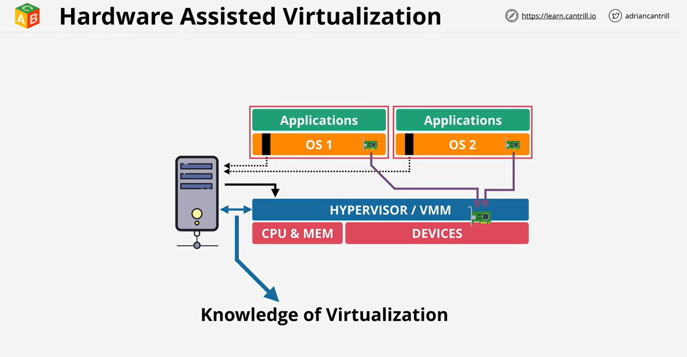  


What matters for a VM is the input and output operations such
as network transfer and disk IO. The problem is multiple OS try to access
the same piece of hardware but they get caught up on sharing.

#### 1.6.1.4. SR-IOV (Singe Route IO virtualization)

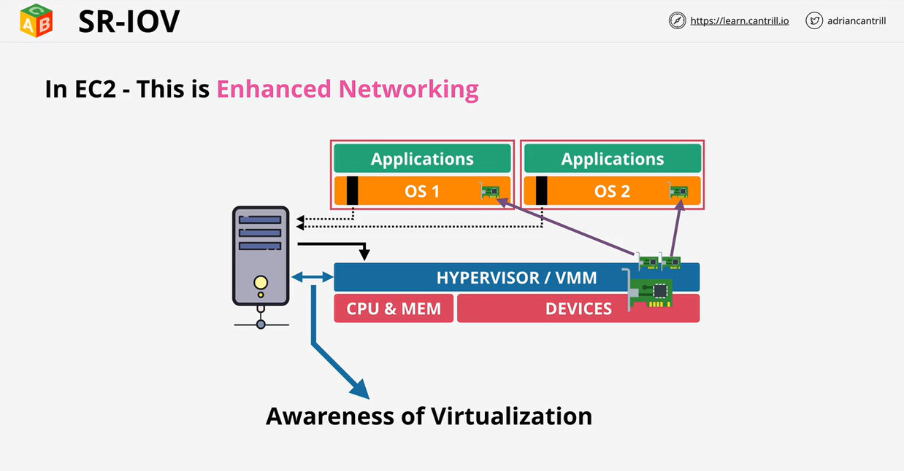  


Allows a network or any card to present itself as many mini cards.
As far as the HV is concerned, they are real dedicated cards for their
use. No translation needs to be done by the HV. The physical card
handles it all. In EC2 this feature is called **enhanced networking**.

### 1.6.2. EC2 Architecture and Resilience

EC2 instances are virtual machines run on EC2 hosts (which are physical hardware managed by aws). Generally runs instances of all the same type, but different sizes.

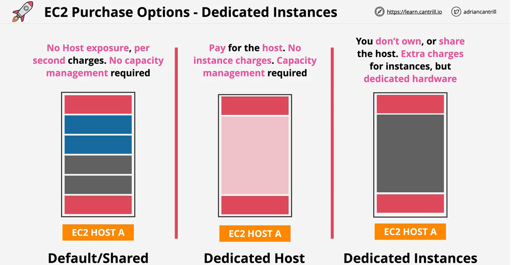  


Tenancy:

- **Shared** - Instances are run on shared hardware, but isolated from other customers. It is the default.
- **Dedicated** - Instances are run on hardware that's dedicated to a single customer.
  Dedicated instances may share hardware with other instances from the same AWS account
  that are not Dedicated instances.
- **Dedicated host** - Instances are run on a physical server fully dedicated for your use.
  Pay for entire host, don't pay for instances.

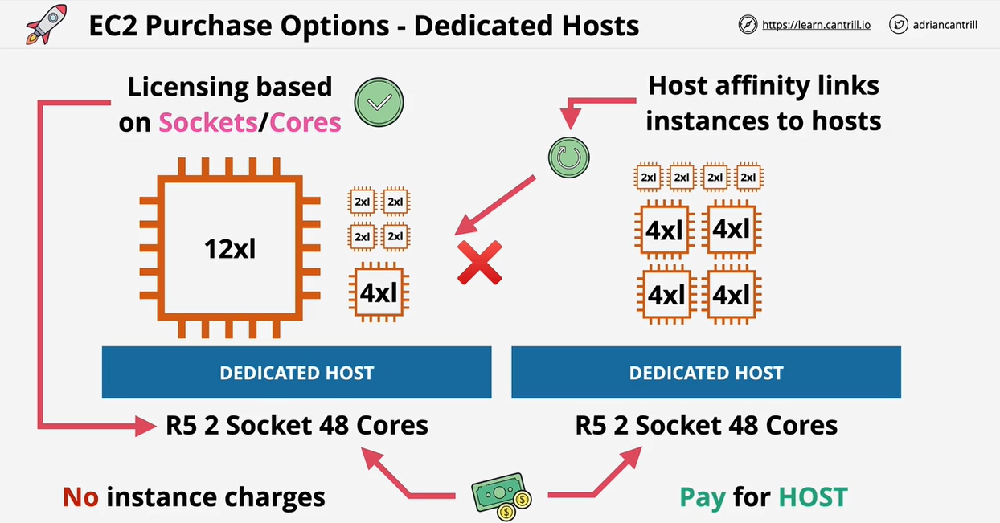  


- **AZ resilient service. They run within only one AZ.**
  - You can't access them cross AZ.

EC2 host contains:

- Local hardware such as CPU and memory
- Also have temporary instance store
  - If instance moves hosts, the storage is lost.
- Can use remote storage, Elastic Block Store (EBS).
  - EBS allows you to allocate volumes of persistent storage to instances
within the same AZ.
- 2 types of networking
  - Storage networking
  - Data networking


EC2 Networking (ENI)

When instances are provisioned within a specific subnet within a VPC
A primary elastic network interface is provisioned in a subnet which
maps to the physical hardware on the EC2 host. Subnets are also within
one specific AZ. Instances can have multiple network interfaces, even within
different subnets so long as they're within the same AZ.

An instance runs on a specific host. If you restart the instance
it will stay on that host until either:

- The host fails or is taken down by AWS
- The instance is stopped and then started, different than restarted.

The instance will be relocated to another host in the same AZ. Instances
cannot move to different AZs. Everything about their hardware is locked within
one specific AZ.
A migration is taking a **copy** of an instance and moving it to a different AZ.

In general instances of the same type and generation will occupy the same host.
The only difference will generally be their size.

#### 1.6.2.1. EC2 Strengths

- Long running compute needs. Many other AWS services have run time limits.
- Server style applications
- burst or steady-load
- monolithic application stack
  - middle ware or specific run time components
- migrating application workloads or disaster recovery (DR)
  - existing applications running on a server and require a backup system for DR

### 1.6.3. EC2 Instance Types


- **General Purpose** (T, M) - default steady state workloads with even resource distribution
- **Compute Optimized** (C) - Media processing, scientific modeling and gaming, Machine Learning
- **Memory Optimized** (R, X) - Processing large in-memory data sets, some database loads
- **Accelerated Computing** (P, G, F) - Hardware GPU, FPGAs
- **Storage Optimized** (H, I, D) - Large amounts of super fast local storage.
  Massive amounts of IO per second. Elastic search, data warehousing and analytic workloads.

#### 1.6.3.1. Naming Scheme


R5dn.8xlarge - whole thing is the instance type. When in doubt give the
full instance type

- 1st char: Instance family.
- 2nd char: Instance generation. Generally always select the newest generation.
- char after period: Instance size. Memory and CPU considerations.
  - Often easier to scale system with a larger number of smaller instance sizes.
- 3rd char - before period: additional capabilities (optional)
  - a: amd cpu
  - d: NVMe storage
  - n: network optimized
  - e: extra capacity for ram or storage

### 1.6.4. Storage Refresher

- **Instance Store**
  - Direct (local) attached storage attached to host
  - Super fast
  - Ephemeral storage or temporary storage
- **Elastic Block Store (EBS)**
  - Network attached storage
  - Volumes delivered over the network
  - Persistent storage lives on past the lifetime of the instance


### 1.6.4. Root Device Storage

When you launch an instance, the root device volume contains the image used to boot the instance. You can choose between AMIs backed by Amazon EC2 instance store and AMIs backed by Amazon EBS. AWS recommend that you use AMIs backed by Amazon EBS, because they launch faster and use persistent storage.

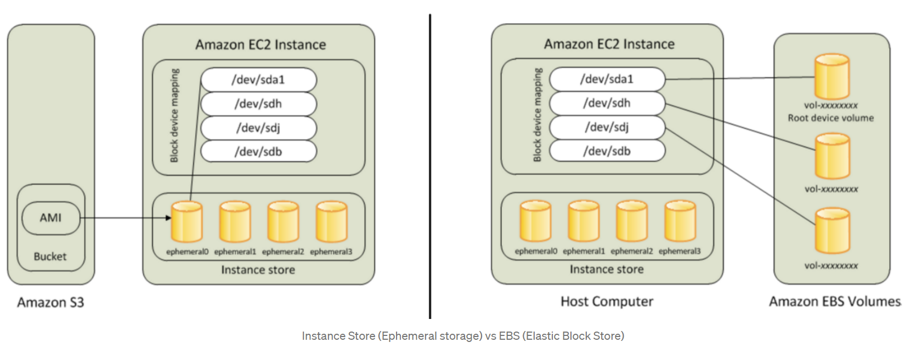  

**Instance store-backed instances**

Instances that use instance stores for the root device automatically have one or more instance store volumes available, with one volume serving as the root device volume. When an instance is launched, the image that is used to boot the instance is copied to the root volume. Note that you can optionally use additional instance store volumes, depending on the instance type.

**Amazon EBS-backed instances**

Instances that use Amazon EBS for the root device automatically have an Amazon EBS volume attached. When you launch an Amazon EBS-backed instance, we create an Amazon EBS volume for each Amazon EBS snapshot referenced by the AMI you use. You can optionally use other Amazon EBS volumes or instance store volumes, depending on the instance type.


#### 1.6.4.1. Three types of storage

- Block Storage: Volume presented to the OS as a collection of blocks. No
structure beyond that. These are mountable and bootable. The OS will
create a file system on top of this, NTFS or EXT3 and then it mounts
it as a drive or a root volume on Linux. Spinning hard disks or SSD. This
could also be delivered by a physical volume. Has no built in structure.
You can mount an EBS volume or boot off an EBS volume.

- File Storage: Presented as a file share with a structure. You access the
files by traversing the storage. You cannot boot from storage, but you
can mount it.

- Object Storage: It is a flat collection of objects. An object can be anything
with or without attached metadata. To retrieve the object, you need to provide
the key and then the value will be returned. This is not mountable or
bootable. It scales very well and can have simultaneous access. Ex: S3.

#### 1.6.4.2. Storage Performance


- IO Block Size: Determines how to split up the data.
- IOPS: How many reads or writes a system can accommodate per second.
- Throughput: End rate achieved, expressed in MB/s (megabyte per second).

`Block Size * IOPS = Throughput`

This isn't the only part of the chain, but it is a simplification.
A system might have a throughput cap. The IOPS might decrease as the block
size increases.

### 1.6.5. Elastic Block Store (EBS)

- Allocate block storage **volumes** to instances.
- Volumes are isolated to one AZ.
  - The data is highly available and resilient for that AZ.
  - All of the data is replicated within that AZ. The entire AZ must have
  a major fault to go down.
- Two physical storage types available (SSD/HDD)
- Varying level of performance (IOPS, T-put)
- Billed as GB/month.
  - If you provision a 1TB for an entire month, you're billed as such.
  - If you have half of the data, you are billed for half of the month.

#### 1.6.5.1. General Purpose SSD (gp2)

You should be careful to not exceed baseline performance for long periods as you could potentially deplete the credits

**General default is gp2/3. Gp3 is cheaper than gp2.**

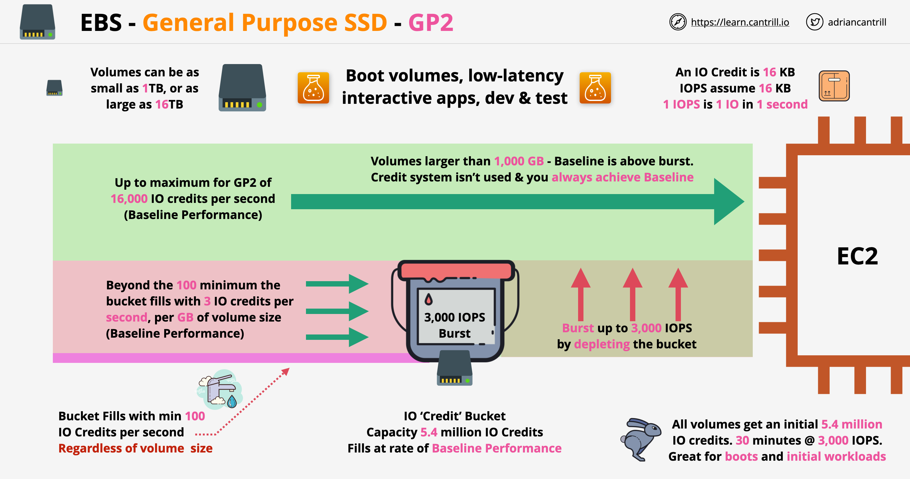  


-Bucket fills with credit which can be used for storage (a min amount + an extra amount based on GB stored)
- Bucket can be depleted if you exceed the credit you have been allocated
- Potential to burst capacity during high periods of operation.
- Maximum 16,000 IO credits per second available


- Standard performance- 3,000 IOPs, extra cost up to 16,000 IOPs

#### 1.6.5.2. Provisioned IOPS SSD (io1)


Good for latency sensitive workloads such as mongoDB.
Multi-attach allows them to attach to multiple EC2 instances at once.

#### 1.6.5.3. HDD Volume Types


- great value
- great for high throughput vs IOPs
- 500 GiB - 16 TiB
- Neither can be used for EC2 boot volumes.
- Good for streaming data on a hard disk.
  - Media conversion with large amounts of storage.
- Frequently accessed high throughput intensive workload
  - log processing
  - data warehouses
- The access patterns should be sequential
  - Massive inefficiency for small reads and writes


#### 1.6.5.4. EBS Exam Power Up

- Volumes are created in an AZ, isolated in that AZ.
- If an AZ fails, the volume is impacted.
- Highly available and resilient in that AZ. The only reason for failure is
if the whole AZ fails.
- Generally one volume to one instance, except **io1** with multi-attach
- Has a GB/month fee regardless of instance state.
- EBS maxes at 80k IOPS per instance and 64k vol (io1)
- Max 2375 MB/s per instance, 1000 MiB/s (vol) (io1)

### 1.6.6. EC2 Instance Store

- Local **block storage** attached to an instance.
- Physically connected to one EC2 host.
  - They are isolated to that one specific host.
  - Instances on that host can access them.
- Highest storage performance in AWS.
- Included in instance price, use it or lose it.
- Can be attached ONLY at launch. Cannot be attached later.

Each instance has a collection of volumes that are
locked to that specific host. If the instance moves, the data doesn't.

Instances can move between hosts for many reasons:

- If an instance is stopped and started.
- If a host undergoes AWS maintenance.
- If you change the type of an instance.
- If a physical hardware fails.

Local Data on the instance store volume is lost in all cases.

The number, size, and performance of instance store volumes vary based on the
type of instance used. Some instances do not have any instance store volumes
at all.

#### 1.6.6.1. Instance Store Exam PowerUp

- Instance store volumes are local to EC2 host.
- Can only be added at launch time. Cannot be added later.
- Any data on instance store data is lost if it gets moved, or resized (type changed).
- Highest data performance in all of AWS.
- You pay for it anyway, it's included in the price.
- TEMPORARY

### 1.6.7. EBS vs Instance Store
 
- Persistence... EBS (avoid Instance Store)
- Resilence... EBS (avoid Instance Store)
- Storage isolated from instance lifecycle... EBS
- Resilence w/ App in-built Replication... it depends
- High performance needs... if depends
- Super high performance needs... Instance Store
- Cost... Instance Store (it's often included)

- Cheap=ST1 or SC1
- Throughput... streaming... ST1
- Boot... **NOT** ST1 or SC1
- GP2/3-up to 16,000 IOPS
- IO1/2-up to 64,000 IOPS (*256,000)
- RAID0+EBS up to 260,000IOPS(io1/2-BE/GP2/3)
- More than 260,000 IOPS-Instance Store

### 1.6.8. EBS Snapshots, restore, and fast snapshot restore

- Efficient way to backup EBS volumes to S3.
  - The data becomes region resilient.
- Can be used to migrate data between AZs.

Snapshots are incremental volume copies to S3.
The first is a **full copy** of `data` on the volume (If you only use 4GB of a 10GB volume, then only 4GB is copied and you are only charged for 4GB). This can take some time.
EBS won't be impacted, but will take time in the background.
Future snaps are incremental, as they only copy across changes made since the last snapshot. consume less space and are quicker to perform.

If you delete an incremental snapshot, it moves data to ensure subsequent
snapshots will still work properly.


Volumes can be created (restored) from snapshots.
Snapshots can be used to move EBS volumes between AZs or regions.
Snapshots can be used to migrate data between volumes.

#### 1.6.8.1. Snapshot and volume performance

- When creating a new EBS volume without a snapshot, the performance is
available immediately.
- When restoring from S3, performs **Lazy Restore**
  - If you restore a volume, it will transfer it slowly in the background.
  - If you attempt to read data that hasn't been restored yet, it will
  immediately pull it from S3, but this will achieve lower levels of performance
  than reading from EBS directly.
  - You can force a read of every block all data immediately using DD through manual configuration.

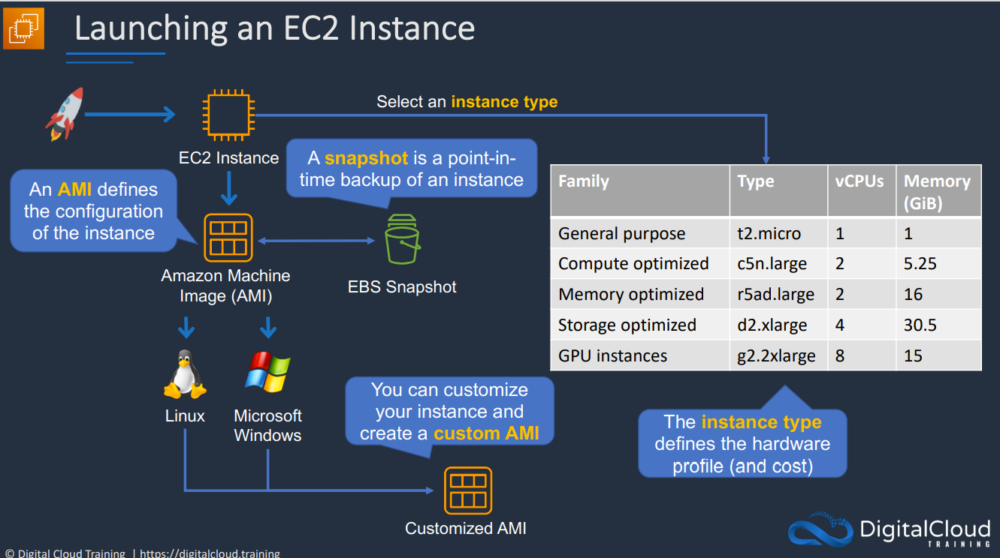  


Fast Snapshot Restore (FSR) allows for immediate restoration.
You can create 50 of these FSRs per region. When you enable it on
a snapshot, you pick the snapshot specifically and the AZ that you want to be
able to do instant restores to. Each combination of Snapshot and AZ counts
as one FSR set. You can have 50 FSR sets per region.
FSR is not free and can get expensive with lost of different snapshots.

  

Shows how EBS snapshots can be used with S3 to replicate storage into another AZ or region. Please note that a snapshot in one AZ can not be taken from an instance located in another AZ (red cross). Data replication across regions provides global resilence.


#### 1.6.8.2. Snapshot Consumption and Billing

Billed using a GB/month metric.

This is used data, not allocated data. If you have a 40 GB volume but only
use 10 GB, you will only be charged for 10GB.
This is not how EBS itself works as you pay for the entire volume regardless of how much you use.

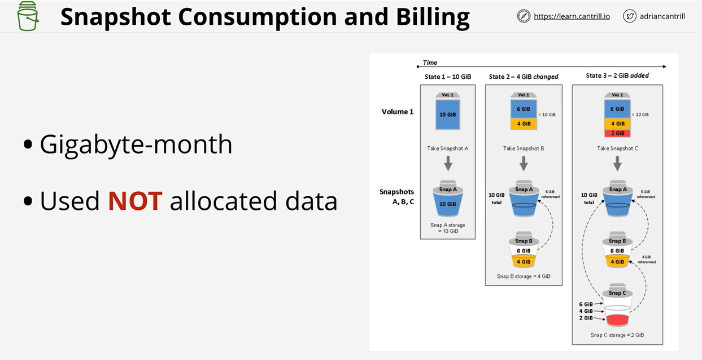  


In this example, the first you pay for 10GB, second you pay for 4GB (the changed data) and third you pay for 2 GB (the changed data). Each snapshot references the unchanged data in the previous snapshot.
The data is incrementally stored which means doing a snapshot every 5 minutes
will not necessarily increase the charge as opposed to doing one every hour.

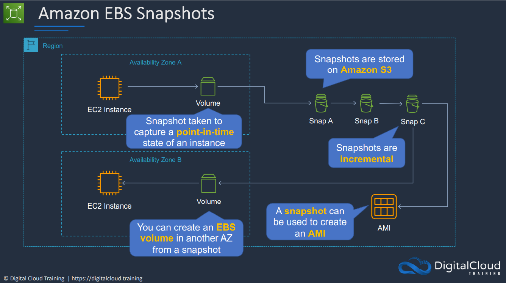  


#### 1.6.8.3. EBS Encryption

Provides at rest encryption for block volumes and snapshots.

When you don't have EBS encryption, the volume is not encrypted.
The operating system itself may be performing encryption internally, but
that is a separate thing.

When you set up an EBS volume initially, EBS uses KMS and a customer master key.
This can be the EBS default (CMK) which is referred to as `aws/ebs` or it
could be a customer managed CMK which you manage yourself.

That key is used by EBS when an encrypted volume is created. The CMK
generates an encrypted **data encryption key (DEK)** which is stored with the volume with
on the physical disk. This key can only be decrypted using KMS when a role with
the proper permissions to decrypt that DEK.


When the volume is first used, EBS asks CMS to decrypt the key and stores
the decrypted key (green) in memory on the EC2 host while it's being used. At all
other times it's stored on the volume in encrypted form (red).

When the EC2 instance is using the encrypted volume, it can use the
decrypted data encryption key to read and write data on the volume. It is used
for all cryptographic operations when data is being used to and from the
volume.

When data is stored at rest, it is stored as ciphertext. 

If the EBS volume is ever moved, the key is discarded.

If a snapshot is made of an encrypted EBS volume, the same data encryption
key is used for that snapshot. Anything made from this snapshot also has the same encryption key.

Every time you create a new EBS volume from scratch, it creates a new
data encryption key.

##### 1.6.8.3.1. EBS Encryption Exam Power Up

- AWS accounts can be set to encrypt EBS volumes by default.
  - It will use the default CMK unless a different one is chosen.
  - Each volume uses 1 unique DEK (data encryption key)
  - Snapshots and future volume use the same DEK
- Can't change a volume from encrypted to unencrypted.
  - You could mount an unencrypted volume and copy things over but you can't
  change the original volume.
- The OS itself isn't aware of the encryption, there is no performance loss.
  - The volume itself is encrypted using AES256
  - This occurs between the EC2 host and the EBS system itself.
  - The OS does not see any encryption. It simply writes data out and reads
  data in from a disk.
  - If an exam question does not use AES256, or it suggests you need an OS to
encrypt or hold the keys, then you need to perform full disk encryption
at the operating system level.
  - Is free to use

### 1.6.9. EC2 Network Interfaces, Instance IPs and DNS

An EC2 instance starts with at least one ENI - elastic network interface.
An instance may have ENIs in separate subnets, but everything must be
within one AZ.

When you launch an instance with Security Groups, they are on the
network interface and not the instance.

#### 1.6.9.1. Elastic Network Interface (ENI)


Has these properties

- MAC address
- Primary IPv4 private address
  - From the range of the subnet the ENI is within.
  - Will be static and not change for the lifetime of the instance
    - `10.16.0.10`
  - Given a DNS name that is associated with the address.
    - `ip-10-16-0-10.ec2.internal`
    - Only for internal communication inside VPC
- 0 or more secondary private IP addresses
- 0 or 1 public IPv4 address
  - The instance must manually be set to receive an IPv4 address or spun into a
subnet which automatically allocates an IPv4.
This is a dynamic IP that is not fixed.
If you stop an instance the address is removed.
When you start up again, it is given a brand new IPv4 address.
Restarting the instance will not change the IP address.
Changing between EC2 hosts will change the address.
This will be allocated a public DNS name. The Public DNS name will resolve to
the primary private IPv4 address of the instance.
Outside of the VPC, the DNS will resolve to the public IP address.
This allows one single DNS name for an instance, and allows traffic to resolve
to an internal address inside the VPC and the public will resolve to a public
IP address.
- 1 elastic IP per private IPv4 address
  - Can have 1 public elastic interface per private IP address on this interface.
This is allocated to your AWS account.
Can associate with a private IP on the primary interface or secondary interface.
If you are using a public IPv4 and assign an elastic IP, the original IPv4
address will be lost. There is no way to recover the original address.
- 0 or more IPv6 address on the interface
  - These are by default public addresses.
- Security groups
  - Applied to network interfaces.
  - Will impact all IP addresses on that interface.
  - If you need different IP addresses impacted by different security
  groups, then you need to make multiple interfaces and apply different
  security groups to those interfaces (SGs are attached to interfaces).
- Source / destination checks
  - If traffic is on the interface, it will be discarded if it is not
  from or going to one of the IP addresses


  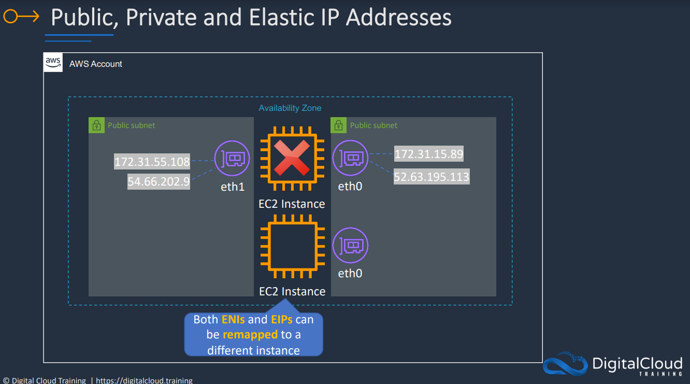  


Secondary interfaces function in all the same ways as primary interfaces except
you can detach them and move them to other EC2 instances.

#### 1.6.9.2. ENI Exam PowerUp

- Legacy software is licensed using a mac address.
  - If you provision a secondary ENI to a specific license, you can move
around the license to different EC2 instances.
- Multi homed (subnets) means two interfaces in two subnets (ie one for management and the other for data).
- Different security groups are attached to different interfaces.
- The OS doesn't see the IPv4 public address.
- You always configure the private IPv4 private address on the interface.
- Never configure an OS with a public IPv4 address.
- IPv4 Public IPs are Dynamic, starting and stopping see them update to a new one (instance moves host).

Public DNS for a given instance will resolve to the primary private IP
address in a VPC. If you have instance to instance communication within
the VPC, it will never leave the VPC. It does not need to touch the internet
gateway.

### 1.6.10. Amazon Machine Image (AMI)

Images of EC2 instances that can launch more EC2 instance.

- When you launch an EC2 instance, you are using an Amazon provided AMI.
- Can be Amazon or community provided
- Marketplace (can include commercial software)
  - Will charge you for the instance cost and an extra cost for the AMI
- AMIs are regional with a unique ID.
- Controls permissions
  - Default only your account can use it.
  - Can be set to be public.
  - Can have specific AWS accounts on the AMI.
- Can create an AMI from an existing EC2 instance to capture the current config.

#### 1.6.10.1. AMI Lifecycle


1. Launch: EBS volumes are attached to EC2 devices using block IDs.

   - BOOT /dev/xvda
   - DATA /dev/xvdf

2. Configure: customize the instance from applications or volume sizes.

3. Create Image or AMI

    - AMI contains:
      - Permissions: who can use it, is it public or private
      - EBS snapshots are created from attached EBS volumes and stored in S3 buckets
        - Snapshots are referenced inside the AMI using block device mapping.
        - Table of data that links the snapshot IDs that you've just
        created when making that AMI and it has for each one of those
        snapshots, a device ID that the original volumes had on the EC2
        instance.

4. Launch: When launching an instance, the snapshots are used to create new EBS
volumes in the AZ of the EC2 instance and contain the same block device mapping.

#### 1.6.10.2. AMI Exam PowerUps

- AMI can only be used in one region
- AMI Baking: creating an AMI from a configuration instance.
- An AMI cannot be edited. If you need to update an AMI, launch an instance,
make changes, then make new AMI
- Can be copied between regions using snapshots
- Remember permissions by default are your account only, you can configure others users or make it public
- Billing is for the storage capacity for the EBS snapshots the AMI references.

### 1.6.11. EC2 Pricing Models

#### 1.6.11.1. On-Demand Instances


- Hourly rate based on OS, size, options, etc
- Billed in seconds (60s min) or hourly
  - Depends on the OS
- Default pricing model
- No long-term commitments or upfront payments
- New or uncertain application requirements
- Short-term, spiky, or unpredictable workloads which can't tolerate disruption.

#### 1.6.11.2. Spot Instances


Up to 90% off on-demand, but depends on the spare capacity.
You can set a maximum hourly rate in a certain AZ in a certain region.
If the max price you set is above the spot price, you pay only that spot
price for the duration that you consume that instance.
As the spot price increases, you pay more.
Once this price increases past your maximum, it will terminate your instance.
Great for data analytics when the process can occur later or withstand interruption.

#### 1.6.11.3. Reserved Instances

**Standard Reserve**

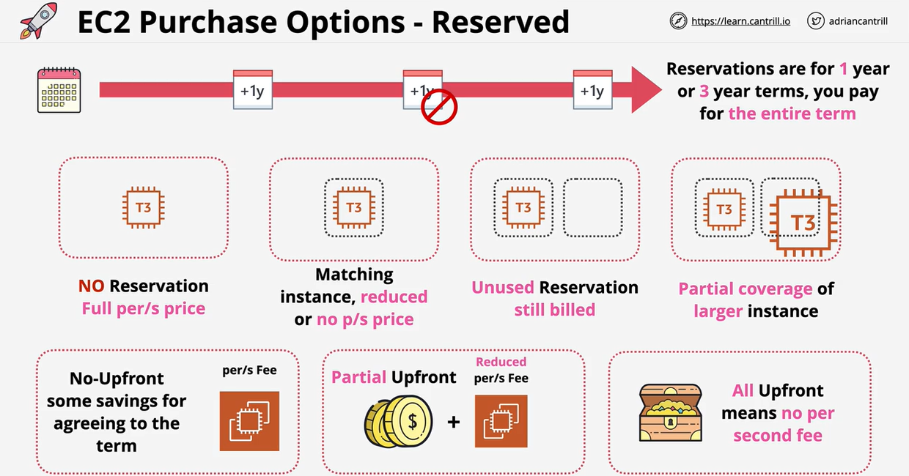  


Up to 75% off on-demand.
The trade off is commitment.
You're buying capacity in advance for 1 or 3 years.
Flexibility on how to pay

- All up front
- Partial upfront
- No upfront

Best discounts are for 3 years all up front.
Reserved in region, or AZ with capacity reservation.
Reserved instances takes priority for AZ capacity.

**Scheduled reserve**
Can perform scheduled reservation when you can commit to specific time windows.


Great if you have a known steady state usage, email usage, domain server.
Cheapest option with no tolerance for disruption.

**Capacity reserve**
1.Regional: can be launced in any AZ in the region
2. Zonal: discounts are provided in that AZ, but instances in other zones are at full price
3. On demand: You can reserve the capacity, but pay for it whether you use it or not


Regional and Zonal reservations have 1 or 3 year terms. On demand has no term minimum.

If capacity is stretched, ec2 capacity is proritised by:

1. reserved instances
2. On demand and capacity reservations
3. Spot purchase


### 1.6.12. Instance Status Checks and Autorecovery


Every instance has two high level status checks

- System Status Checks
  - Failure of this check could indicate SW or HW problems of the EC2
service or the host.
- Instance Status Checks
  - Specific to the file system or has a corrupted Kernel.

Autorecovery can kick in and help, if there is spare capacity. Only works on instances which solely have ebs volumes attached. Reboots to another instance in the same AZ

- Recover this instance
  - can be a number of steps depending on the failure
- Stop this instance
- Terminate this instance
  - useful in a cluster
- Reboot this instance

### 1.6.13. Horizontal and Vertical Scaling

#### 1.6.13.1. Vertical Scaling

As customer load increases, the server may need to grow to handle more data.
The server can increase in capacity, but this will require a reboot.

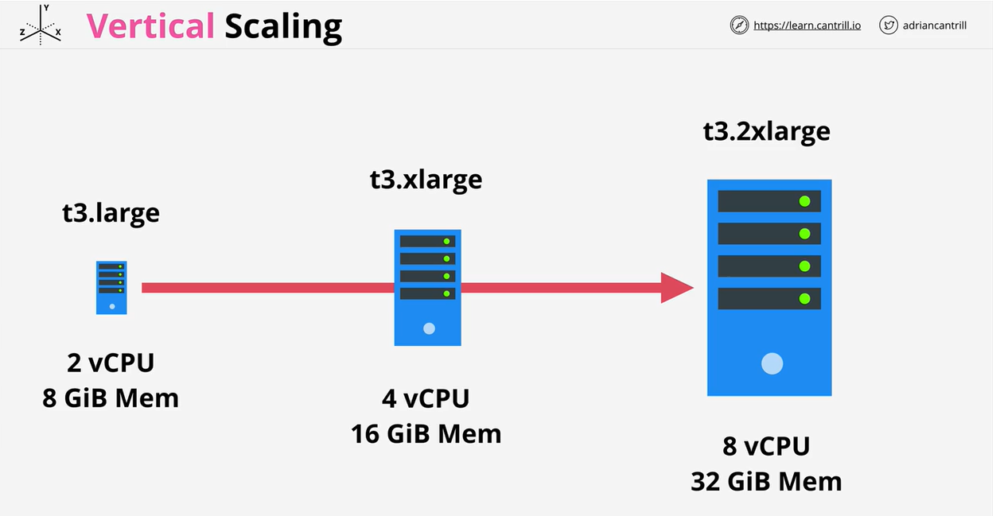  


- Often times vertical scaling can only occur during planned outages.
- Larger instances also carry a **$ premium** compared to smaller instances.
- Instance size is an upper cap on performance.
- No application modification is needed.
  - Works for all applications, even monoliths (all code in one app)

#### 1.6.13.2. Horizontal Scaling

As the customer load increases, this adds additional capacity.
Instead of one running copy of an application, you can have multiple versions
running on each server.
This requires a load balancer.


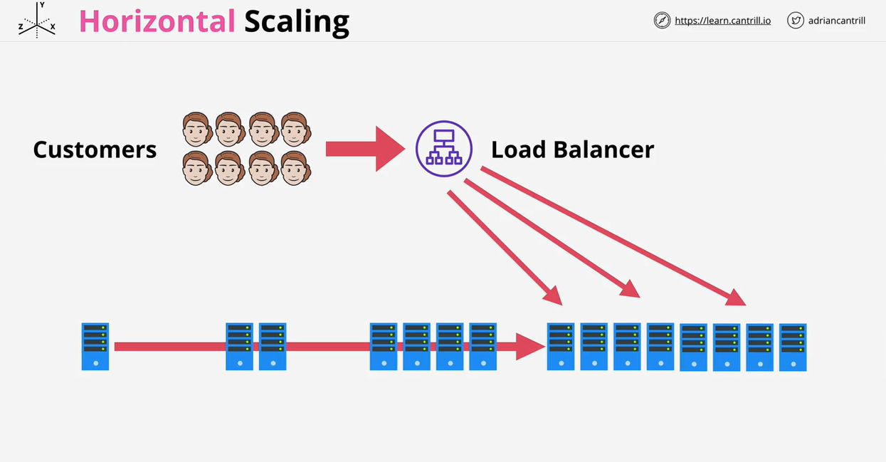  


> A load balancer is an _appliance_ that sits in between your servers -- in this case instances -- and your customers.

When customers try to access an application, the load balancer ensures the
servers get equal parts of the load.

- Sessions are everything.
  - When you log into youtube, netflix or your email, the state of your interaction with that application is called a *session*.
- With horizontal scaling your session can shift between instances.
- This requires either *application support* or *off-host* sessions.
  - If you use off-host sessions, then your session data is stored in another place, an external database.
  - This means that the servers are what's called **stateless**, they are just dumb instances of your application.
  - The application does not care which instance you are connected to because your session is externally hosted somewhere else.
  - With off host sessions and horizontal scaling, there is no disruption when scaling.
  

#### 1.6.13.3. Benefits of Horizontal Scaling

- No disruption while scaling up or down.
- No real limits to scaling.
- Uses smaller instances is less expensive.
- Allows for better granularity.

### 1.6.14. Instance Metadata

> A service EC2 provides to instances. It is data about the instance that can be used to configure or manage a running instance. It is a way an instance or anything running inside an instance can access information about the environment it wouldn't be able to access otherwise.

- Accessible inside all instances using the same access method.

Memorize [instance metadata](http://169.254.169.254/latest/meta-data/) -> `http://169.254.169.254/latest/meta-data/`

Meta-data contains information on the:

- environment the instance is in.
- You can find out about the networking, authentication or user-data among other things.
- This is not authenticated or encrypted. Anyone who can gain access to the
instance can see the meta-data. This can be restricted by local firewall.

The public IPv4 is never configured or known by the operating system of an instance at any point. The internet gateway translates the private address into public address.

For example curl http://169.254.169.254/latest/meta-data/public-ipv4 will contact the metadata service and retrieve the public ipv4 information.


---

## 1.7. Containers-and-ECS

### 1.7.1. Intro to Containers

Virtualization Problems

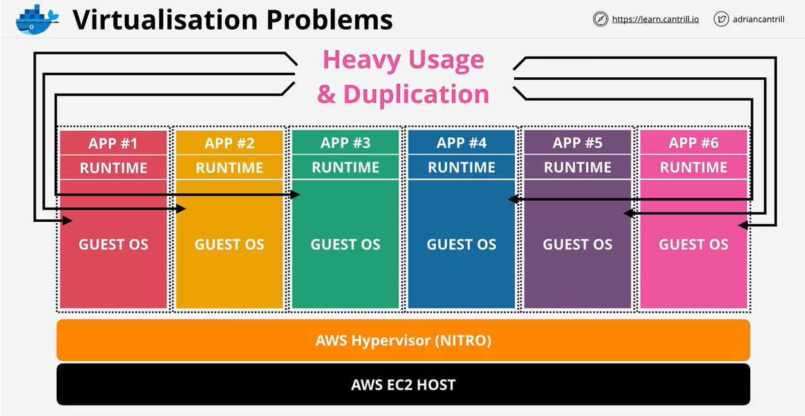  


Using an EC2 virtual machine with Nitro Hypervisor, 4 GB ram, and 40 GB disk,
the OS can consume 60-70% of the disk and much of the available memory.
Containers leverage the similarities of multiple guest OS by removing duplicate
resources. This allows applications to run in their own isolated environments.

#### 1.7.1.1. Image Anatomy

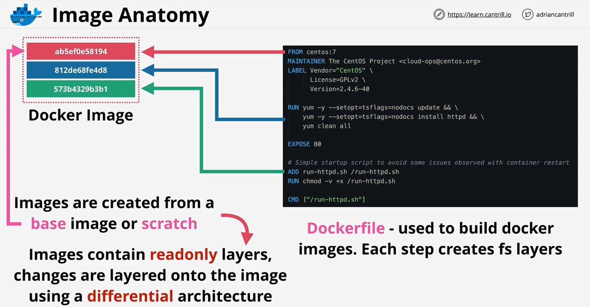  

A Docker image is composed of multiple independent layers. Docker images are stacks of these layers and not a single, monolithic disk image. Docker images are created initially using a _docker file_.
Each line in a docker file is processed one by one and each line creates a new filesystem layer inside the docker image it creates.
Images are created from scratch or a base image.
Images contain read only layers, images are layer onto images.

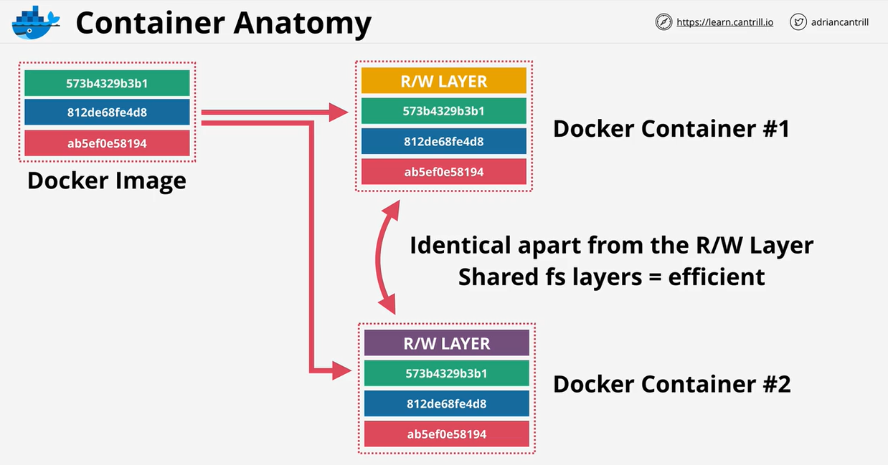  


##### 1.7.1.1.1. What are images used for

1. A docker image is actually how we create a docker container. In fact a docker container is just a running copy of a docker image with one crucial difference: a docker container has an additional *read/write* file system layer. File system layers --  the layers that make up the docker image -- by default are _read_ only; they never change after they are created. And so, the special read/write layer is added which allows containers to run. If you have lots of containers with very similar base structures, they will share the parts that overlap. The other layers are reused between containers.

2. The reuse architecture that is offered by the way containers do their disk images scales really well. Disk space when you have lots of containers is minimized because of this layered architecture. The base layer -- the OS -- they are generally made available by the OS vendors through something called a _container registry_ and a popular one is _docker hub_.

#### 1.7.1.2. Container Registry

A container registry or hub is a hub of container images. As a developer or solution architect, you use a dockerfile to create a container image. Then you upload that image to a private/public repository such as the docker hub. In the case of a public hub, other people will likely do the same including vendors of the base OS such as the CentOS example shown above. From there, these container images can then be deployed to docker hosts, which are just services running a container engine (e.g. docker).

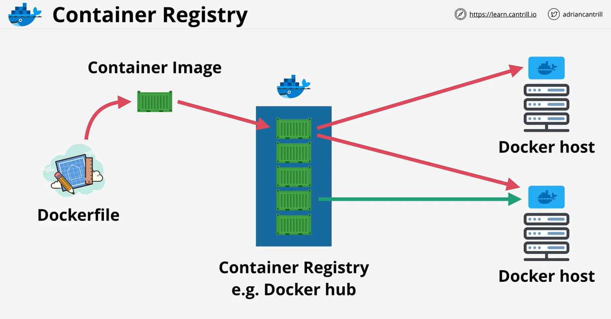  


A docker host can run many containers based on one or more images. A single image can be to generate containers on many docker hosts.
Dockerfile can create a container image where it gets stored
in the container registry.

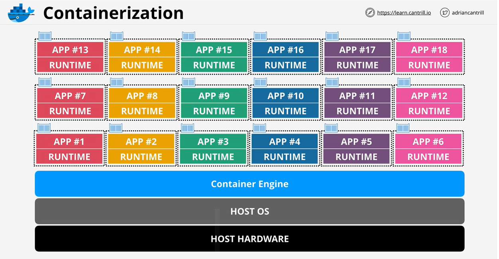  


#### 1.7.1.3. Container Key Concepts

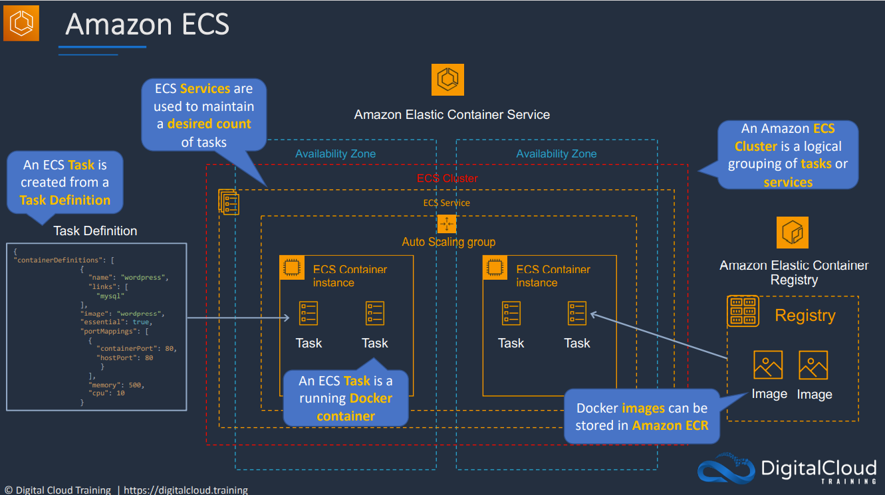  


- Docker files are used to build Docker images
- Containers are portable and always run as expected.
  - Anywhere there is a compatible host, it will run exactly as you intended.
- Containers are lightweight, use the host OS for the heavy lifting.
  - File system layers are shared when possible.
- Containers only run the application and environment it needs to run.
- Ports need to be **exposed** to allow outside access from the host and beyond.
- Application stacks can be multi container

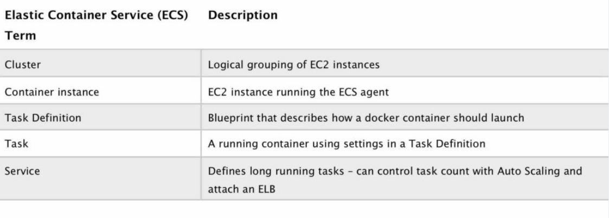  


### 1.7.2. Elastic Container Service (ECS) Concepts


- Accepts containers and instructions you provide. It orchestrates where and how to run the containers. It is a managed container-based compute service.

ECS runs in two modes: 
1. Using EC2
2. Using Fargate

- ECS allows you to create a cluster.
  - Clusters are where containers run from.

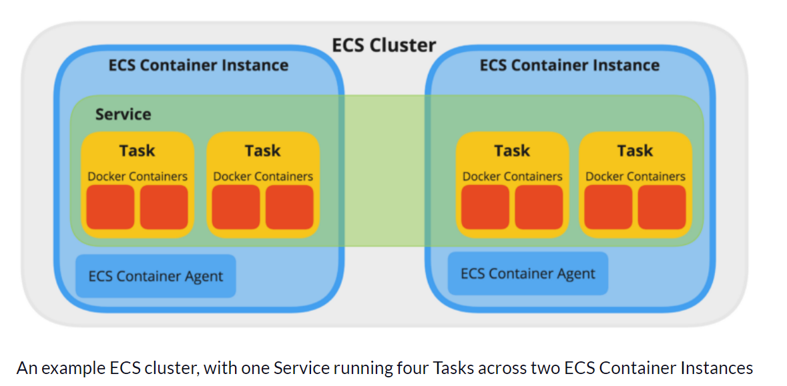  

- Container images will be located on a registry.
  - AWS provides a registry called **Elastic Container Registry** (ECR).
  - Dockerhub can be used as well.

- **Container definition** tell ECS where your container image is. It tells ECS which port your container uses (e.g. port 80, which is http). Container definition gives ECS just enough info about a single container.
  - It defines which image to use and the ports that will be exposed.

- **Task definitions** store the container definitions used by the **task** - cpu, memory, networking mode, compatability (ec2 or fargate).
  - It also stores the **task role**, an IAM role that allows the task access to other AWS resources.


**Example of Task Definition**: 
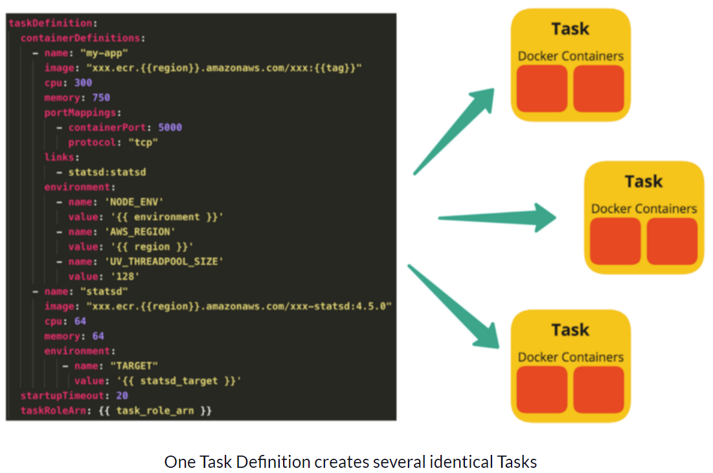  


- **Service** defines the minimum and maximum Tasks from one Task Definition that run at any given time, utlising autoscaling, and load balancing capability. Adds capacity and resilience. 

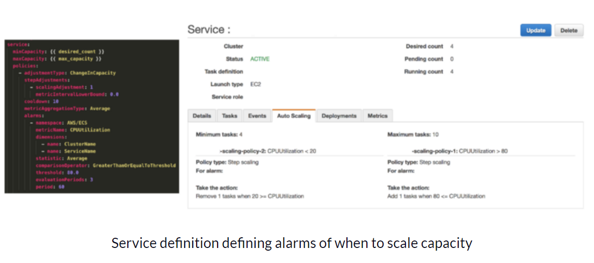  


### 1.7.3. ECS Cluster Types

ECS Cluster manages:

- Scheduling and Orchestration
- Cluster manager
- Placement engine

#### 1.7.3.1. EC2 mode

ECS cluster is created within a VPC. It benefits from the multiple AZs that
are within that VPC.
You specify an initial size which will drive an **auto scaling group** (ASG).

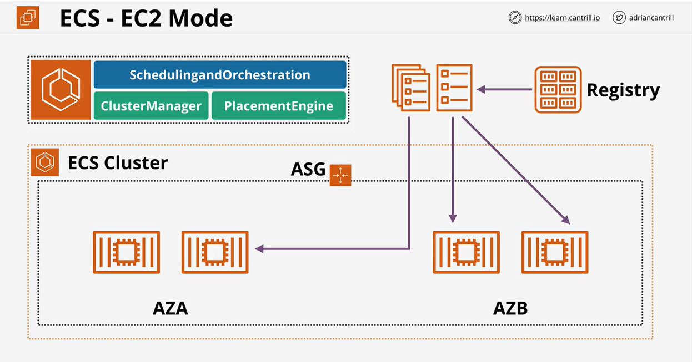  


ECS using EC2 mode is not a serverless solution, you need to worry about
capacity and availability for your cluster.

The container instances are not delivered as a managed service, they
are managed as normal EC2 instances.
You can use spot pricing or reserved EC2 servers. You pay for them while they are in a running state in your containers even if you don't use them. 

 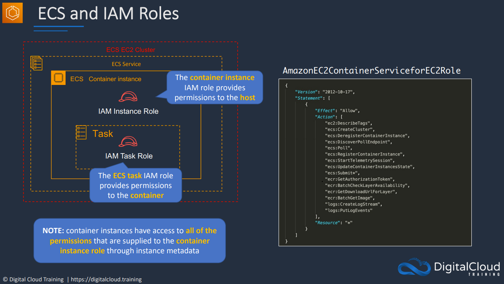  


1. All docker container images are tagged and stored in AWS ECR (Elastic Container Repository)
2. ECS Task Definition contains details about the docker image location and the tag that needs to be run on the ECS as a container.
3. ECS reads the task definition and schedules the tasks on the EC2 instances registered with it.
4. Each EC2 instance(usually running Amazon Linux or Amazon Linux 2 ECS Optimized AMI) has a ECS-AGENT which pulls the docker image from ECR and runs it on the EC2 instance.


#### 1.7.3.2. Fargate mode


Removes more of the management overhead from ECS, no need to manage EC2.

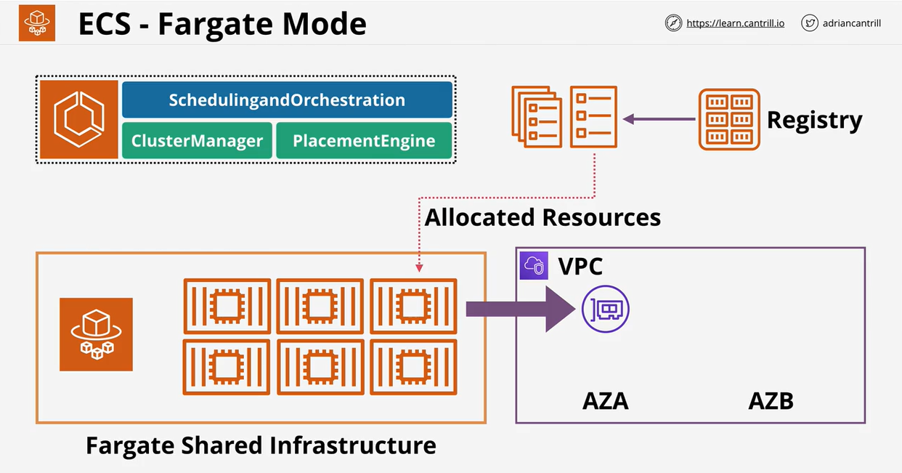  


**Fargate shared infrastructure** allows all customers
to access from the same pool of resources.

Fargate deployment still uses a cluster with a VPC where AZs are specified.

For ECS tasks, they are injected into the VPC. Each task is given an
_elastic network interface_ (in purple) which has an IP address within the VPC. They then
run like a VPC resource.

You only pay for the container resources you use. You don't need to manage host, think about high availability, capacity.


#### 1.7.3.3. EC2 vs ECS(EC2) vs Fargate

If you already are using containers, use **ECS**.

**EC2 mode** is good for a large, consistent workloads if you are price conscious.
This allows for spot pricing and prepayment discounts, but will probably require more admin overhead.

**Fargate** is great if you:

- Have a large workload but are overhead conscious.
- Have small or burst style workloads.
- Use batch or periodic workloads.

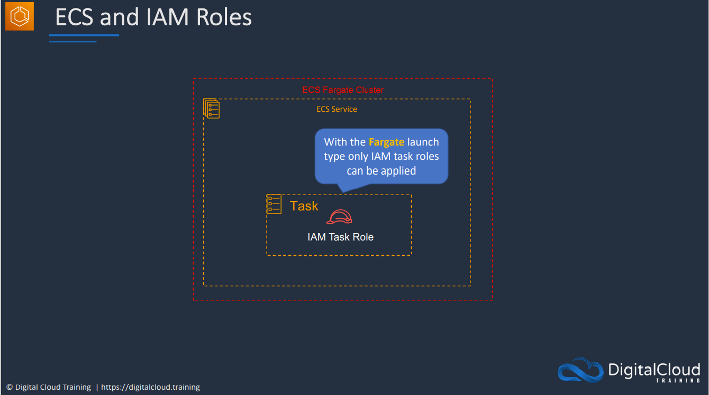  

#### 1.7.3.4. ECS and auto-scaling

  


#### 1.7.3.5. ECS and ALB

  


---

## 1.8. Advanced-EC2

### 1.8.1. Bootstrapping EC2 using User Data

Bootstrapping is a process where scripts or other config steps can be run when
an instance is first launched. This allows an instance to be brought to service
in a particular configured state.

In systems automation, bootstrapping allows the system to self configure.
In AWS this is **EC2 Build Automation**.

This could perform some software installs and post install configs.

Bootstrapping is done using **user data** and is injected into the instance
in the same way that meta-data is. It is accessed using the meta-data IP.

<http://169.254.169.254/latest/user-data>

Anything you pass in is executed by the instance OS **only once on initial launch!** It is for initial launch time configuration only.

EC2 doesn't validate the user data. You can tell EC2 to pass in trash data
and the data will be injected. The OS needs to understand the user data.

#### 1.8.1.1. Bootstrapping Architecture

An AMI is used to launch an EC2 instance in the usual way to create
an EBS volume that is attached to the EC2 instance. This is based on the
block mapping inside the AMI.

Now the EC2 service provides some user data through to the EC2 instance.
There is SW within the OS designed to look at the metadata IP for any user data.
If it sees any user data, it executes this on launch of that instance.

  


This is treated like any other script the OS runs. At the end of running
the script, the instance will be in:

- Running state and ready for service.
- Bad config but still likely running.
  - The instance will probably still pass its checks.
  - It will not be configured as you expected.


#### 1.8.1.2. User Data Key Points

EC2 doesn't know what the user data contains, it's just a block of data.
The user data is not secure, anyone can see what gets passed in. For this
reason it is important not to pass passwords or long term credentials.

**User data is limited to 16 KB in size**. Anything larger than this will
need to pass a script to download the larger set of data.

User data can be modified if you stop the instance, change the user
data, then restart the instance. This won't be executed since the instance
has already started.

#### 1.8.1.3. Boot-Time-To-Service-Time

How quickly after you launch an instance is it ready for service?
This includes the time for EC2 to configure the instance and any software
downloads that are needed for the user.
When looking at an AMI, this can be measured in minutes.

AMI baking will front load the time needed by configuring as much as possible.

- Use AMI baking for any part of the process that is time intensive.
- Use bootstrap for the final configuration.

This way you reduce the post-launch time and thus the boot-time-to-service.


### 1.8.2. AWS::CloudFormation::Init

**cfn-init** is a helper script installed on EC2 OS.
This is a simple configuration management system.

- User Data is procedural and run by the OS line by line.
- cfn-init can be procedural, but can also be desired state.
  - Can specify particular versions of packages. It will ensure things are
  configured to that end state.
  - Can manipulate OS groups and users.
  - Can download sources and extract onto the local instance them using authentication.
  - Run commands
  - control services

This is executed as any other command by being passed into the instance as part
of the user data and retrieves its directives from the CloudFormation
stack and you define this data in the CloudFormation template called
`AWS::CloudFormation::Init`.

#### 1.8.2.1. cfn-init explained

  


Starts off with a **CloudFormation template**.
This has a logical resource within it which is to create an EC2 instance.
This has a specific section called `Metadata`.
This then passes in the information passed in as `UserData`.
cfn-init gets variables passed into the user data by CloudFormation.

It knows the desired state and can work towards a final configuration.
This can monitor the user data and change things as the EC2 data changes.

#### 1.8.2.2. CreationPolicy and Signals

If you pass in user data, there is no way for CloudFormation to know
if the EC2 instance was provisioned properly. It may be marked as complete,
but the bootstrapping inside the instance could have failed.

A **CreationPolicy** is something which is added to a logical resource
inside a CloudFormation template. You create it and supply a timeout value (15 minutes in this example).

  


This waits for a signal from the resource itself before moving to a create
complete state. Waits the designated time for a success or error signal, if no signal is recieved assumes it has errored and doesn't let stack create.

### 1.8.3. EC2 Instance Roles

IAM roles are the best practice ways for services to be granted permissions.
EC2 instance roles are roles that an instance can assume and anything
running in that instance has the permissions that that role grants.

Starts with an IAM role with a permissions policy.
EC2 instance role allows the EC2 service to assume that role.

The **instance profile** is the item that allows the permissions to get
inside the instance. When you create an instance role in the console,
an instance profile is created with the same name.

When IAM roles are assumed, you are provided temporary roles based on the
permission assigned to that role. These credentials are passed through
instance **meta-data**.

EC2 and the secure token service ensure the credentials never expire as long as the instance profile is attached.

  


Key facts

- Credentials are inside meta-data
  - iam/security-credentials/role-name
  - automatically rotated - always valid as long as still active and attached
  - Resources need to check the meta-data periodically
- Should always use roles compared to storing long term credentials in an ec2 or on local system
- CLI tools use role credentials automatically

### 1.8.4. AWS System Manager Parameter Store

Passing secrets into an EC2 instance is bad practice because anyone
who has access to the meta-data has access to the secrets.

Parameter store allows for storage of **configuration** and **secrets**

- Strings
- StringList
- SecureString

Parameter Store:

- Can store license codes, database strings, and full configs and passwords.
- Allows for hierarchies and versioning.
- Can store plaintext and ciphertext.
  - This integrates with **kms** to encrypt passwords.
- Allows for public parameters such as the latest AMI parameter to be stored
and referenced during EC2 creation
- Is a public service.
- Applications, EC2 instances, lambda functions can all request access to
parameter store.
- Tied closely to IAM, can use
  - Long term credentials such as access keys.
  - Short term use of IAM roles.

### 1.8.5. System and Application Logging on EC2


CloudWatch (CW) and CloudWatch Logs cannot natively capture data inside an instance.

CloudWatch Agent is required for OS visible data. It sends this data into CW.
For CW to function, it needs configuration and permissions in addition
to having the CW agent installed.
The CW agent needs to know what information to inject into CW and CW Logs. In this example, a cloudwatch agent is installed and configured on an instance.

The agent also needs some permissions to interact with AWS.
This is done with an IAM role as best practice.
The IAM role has permissions to interact with CW logs.
The IAM role is attached to the instance which provides the instance and
anything running on the instance, permissions to manage CW logs.

The data requested is then injected in CW logs.
There is one log group for each individual log we want to capture.
There is one log stream for each group for each instance that needs
management.

We can use parameter store to store the configuration for the CW agent.

### 1.8.6. EC2 Placement Groups

#### 1.8.6.1. Cluster Placement -> Pack Instances Close Together

  


Designed so that instances within the same cluster are physically close together.

Achieves the highest level of performance possible inside EC2.

Best practice is to launch all of the instances within that group at the
same time.
If you launch with 9 instances and AWS places you in a place with capacity
for 12, you are now limited in how many you can add.

Cluster placements need to be part of the same AZ. Cluster
placement groups are generally the same rack, but they can even be the same
EC2 host.

All members have direct connections to each other. They can achieve
**10 Gbps single stream** vs 5 Gbps normally. They also have the lowest
latency and max packets-per-second (PPS) possible in AWS.

If the hardware fails, the entire cluster will fail.

##### 1.8.6.1.1. Cluster Placement Exam PowerUp

- **Clusters can't span AZs**. The first AZ used will lock down the cluster.
- They can span VPC peers.
- Requires a supported instance type.
- Best practice to use the same type of instance (not mandatory).
- Best practice to launch all instances at once (not mandatory, but highly recommended).
- This is the only way to achieve **10Gbps SINGLE stream performance**, other data metrics assume multiple streams.
- Use cases: High Performance, fast transfer speeds, and low consistent latency.

#### 1.8.6.2. Spread Placement -> Keep Instances Separated

  


Keep instances separated

This provides the best resilience and availability.
Spread groups can span multiple AZs. Information will be put on distinct
racks with their own network or power supply. There is a limit of 7 instances
per AZ. The more AZs in a region, the more instances inside a spread placement
group.

##### 1.8.6.2.1. Spread Placement Exam PowerUp

- Provides the highest level of availability and resilience.
  - Each instance by default runs from a different rack.
- **7 instances per AZ is a hard limit**.
- Not supported for dedicated instances or hosts.

- Use case: small number of critical instances that need to be kept separated
from each other. Launching instances in a spread placement group reduces the risk of simultaneous failures that might occur when instances share the same racks. Spread placement groups provide access to distinct racks, and are therefore suitable for mixing instance types or launching instances over time.

#### 1.8.6.3. Partition Placement -> Groups of Instances Spread Apart

  


Groups of instances spread apart

If a problem occurs with one rack's networking or power, it will
at most take out one partition.

The main difference is you can launch as many instances in each partition
as you desire.

When you launch a partition group, you can allow AWS decide where the instances go or you can
specifically decide.

##### 1.8.6.3.1. Partition Placement Exam PowerUp

- 7 partitions maximum for each AZ (multiple instances can be placed in each partition)
- Instances can be placed into a specific partition, or AWS can pick.
- This is not supported on dedicated hosts.
- Great for HDFS, HBase, and Cassandra

### 1.8.7. EC2 Dedicated Hosts

EC2 host allocated to you in its entirety.
Pay for the host itself which is designed for a family of instances eg c1, m5, a1.
There are no instance charges.
You can pay for a host on-demand or reservation with 1 or 3 year terms.

The host hardware has physical sockets and cores. This dictates how
many instances can be run on the Hardware.

Hosts are designed for a specific size and family. If you purchase one host, you configure what type of instances you want to run on it. With the older VM
system you cannot mix and match. The new Nitro system allows for mixing and
matching host size.

#### 1.8.7.1. Dedicated Hosts Limitations

- AMI Limits, some versions can't be used
- Amazon RDS instances are not supported
- Placement groups are not supported for dedicated hosts.
- Hosts can be shared with other organization accounts using **Resource Access Manager (RAM)**
- This is mostly used for licensing problems related to ports.

### 1.8.8. Enhanced Networking


Enhanced networking uses SR-IOV.
The physical network interface is aware of the virtualization.
Each instance is given exclusive access to one part of a physical network
interface card.

  


There is no charge for this and is available on most EC2 types.
It allows for higher IO and lower host CPU usage
This provides more bandwidth and higher packet per seconds.
In general this provides lower latency.

#### 1.8.8.1. EBS Optimized

Historically network on EC2 was shared with the same network stack used
for both data networking and EBS storage networking.

EBS optimized instance means that some stack optimizations have taken place
and dedicated capacity has been provided for that instance for EBS usage.

Most new instances support this and have this enabled by default for no charge.

---

## 1.9. Route-53

### 1.9.1. Public Hosted Zones


A hosted zone is a DNS database for a given section of global DNS data.
A public hosted zone is a type of R53 hosted zone which is hosted on
R53 provided public DNS name servers. When creating a hosted zone, AWS provides
at least 4 DNS name servers which host the zone.

This is globally resilient service due to multiple DNS servers.

Hosted zones are created automatically when you register a domain using R53.

Hosted zones can be created separately. If you want to register a domain
elsewhere and use R53 to host the zone file and records for that domain, then
you can specifically create a hosted zone and point at an externally
registered domain at that zone.
There is a monthly fee to host each hosted zone within R53 and a fee for
any queries made to that service.

Hosted Zones are what the DNS system references via delegation and name server
records. A hosted zone, when referenced in this way by the DNS system, is known
as being authoritative for a domain.
It becomes the single source of truth for a domain.

VPC instances are already configured (if enabled) with the VPC +2 address as their
DNS resolver - this allows querying of R53 public and internet hosted DNS zones from
instances within that VPC.

### 1.9.2. Private Hosted Zones


Same as public hosted zones except these are not accessible over the public internet.
They are associated with VPCs and are only accesible within those VPCs via the R53 resolver. Good for company intranet as it means that the content is restricted to users on your own network. In this image, only queries from associated VPCs (VPC1 and VPC2) can query the animals4life.org website through the R53 resolver.

It's possible to use a technique called Split-view for public and internal use with the same
zone name. A common architecure is to make the public hosted zone a subset of the private hosted zone
containing only those records that are meant to be accessed from the Internet, while inside VPCs
associated with the private hosted zone all resource records can be accessed. Both have the same name (animals4life.org) but different accessible records. In this examples queries from VPC1 can access all records while public queries can access all records (except accounting which is restricted as a private record).


### 1.9.2. CNAME

- "A" maps a name to an IPv4 Address
- CNAME maps a name to another name
- CNAME is invalid for naked/apex name
- Many AWS services use a DNS name (ELBs)
- Should be the same type as what the record is pointing to
- Alias records map a name to an AWS resource
  - Can be used for naked/apex names, functions like CNAME
  - There is no charge for Alias requests pointing at AWS resources
  - Alias should be your default when choosing a record for which maps to an AWS service

  


### 1.9.2. Route 53 Health Checks

Route checks will allow for periodic health checks on the servers.
If one of the servers has a bug, this will be removed from the list.

If the bug gets fixed, the health check will pass and the server will be
added back into a healthy state.

Health checks are separate from, but are used by, records inside R53.
You don't create health checks inside records themselves.

These are performed by a fleet of global health checkers. If you think
they are bots and block them, this could cause alarms.


Checks occur every 30 seconds by default. This can be increased to 10 seconds
for additional costs. These checks are per health checker. Since there are many
you will automatically get one every few seconds. The 10 second option will
complete multiple checks per second.

There could be one of three checks performed:

- TCP checks: R53 tries to establish TCP with end point within 10 (fast) or 30 seconds (standard).
- HTTP/HTTPS: Same as TCP but within 4 seconds. The end point must respond
with a 200 or 300 status code within 2 seconds after connecting.
- HTTP/HTTPS String matching: Same as above, the body must have a string within the first
5120 bytes. This is chosen by the user.

It will be deemed healthy or unhealthy.

There are three types of checks.

- Endpoint checks
- CloudWatch alarms
- Checks of checks (calculated)- application as a whole and individual application components


### 1.9.3. Route 53 Routing Policies Examples

- **Simple**: Route traffic to a single resource. Client queries the resolver
which has one record. It will respond with 3 values and these get forwarded
back to the client. The client then picks one of the three at random.
This is a single record only. No health checks.


- **Failover**: Create two records of the same name and the same type. One
is set to be the primary and the other is the secondary. This is the same
as the simple policy except for the response. Route 53 knows the health of
both instances. As long as the primary is healthy, it will respond with
this one. If the health check with the primary fails, the backup will be
returned instead. This is set to implement active - passive failover.


- **Weighted**: Create multiple records of the same name within the hosted zone.
For each of those records, you provide a weighted value. The total weight
is the same as the weight of all the records of the same name. If all of the
parts of the same name are healthy, it will distribute the load based
on the weight. If one of them fails its health check, it will be skipped over
and over again until a good one gets hit. This can be used for migration
to separate servers or if you want to control distribution of queries.


- **Latency-based**: Multiple records in a hosted zone can be created with
the same name and same type. When a client request arrives, it knows which
region the request comes from. It knows the lowest latency and will respond
with the lowest latency. In this example, the client is in Australia. The database is not updated in real time, but is better than nothing.


- **Geolocation**: Focused to delivering results matching the query of your
customers. The record will first be matched based on the US state if possible.
If this does not happen, the record will be checked based on the country, then based on continent.
Finally, if nothing matches it will respond with the default response.
This can be used for licensing rights. If overlapping regions occur,
the priority will always go to the most specific or smallest region. The US
will be chosen over the North America record. Not about the closest record, but that one that is applicable (ie if you are in the UK you will not get a Canadian record returned.


- **Multi-value**: Simple records use one name and multiple values in this record.
These will be health checked and the unhealthy responses will automatically
be removed. With multi-value, you can have multiple records with the same
name and each of these records can have a health check. R53 using this method
will respond to queries with any and all healthy records, but it removes
any records that are marked as unhealthy from those responses. This removes
the problem with simple routing where a single unhealthy record can make it
through to your customers. Great alternative to simple routing when
you need to improve the reliability, and it's an alternative to failover
when you have more than two records to respond with, but don't want
the complexity or the overhead of weighted routing.


- **Geo-proximity**:
Bias can be added or subtracted to manipulate the routing zone. In this example, the AU region is given a plus bias so Saudi Arabia routes towards it and not the UK.


- **Interoperability**:


  - R53 normally has 2 jobs- Domain registrar and Domain Hosting
  - R53 can do BOTH, or either Domain Registrar or Domain Hosting
  - R53 Accepts your money (domain registration fee)
  - R53 allocates 4 Name Servers (NS)(domain hosting)
  - R53 Creates a zone file (domain hosting) on the above NS
  - R53 communicates with the registry of the TLD (Domain Registrar)
  -... sets the NS records for the domain to point at the 4 NS above


In the example above, user purchases a domain name from R53. R53 checks availability and creates entry in the TLD registry ('PIR' in this example) and provides links to 4 name servers who will host the zone file (which contains the record).


In the example above, user purchases a domain name from R53. R53 checks availability and creates entry in the TLD registry ('PIR' in this example) and provides links to 4 **external** name servers who will host the zone file (which contains the record). These NS are hosted by a 3rd party provider.


In the example above, user purchases a domain name from a 3rd party domain registrar ('Hover' in this examples). They checks availability and creates entry in the TLD registry ('PIR' in this example) and provides links to 4 name servers on R53 who will host the zone file (which contains the record). These NS are hosted by a AWS.


---

## 1.10. Relational-Database-Service-RDS

### 1.10.1. Database Refresher

Systems to store and manage data.

#### 1.10.1.1. Relational (SQL)

- Structured Query Language (SQL) is a feature of most RDS.
- Structure to the data known as a **schema**.
  - Defined in advance.
  - Defines names of things
  - Valid values of things
  - Types of data which is stored and where
- Fixed relationship between tables.
  - This is defined before data is entered into the database.


Every row in a table must have a value for the **primary key**.
There must be a value stored for every attribute in the table.

SQL systems are relational so we generally define relationships between
tables as well. This is defined with a **join table**.
A join table has a **composite key** which is a key formed of two parts.
Composite keys together must be unique.

Keys in different tables are how the relationships between the tables
are defined.

The Table schema and relationships must be defined in advance which can be
hard to do.

#### 1.10.1.2. Non-Relational (NoSQL)

Not a single thing, and is a catch all for everything else.
There is generally no schema or a weak one.

##### 1.10.1.2.1. Key-Value databases

This is just a list of keys and value pairs.
So long as every key is unique, there is no real schema or structure needed.
These are really fast and highly scalable.
This is also used for **in memory caching**.


##### 1.10.1.2.2. Wide Column Store

DynamoDB is an example of wide column store database.

Each row or item has one or more keys.
One key is called the partition key.
You can have additional keys other than the partition key called the
sort or range key.

It can be **single key** (only partition key) or **composite key**
(partition key and sort key).

Every item in a table can also have attributes, but they don't have to be
the same between values.
The only requirements is that every item inside the table has to use the same
key structure and it has to have a unique key.


##### 1.10.1.2.3. Document

Documents are generally formatted using JSON or XML.

This is an extension of a key-value store where each document is interacted
with via an ID that's unique to that document, but the value of the document
contents are exposed to the database allowing you to interact with it.

Good for order databases, or collections, or contact stale databases.

Great for nested data items within a document structure such as user profiles, catalogues where documents might vary.


##### 1.10.1.2.4. Row Database (MySQL)

Often called OLTP (Online Transactional Processing Databases).

If you needed to read the price of one item you need that
row first. If you wanted to query all of the sizes of every order, you will
need to check for each row.

Great for things which deal in associated items along a row where they are constantly
accessed, modified, and removed. Grouped as a row.

##### 1.10.1.2.5. Column Database (Redshift)

Instead of storing data in rows on disk, they store it based on columns.
The data is the same, but it's grouped together on disk, based on
column so every order value is stored together, every product item, color,
size, and price are all grouped together.


This is bad for transactional style processing, but great for reporting or when
all values for a specific size are required.


##### 1.10.1.2.6. Graph

Relationships between things are formally defined and stored along in the
database itself with the data.
They are not calculated each and every time you run a query.
These are great for relationship driven data.


Nodes are objects inside a graph database (the circles). They can have properties.

Edges are relationships between the nodes (the lines). They have a direction.

Relationships themselves can also have attached data, so name-value pairs.
We might want to store the start date of any employment relationship.

Can store massive amounts of complex relationships between data or between
nodes in a database. Flexible.


### 1.10.2. ACID and BASE

Particular database frameworks: ACID and BASE

**ACID** acronym commonly used to describe RDS


**BASE** acronym commonly used to describe DynamoDB


### 1.10.2. Databases on EC2

It is always a bad idea to do this.

- Splitting an instance over different AZs
  - Adds reliability concerns between the AZs
  - Adds a cost to move the data between AZs


#### 1.10.2.1. Reasons EC2 Database might make sense

- Need access to the OS of the Database.
  - You should question if a client requests this, it rarely is needed.
- Advanced DB Option tuning (DBROOT)
  - AWS provides options to tune many of these parameters anyways.
  - Can be a vendor that is asking for this.
- DB or DB version that AWS doesn't provide.
- You might need a specific version of an OS and DB that AWS doesn't provide.

#### 1.10.2.2. Reasons why you REALLY shouldn't run a database on EC2

- **Admin overhead** is intense to manage the EC2 host.
- Backup and Disaster Management adds complexity.
- EC2 is running in one AZ. If the zone fails, access to the database fails.
- Will miss out on features from AWS DB products.
- EC2 is ON or OFF, there is no way to scale easily.
- **Replication** can be tricky to manage on your own.
- Performance will be slower than other AWS options.

### 1.10.3. Relational Database Service (RDS)

- Database-as-a-service (DBaaS)
  - Not entirely true more of DatabaseServer-as-a-service.
  - Managed Database Instance for one or more databases.
- No need to manage the hardware or server itself.
- Handles engines such as MySQL, MariaDB, PostgreSQL, Oracle, Microsoft SQL.

Amazon Aurora. This is so different from normal RDS, it is considered a separate product.

#### 1.10.3.1. RDS Database Instance

Runs one of a few different types of database engines (MySQL, Postgres, MongoDB etc) and can contain multiple
user created databases. Create one when you provision the instance, but
multiple ones can be created thereafter.

When you create a database instance, the way you access it is using a database
host-name, a CNAME, and this resolves to the database instance itself. Can not use IP address.

RDS uses standard database engines so you can access an RDS instance using the
same tooling as if you were accessing a self-managed database.

The database can be optimized for:

- db.m5 general
- db.r5 memory
- db.t3 burst

There is an associated size and AZ selected.

When you provision an instance, you provision dedicated storage to that instance.
This is EBS storage located in the same AZ.
RDS is vulnerable to failures in that AZ.

The storage can be allocated with SSD or magnetic.

io1 - lots of IOPS and consistent low latency
gp2 - same burst pool architecture as it does on EC2, used by default
magnetic - compatibility mostly for long term historic uses


Billing is per instance and hourly rate for that compute. You are billed
for storage allocated.


### 1.10.4. RDS Multi AZ (High-Availability)

This is an option that you can enable on RDS instances.
Secondary hardware is allocated inside another AZ. This is referred to as
the standby replica or standby replica instance. The standby replica has
its own storage in the same AZ as it's located.

RDS enables synchronous replication from the primary instance to the
standby replica.


RDS Access ONLY via database CNAME. The CNAME will point at the primary
instance. You cannot access the standby replica for any reason via RDS.

The standby replica cannot be used for extra capacity. A multi-AZ deployment deploys standby relicas in multiple zones.

  


**Synchronous Replication** means:

1. Database writes happen.
2. Primary database instance commits changes.
3. Same time as the write is happening, standby replication is happening.
4. Standby replica commits writes.

If any error occurs with the primary database, AWS detects this and will
failover within 60 to 120 seconds to change to the new database.


This does not provide fault tolerance as there will be some interuption during the change.

#### 1.10.4.1. RDS Exam PowerUp

- Multi-AZ feature is not free tier, extra infrastructure for standby.
  - Generally two times the price.
- The standby replica cannot be accessed directly unless a fail occurs.
   - Can't be used for scaling. It's an availability improvement not performance one.
- Failover is highly available, not fault tolerant.
- Offers only high availability and minimizes disruptions associated with software updates, backups, and instance type changes not performance improvement or scalability. (Don't for exam questions that try to trick you into choosing options that say Multi-AZ can improve performance.)
- Same region only (others AZ in the VPC).
- Backups are taken from standby which removes performance impacts.
- Failover can happen for a number of reasons.
  - Full AZ outage
  - Primary RDS failure
  - Manual failover for testing
  - If you change the type of a RDS instance, it will failover as part of
  changing that type.

### 1.10.5. RDS Backup and Restores

RPO - Recovery Point Objective

- Time between the last backup and when the failure occurred.
- Amount of maximum data loss.
- Influences technical solution and cost.
- Business usually provides an RPO value.

RTO - Recovery Time Objective

- Time between the disaster recovery event and full recovery.
- Influenced by process, staff, tech and documentation.


RDS Backups

First snap is full copy of the data used on the RDS volume. From then on,
the snapshots are incremental and only store the change in data.

When any snapshot occurs, there's a brief interruption to the flow of data
between the compute resource and the storage. If you are using single AZ, this
can impact your application. If you are using Multi-AZ, the snapshot occurs
on the standby replica. A snapshot is a backup of all the databases on the instance (not just one).

**Manual snapshots don't expire**, you have to clean them yourself. Manual snapshots will remain in your account even if you have already deleted the RDS instance.


In addition to automated backup, every 5 minutes database transaction logs are
saved to S3. Transaction logs store the actual data which changes inside a
database so the actual operations that are executed on that database. This allows a database
to be restored to a point in time often with 5 minute granularity.

Automatic cleanups can be anywhere from *0 to 35* days.
This means you can restore to any point in over that time frame.
This will use both the snapshots and the translation logs.

When you delete the database, they can be retained but they will expire
based on their retention period.

The only way to maintain backups is to create a final snapshot which will not
expire automatically.


#### 1.10.5.1. RDS Backup Exam PowerUp

- When performing a restore, RDS creates a new RDS with a new endpoint address.
- When restoring a manual snapshot, you are setting it to a single point
in time. This influences the RPO value.
- Automated backups are different, they allow any 5 minute point in time.
- Backups are restored and transaction logs are replayed to bring DB to
desired point in time.
- Restores aren't fast, think about RTO.

### 1.10.6. RDS Read-Replicas

Kept in sync using **asynchronous replication**

RDS Read-Replicas are read only replicas of an RDS instance. You can not write to them.


It is written fully to the primary and standby instance first.
Once its stored on disk, it is then pushed to the replica.
This means there could be a small lag.
These can be created in the same region or a different region.
This is known as **cross region replication**. AWS handles all of the
encryption, configuration, and networking without intervention.

#### 1.10.6.1. Why do these matter

(READ Replicas) Performance Improvements

- 5 direct read-replicas per DB instance.
- Each of these provides an additional instance of read performance.
- This allows you to scale out read operations for an instance.
- Read-replicas can chain (read-replica connected to read-replica), but lag will become a problem.
- Can provide global performance improvements.
- Provides global resilience by using cross region replication.
- They don't improve RTO

(Read Replicas) Availability Improvements

- Snapshots & backups improve recovery-point-objective (time difference between the last backup and the occurrence of a failure).
- Provide near 0 RPO; RTOs still remain a problem.
- If the primary instance fails, you can promote a read-replica (RR) quickly to take over thus resulting in a low RTO (the time between a failure and full recovery).
- Once it is promoted, it allows for read and write.
- Only works for failures.
  - Read-replicas will replicate data corruption.
  - In this case you must default back to snapshots and backups.
- Promotion cannot be reversed.
- RRs are for reads only until promoted.
- Offers global availability improvements and global resilience.

### 1.10.7. Amazon RDS security


Keys are provided by KMS or optionally CloudHSM. Dek is loaded onto the host so that KMS can identify which key was used to encrypt the data. Amazon RDS supports using Transparent Data Encryption (TDE) to encrypt stored data on your DB instances running Microsoft SQL Server. TDE automatically encrypts data before it is written to storage, and automatically decrypts data when the data is read from storage.

  


- Encryption at rest can be enabled – includes DB storage, backups, read 
replicas and snapshots
- You can only enable encryption for an Amazon RDS DB instance when you 
create it, not after the DB instance is created
- DB instances that are encrypted can't be modified to disable encryption
- Uses AES 256 encryption and encryption is transparent with minimal 
performance impact
- You can't have:
  - An encrypted read replica of an unencrypted DB instance
  - An unencrypted read replica of an encrypted DB instance
- Read replicas of encrypted primary instances are encrypted
- The same KMS key is used if in the same Region as the primary
- If the read replica is in a different Region, a different KMS key is 
used
- You can't restore an unencrypted backup or snapshot to an 
encrypted DB instance


  


With IAM database authentication, you use an authentication token when you connect to your DB instance. An authentication token is a string of characters that you use instead of a password. After you generate an authentication token, it's valid for 15 minutes before it expires. If you try to connect using an expired token, the connection request is denied.


IAM database authentication provides the following benefits:

- Network traffic to and from the database is encrypted using Secure Sockets Layer (SSL).
- You can use IAM to centrally manage access to your database resources, instead of managing access individually on each DB instance.
- For applications running on Amazon EC2, you can use profile credentials specific to your EC2 instance to access your database instead of a password, for greater security


### 1.10.7. Enhanced Monitoring

Amazon RDS provides metrics in real time for the operating system (OS) that your DB instance runs on. You can view all the system metrics and process information for your RDS DB instances on the console. You can manage which metrics you want to monitor for each instance and customize the dashboard according to your requirements.

RDS delivers the metrics from Enhanced Monitoring into your Amazon CloudWatch Logs account. You can create metrics filters in CloudWatch from CloudWatch Logs and display the graphs on the CloudWatch dashboard. You can consume the Enhanced Monitoring JSON output from CloudWatch Logs in a monitoring system of your choice.

Enhanced Monitoring metrics are useful when you want to see how different processes or threads on a DB instance are functioning.

### 1.10.8. Amazon Aurora

Aurora architecture is VERY different from RDS.

It uses a **cluster** which is:

- A single primary instance and 0 or more replicas.
- The replicas within Aurora can be used for reads during normal operation.
  - Provides benefits of RDS multi-AZ and read-replicas.
- Aurora doesn't use local storage for the compute instances.
  - An Aurora cluster has a shared cluster volume.
  - Provides faster provisioning.
  - Improved availability.
  - Better performance.

Aurora cluster functions across a number of availability zones.

There is a primary instance and a number of replicas.
The read requests from applications can use the replicas to read from. You can only write to the primary.

There is a shared storage of **max 64 TiB** across all replicas (the line in yellow).
This uses 6 copies across AZs.

All instances have access to these storage nodes. This replication
happens at the storage level. No extra resources are consumed during
replication.

By default the primary instance is the only one who can write. The replicas
will only have read access.


Aurora automatically detects hardware failures on the shared storage. If there
is a failure, it immediately repairs that area of disk and
recreates that data with no corruption.

With Aurora you can have up to 15 replicas and any of them
can be a failover target. The failover operation will be quicker because
it doesn't have to make any storage modifications.

- Cluster shared volume is based on SSD storage by default.
  - Provides high IOPS and low latency.
  - Magnetic storage not an option.
- Aurora cluster does not specify the amount of storage needed.
  - This is based on what is consumed.
- High water mark billing or billed for the most used.
  - Storage which is freed up can be re-used.
  - If you reduce a lot of storage, you will need to create a brand new
  cluster and migrate data from the old cluster to the new cluster.
- Storage is for the cluster and not the instances which means Replicas can be
added and removed without requiring storage, provisioning, or removal.

  


#### 1.10.8.1. Aurora Endpoints

Aurora clusters, like RDS, use endpoints which are DNS addresses which
are used to connect to the cluster. Unlike RDS, Aurora clusters have
multiple endpoints that are available for an application. These endpoints are cluster and reader.

 


Minimum endpoints

- **Cluster endpoint** always points at the primary instance.
  - This is used for read and write applications.
- **Reader endpoint**
  - Will point at primary instance if that is all there is.
  - Will load balance across all available replicas for read operations.
  - Additional replicas which are used for reads will be load balanced
  automatically.
  


#### 1.10.8.2. Costs

- No free-tier option
- Aurora doesn't support micro instances
- Beyond RDS singleAZ (micro) Aurora provides best value.
- Compute is billed per second with a 10 minute minimum.
- Storage is billed using the high watermark (max amount of storage used for cluster) for the lifetime using GB-Month.
  - Additional IO cost per request made to the cluster shared storage.
- 100% DB size in backups are included for free.
  - 100 GB cluster will have 100 GB of storage for backups.

#### 1.10.8.3. Aurora Restore, Clone and Backtrack

Backups in Aurora work in the same way as RDS.
Restores create a brand new cluster.

Backtrack must be enabled on a per cluster basis. This allows you to roll back
your data base to a previous point in time. This helps for data corruption.

You can adjust the window backtrack will work for.

Fast clones make a new database much faster than copying all the data.
It references the original storage and only stores the differences between
the two. It uses a tiny amount of storage and only stores data that's changed
in the clone or changed in the original after you make the clone.

### 1.10.9. Aurora Serverless

Provides a version of Aurora database product without managing the resources.
You still create a cluster, but it uses ACUs or Aurora Capacity Units.

For a cluster, you can set a min and max ACU based on the load and can even
go down to 0 to be paused. In this case you would only be billed for storage
consumed.

Billing is based on resources used on a per-second basis.  It is cost-effective because it automatically starts up, scales compute capacity to match your application's usage, and shuts down when it's not in use.

Same resilience as Aurora (6 copies across AZs).

ACUs are stateless and shared across many AWS customers and have no local
storage. They can be allocated to your Aurora Serverless cluster rapidly
when required. Once ACUs are allocated to a cluster, they have access to cluster
storage in the same way as an Aurora Provisioned cluster.


There is a shared proxy fleet. When a customer interacts with the data
they are actually communicating with the proxy fleet. The proxy fleet
brokers an application with the ACU and ensures you can scale in and out
without worrying about usage. The resources you need (databases) are drawn from the pool as you need them. This is all managed by AWS on your behalf.


#### 1.10.9.1. Aurora Serverless - Use Cases

  


- Infrequently used applications.
  - Low volume blog site.
  - You only pay for resources as you consume them on a per second basis.
- New applications with unpredictable workloads.
- Great for variable workloads such as sales cycles.
It can scale in and out based on demand
- Good for development and test databases, can scale back when not needed. When not in use, you only pay for storage. Databases go back into pool for other customers to use.
- Great for multi-tenant applications.
  - Multi-tenant applications – With Aurora Serverless, you don't have to individually manage database capacity for each application in your fleet. Aurora Serverless manages individual database capacity for you.


### 1.10.10. Aurora Global Database

  


Introduces the idea of secondary regions with up to 16 read only replicas.
Replication from primary region to secondary regions happens at the storage
layer and typically occurs within one second.

  


- Great for *cross region disaster recovery and business continuity*.
- Global read scaling
  - Low latency performance improvements for international customers.
- The application can perform read operations against the read replicas.
- There is ~1s or less replication between regions.
- It is one way replication.
- No additional CPU usage is needed, it happens on the storage layer.
- Secondary regions can have 16 replicas.
  - All can be promoted to Read or Write in a DR situation.
- Maximum of 5 secondary regions.

  


### 1.10.11. Aurora Multi-Master Writes

Allows an aurora cluster to have multiple instances capable of reads and writes.

**Single-Master Mode**


- one R/W and zero or more read only replicas
- Cluster endpoint is normally used to write
- Read endpoint is used for load balancing reads
- if the primary cluster goes down, there is a slight interruption as the cluster endpoint moves to the read only replica.
- Failover is quicker than RDS as each cluster shares storage.

**Multi-Master Mode**

  


Aurora Multi-master has no endpoint or load balancing. An application
can connect with one or all of the instances inside a multi-master
cluster.


In a multi-master cluster, all DB instances can perform write operations. The notions of a single read/write primary instance and multiple read-only Aurora Replicas don't apply. There isn't any failover when a writer DB instance becomes unavailable, because another writer DB instance is immediately available to take over the work of the failed instance. We refer to this type of availability as continuous availability, to distinguish it from the high availability (with brief downtime during failover) offered by a single-master cluster.

When one of the R/W instances receives a write request from the application, it
immediately proposes that data be committed to all of the storage nodes in that
cluster. At this point, each node that makes up a cluster either confirms
or rejects the proposed change. It will reject if this conflicts with something
already in flight.

The writing instance is looking for a bunch of nodes to agree (a quorum of nodes). If the group
rejects it, it cancels the write in error. If it commits, it will replicate
on all storage nodes in the cluster.

This also ensures storage is updated on in-memory cache's of other instances.

If a writer goes down in a multi-master cluster, the application will shift
all future load over to a new writer with little if any disruption.


### 1.10.12. Database Migration Service (DMS)

  

A managed database migration service.
Starts with a replication instance which runs on top of an EC2 instance.
This replication instance runs one or more replication tasks.
This is where the configuration is defined for the migration of databases.
This runs using a replication instance.


Need to define the source and destination endpoints.
These point at the physical source and target databases.
One of these end points must be on AWS.

Full load migration is a one off process which transfers everything at once.
This requires the database to be down during this process. This might
take several days.

Instead Full Load + CDC allows for a full load transfer to occur and it
monitors any changes that happens during this time. Any of the captured
changes can be applied to the target after full load migration. After transfer has occured, you can point your application at the new target database.

CDC only migration is good if you have a vendor solution that works quickly
and only changes need to be captured.

Schema Conversion Tool or SCT can perform conversions between database types. It is not used for databases of the same type (On-premises MySQL to RDS MySQL).

DMS can use snowball for large database migrations (multi-TB)
- Step 1: Use SCT to extract data locally and move to a snowball device.
- Step 2: Ship the device back to AWS. They load onto an S3 bucket.
- Step 3: DMS migrates from S3 into the target store.
- Step 4: Change Data Capture (CDC) can capture changes, and via S3 intermediary they are also written to the target database. 

  


This process uses SCT because you are converting the data engine into a generic file when you store it on a snowball device. Hence it needs to be used even if the database type is not changing (On-premises MySQL to RDS MySQL).

DMS is the default service used to migrate databases.

  


---

## 1.11. Network-Storage-EFS

### 1.11.1. EFS Architecture

EFS moves the instances closer to being stateless.


- EFS is an implementation of NFSv4
- EFS file systems are created and mounted in Linux instances.
- EFS storage exists separately from an EC2 instance like EBS does.
  - EBS is block storage
  - EFS is file storage
- Media can be shared between many EC2 instances.
- EFS is a private service.
  - Isolated to the VPC its provisioned into.
  - Access is via mount targets inside the VPC.
- EFS access outside of the VPC with
  - VPC peering
  - VPN connections
  - AWS direct connect
  - Across accounts

    


#### 1.11.1.1. Elastic File System Explained

  

EFS runs inside a VPC. Inside EFS you create file systems and these use POSIX
permissions (standard for interoperability that is used in linux). EFS is made available inside a VPC via mount targets.
Mount targets have IP addresses taken from the IP address range of the
subnet they're inside. For HA, you need to make sure that you put mount
targets in each AZ the system runs in.

You can use hybrid networking to connect to the same mount targets via the network interface.

  


#### 1.11.1.2. EFS Exam PowerUp

- EFS is for use with Linux instances **only**
- Two performance modes:
  - **General purpose** is good for _latency sensitive_ use cases.
    - General purpose should be default for 99.9% of uses.
  - **Max I/O performance** mode can scale to higher levels of aggregate through-put
  and IOPS but it does have increased latencies. Good for anything highly parallel (big data, media processing)
- Two throughput modes:
  - Bursting works like GP2 volumes inside EBS with a burst pool.
      The more data you store in the FS, the better performance you get.
  - Provisioned t-put modes can specify through put requirements separately from size.
- Two storage classes available:
  - Standard (default)
  - Infrequent access
- Like S3, you can use lifecycle policies to move data between classes.


#### 1.11.1.3. S3 vs EBS vs EFS

  

---

## 1.12. HA-and-Scaling

### 1.12.1. Regional and Global AWS Architecture

Example: A user in Australia requests data stored in the US. Route53 provides DNS services, and cloudfront provides the CDN infrastructure. This is global architectural design.


Global Considerations
  - Global Service Location and Service Discovery
  - Content Delievery and Optimisation
  - Global Health Checks and Failover

Once the request enters the US, it pertains to regional architecture and design.


Regional Considerations
  - Regional Entry point
  - Scaling and Resilence
  - Application services and components,

The request enters via VPC or using public space AWS services. 

- The request will generally enter the web tier, through an application load balancer or API Gateway. This acts as an entry point for regionally based applications.
- Compute tier includes EC2, Lambda and Container services which provide application functionality.
- The storage tier includes EBS, EFS and S3 (S3 stores data which can be cached by cloudfront)
- DB tiers includes RDS, Aurora, DynamoDB and Redshift 
- Caching tiers includes Elastic-Cache and DAX. To improve performance, applications access the DB tier through the Caching layer. 
- App services include kinesis, step functions, SNS and SQS. 


### 1.12.1. Load Balancing Fundamentals

There are three types of load balancers (ELB) available in AWS.
Split between V1(avoid) and V2(preferred)
**Application Load Balancer (ALB)** -V2- HTTP/S, Websocket
**Network Load Balancer (NLB)**- V2- TCP, TLS, UDP- V2- faster, cheaper, supports target groups and rules.


When you provision an ELB, you have to decide if you want to configure
  -ipv4 or dual stack (ipv4 and ipv6)
  - Availability zones the load balancer will use (1, and 1 only, subnet in 2 or more availability zones)
  - Whether the Load Balancer should be internet facing or internal
 
 Load Balancers are called nodes and are placed in the subnet, and DNS used to route to the node of public instances. Node can scale up or down, additional nodes can be provisioned in the event of failure.


 Architectually, the load balancers abstract each of the surrounding infrastructure so that they can scale independently (loosly coupled). For example the web tier (composed of two subnets) can scale independently of the web tier (also composed of two subnets). This is represeneted by the orange outline.
 


 
  ELB(v2) on the right is must better as it can scale using the one load balancer (the v1 to the left would require additional Load balancers to scale).
 
 

  
Using one server is risky because that server can have performance issues
or be completely unavailable, thus bringing down an application.

A better solution is to use multiple servers.
Without load balancing, this could bring additional problems.

- The servers can end up with uneven load.
  - Some requests take more CPU than others.
- Failed instances will still show up in DNS cache.
  - Due to TTL values, a user can be directed toward a dead server.

#### 1.12.1.1. Load Balancers Architecture


The user connects to a load balancer that is set to listen on port 80 and 443.

Within AWS, the configuration for which ports the load balancer listens on is
called a **listener**.

The user is connected to the load balancer and not the actual server.

Behind the load balancer, there is an application server.
At a high level when the user connects to the load balancer, it distributes
that load to servers on the application server. The users client thinks it is
talking directly to the application server.

LB will run health checks against all of the servers. If one of the servers
does fail, the load balancer will realize this and stop sending connections
to that server. From the users client, the application always works.

  


As long as 1+ servers are operational, the LB is operational.
Clients shouldn't see errors that occur with one server.

#### 1.12.1.2. LB Exam PowerUp

- Clients connect to the **listener** of the load balancer.
- The load balancer connects to one or more **targets** or servers.
- Two connections in play.
  - Listener connection: one connection between the client and listener.
  - Backend connection: one connection between load balancer and target.
- The LB abstracts the client away from individual servers.
- Used for high availability, fault tolerance, and scaling

### 1.12.2. Application Load Balancer (ALB)

  


ALB is a layer 7 or Application Layer Load Balancer. It is capable of inspecting data that passes through it. It can only understand the application layer `http` and `https` protocols and take actions based on things in those protocols like paths, headers, and hosts. No TCP/UDP/TLS Listeners. L7 content including cookies, custom headers, user location and app behaviour.

- [1.19. Networking Fundamentals](#119-network-fundamentals)

HTTP/HTTPS (which is just HTTP but transiting using SSL/TLS) always terminates on the ALB, this means that it is not possible to have an unbroken SSL connection. A new connection is made from the balancer to the application. Can't do end-to-end ubroken SSL encryption. ALBS must have SSL certs if HTTPS used (note the SSL certifiate image sitting on top of the listeners in the image above).

ALBs are slower than NLB as there are additional layers of the network stack to process. Health checks evaluate application health on layer 7.

- Rules direct connections which arrive at a listener
- Processed in priority order
- Default rule = catch all for anything unmatched
- Actions: forward, redirect, fixed-response, authenticate-oicd & authenticate-cognito

If your application is composed of several individual services, an Application Load Balancer can route a request to a service based on the content of the request such as Host field, Path URL, HTTP header, HTTP method, Query string, or Source IP address.

**Rule Conditions**: 
- Host-based Routing: You can route a client request based on the Host field of the HTTP header allowing you to route to multiple domains from the same load balancer.
- Path-based Routing: You can route a client request based on the URL path of the HTTP header.
- HTTP header-based routing: You can route a client request based on the value of any standard or custom HTTP header.
- HTTP method-based routing: You can route a client request based on any standard or custom HTTP method.
- Query string parameter-based routing: You can route a client request based on query string or query parameters.
- Source IP address CIDR-based routing: You can route a client request based on source IP address CIDR from where the request originates.


All AWS load balancers are scalable and highly available. Capacity that you have as part of an ALB increases automatically based on the load which passes through that ALB. This is made of multiple ALB nodes each running in different AZs. This makes them scalable and highly available.

Internet facing LB is designed to be connected to, from public internet based clients, and load balance them across targets.

Internal load balancer is not accessible from the internet and is used to load balance inside a VPC only.


Load balancer sits between a client and one or more servers. Front end or listening side, accepts connections from a client. Back end is used for distribution to the targets.

LB billed based on two things:

1. A standard hourly rate.
2. An LCU (**Load Balancer Capacity Unit**) rate. One LCU allows 25 connections per second, 3,000 active connections per minute, 1GB per hour for EC2 instances and IP addresses as targets, and 0.4GB per hour for Lambda functions as targets, and 1,000 rule evaluations per second. LCU that you consume is based on the highest value for all of the individual measurements. You pay a certain number of LCUs based on your load over that hour.

#### 1.12.2.1. Cross zone load balancing


The problem above? Unequal distribution of load due to there being more loads in the left subnet. The instance on the right is getting a full 50% of the total load, while the other 4 share 50%.


The solution? Cross-zone balancer.

It means that node that is part of the load balancer is able to distribute load
across all instances across all AZ that are registered with that LB,
even if its not in the same AZ. It is the reason we can achieve a balanced
distribution of connections behind a load balancer. Comes enabled as standard.

  


#### 1.12.2.2. ELB Exam PowerUp

- ELB is a DNS A Record pointing at 1+ nodes per AZ
- Nodes can scale
- Internet-facing means nodes have public IPv4 IPs
- Internal is private only IPs
- Ec2 doesn't need to have public IP to work with an internet facing LB
- Listener Congiguration controls what the LB does
- Requires 8+ free IP addresses per subnet, which equates to a /27 subnet mask

It can also provide health checks on the target servers.
If all instances are shown as healthy, it can distribute evenly.

ALB can support a wide array of targets. Targets are grouped within target
groups and an individual target can be a member of multiple groups. It's the
groups which ALBs distribute connections to. You could create rules
to direct traffic to different Target Groups based on their DNS.

#### 1.12.2.2. ALB Exam PowerUp

- Targets are one single compute resource that connections are directed
towards. Targets represents Lambda functions, EC2 instances, ECS containers.
- Target groups are groups of targets which are addressed using rules.
- Rules are:
  - path-based `/cat` or `/dog`
  - host-based if you want to use different DNS names.
- Support EC2, EKS, Lambda, HTTPS, HTTP/2 and websockets.
- ALB can use Server Name Indication (SNI)[^1] for multiple SSL certs attached to that LB.
  - LB can direct individual domain names using SSL certs at different target
  groups.
- AWS does not suggest using Classic Load Balancer (CLB), these are legacy.
  - This can only use one SSL certificate.


### 1.12.3. Launch Configuration and Templates


They are documents which allow you to define the configuration of an EC2 instance in advance.

They allow you to configure:

- AMIs to use; Instance Type; Storage and Key Pairs.
- Networking and Security Groups
- User-data & IAM Role

Anything you usually define at the point of launching an instance can be selected with a Launch Configuration (LC) or Launch Template (LT).

LTs are newer and provide more features than LCs such as T2/T3 unlimited, placement groups, capacity reservations, elastic graphics, and versioning.

Both of these are not editable. You define them once and that configuration is locked. If you need to adjust a configuration, you must make a new one and launch it.

LTs can be used to save time when provisioning EC2 instances from the console UI / CLI.


  


### 1.12.5. ASG Lifecycle Hooks

Provides a waiting period in which custom actions can be performed before instance is provisioned (or terminated).


### 1.12.5. ASG Health Check

- EC2 Health Check(default), ELB Health Check(can be enabled) & custom Health Check
- EC2: Stopped, stopping, terminated, shutting down or impaired (not 2/2 status checks passed) = unhealthy
- ELB: Running and passing ELB Health Checks
- Custom: instances marked healthy and unhealthy by an external system.
- Health check grace period (default 300s)- delay before health checks starts
- If an ASG is provisioning and terminating instances in a continuous cycle it may be because the health check grace period is too short (application hasn't had enough time to launch bootstrap and be configured before the health check takes place).

  


### 1.12.4. Autoscaling Groups

Automatic scaling and self-healing for EC2

  


- They make use of LCs or LTs to know what to provision.
- Autoscaling group uses one LC or one version of a LT which it's linked with.
- Three values to control
  - minimum size
  - desired capacity
  - maximum size


Provision or terminate instances to keep at the desired level
Scaling Policies can trigger this based on metrics.

Autoscaling Groups will distribute EC2 instances across the AZs to try and keep the load equal (resilence and HA).

  


#### 1.12.4.1. Scaling Policies

Scaling policies are rules that you can use to define autoscaling of instances.
There are three types of scaling policies:

1. Manual Scaling - manually adjust the desired capacity
2. Scheduled Scaling - useful for known periods of high or low usage. They are time based adjustments e.g. Sales Periods.
3. Dynamic Scaling:

**Simple**: If CPU is above 50%, add two instances. If less than 50% remove two.


**Stepped**: If CPU usage is above 60%, add one, if above 70% add two, above 80% add three


**Target**: Desired aggregate CPU = 40%, ASG will achieve this

  

**Target**: Scale according to predefined schedule.

  


**Cooldown Period** is how long to wait at the end of a scaling action before
scaling again. Default is 300 seconds. An adequate cooldown period helps to prevent the initiation of an additional scaling activity based on stale metrics. ASG won't wait for a cooldown period to expire if they locate an unhealthy instance (will just replace it).

**Self healing** occurs when an instance has failed and AWS provisions a new
instance in its place. This will fix most problems that are isolated to one
instance.

  


AGS can use the load balancer health checks rather than EC2.
ALB status checks can be much richer than EC2 checks because they can monitor
the status of HTTP and HTTPS requests. This makes them more application aware.

- Autoscaling Groups are free, only billed for the resources deployed.
- Always use cool downs to avoid rapid scaling.
- Think about implementing more and smaller instances to allow granularity.
- Generally, for anything client-facing you should always use Auto Scaling Groups (ASG) with Application Load Balancers (ALB) with autoscaling because they allow you to provide elasticity by abstracting the user away from individual servers. Since, the customers will be connecting through an ALB, they don't have any visibility of individual servers.
- ASG defines WHEN and WHERE; Launch Templates defines WHAT.

  


### 1.12.5. Network Load Balancer (NLB)

1. NLBs are Layer 4, only understand TCP, TLS, UDP, TCP_UDP. No headers, no cookies, no session stickiness. SMTP, SSH, game servers, Financial Apps(not HTTP/s). Can't do detailed health check like ALB.

2. Can't interpret HTTP or HTTPs, but this makes it much faster.
[**EXAM HINT]** => If you see anything about latency and HTTP and HTTPS are not involved, this should default to a NLB.

3. Rapid Scaling: Really fast and can deliver millions of requests per second.

4. Only member of the load balancing family that can be provided a static IP.
There is 1 interface per AZ. Can also use Elastic IPs (whitelisting on firewalls) and should be used for this purpose.

5. Can perform SSL pass through. Unbroken SSL. Connection is not terminated on the load balancer.

6. NLB can load balance non-HTTP/S applications, doesn't care about anything
above TCP/UDP. This means it can handle load balancing for FTP or things
that aren't HTTP or HTTPS.

7. Can forward TCP to instances.

9. Used with private link to provide services to other VPCs.

### ALB vs NLB

- Unbroken encryption... NLB
- Static IP for whitelisting...NLB
- The fastest performance... NLB (millions rps)
- Protocols not HTTP or HTTPS... NLB
- Privatelink... NLB
- Otherwise... ALB

### 1.12.6. SSL Offload and Session Stickiness

#### 1.12.6.1. Bridging - Default mode


One or more clients makes one or more connections to a load balancer.
The load balancer is configured so its **listener** uses HTTPS, SSL connections
occur between the client and the load balancer.

The load balancer then needs an SSL certificate that matches the domain name
that the application uses. AWS has access to this certificate.
If you need to be careful of where your certificates are stored, you may
have a problem with this system.

ELB initiates a new SSL connection to backend instances with a removed
HTTPS certificate. This can take actions based on the content of the HTTP.

The application local balancer requires a SSL certificate because it needs
to decrypt any data that's being encrypted by the client. Once decrypted, it
will interpret it then create new encrypted sessions between it and the back
end EC2 instances. The EC2 instance will need matching SSL certificates.

Needs the compute for the cryptographic operations. Every EC2 instance must
perform these cryptographic operations. This overhead can be significant.

The main benefit is the elastic load balancer removes the SSL wrapper and gets to see the unencrypted
HTTP and can take actions based on what's contained in this plain text
protocol.


#### 1.12.6.2. Pass-through - Network Load Balancer

The client connects, but the load balancer passes the connection along without
decrypting the data at all. The instances still need the SSL certificates,
but the load balancer does not. Specifically it's a network load balancer
which is able to perform this style of connection.

The load balancer is configured for TCP, it can see the source or destinations,
but it never touches the encrypted connection (client to instance). The certificate never
needs to be seen by AWS.

Negative is you don't get any load balancing based on the HTTP part
because that is never exposed to the load balancer. The EC2 instances
still need the compute cryptographic overhead.

#### 1.12.6.3. Offload

Clients connect to the load balancer using HTTPS with connection terminated on the
load balancer. The LB needs an SSL certificate to decrypt the data, but
on the backend the data is sent via HTTP. While there is a certificate
required on the load balancer, this is not needed on the LB. It is sent ELB to instance as plaintext (unecrypted)

Data is in plaintext form across AWS's network. Not a problem for most.

#### 1.12.6.4. Connection Stickiness


If there is no stickiness, each time the customer logs on they will have
a stateless experience. If the state is stored on a particular server,
sessions can't be load balanced across multiple servers.

There is an option available within elastic load balancers called Session
Stickiness.

And within an application load balancer this is enabled on a
target group. If enabled, the first time a user makes a request, the load
balancer generates a cookie called AWSALB with a duration. A valid duration
is between one second and seven days. For this time, sessions will be sent to
the same backend instance. This will happen until:

- A server failure, then the user will be moved to a different server.
- The cookie expires, the whole process will repeat and will receive a
new cookie

This could cause backend unevenness because one user will always be forced
to the same server no matter what the distributed load is. Applications
should be designed to hold session stickiness somewhere other than EC2. You can hold session state in, for instance, DynamoDB. If store session state data externally, this means EC2 instances will be completely stateless.

#### 1.12.6.5. Gateway Load Balancer

Some applications use a third party security device checking traffic (represented as a shield in the image below) into and out of the application. Can present a problem as an appplication may have to scale and the instance and security device are tightly coupled (tied) together. 

<p>
    
</p>


A Gateway Load Balancer:

- helps you run and scale third party applications (things like firewalls, intrusion detection and prevention systems).

- Inbound and outbound traffic (transparent inspection and protection)

- Traffic enters/leaves via GWLB endpoints.

- The GWLB balances across multiple backend appliances.
- Traffic and metadata is tunnelled using Geneve protocol (in pink).

  

Traffic enters the VPC and goes through GWLBE and the GWLB. It is encapsulated and directed to one of the instances before going back through the GWLB and GWLBE and to the App server. It allows for abstraction as you can use multiple applications. Designed to assist horizontal scaling of third party security devices.

  


---

## 1.13. Serverless-and-App-Services

### 1.13.1. Architecture Evolution

#### 1.13.1.1. Monolithic

Think of this as a single black box with all of the components of the architecture within it.

  


- Fails together as an entity.
  - One error will bring the whole system down.
- Scales together. Systems are highly coupled. Usually scales vertically.
  - Everything expects to be running on the same compute hardware
- Bills together.
  - All components are always running and always incurring charges.

This is the least cost effective way to architect systems.

#### 1.13.1.2. Tiered

  

- Different components can be on the same server or different servers.
- Components are coupled together because the endpoints connect together.
- Can adjust the size of the server that is running each application tier.
- Utilizes load balancers in between tiers to add capacity. You can now scale each tier independently. More Highly Available.
- Tiers are still coupled however.
  - Tiers expect a response from each other. If one tier fails, subsequent
  tiers will also fail because they will not receive the proper response.
  - Back loads in one tier will impact the other tiers and customer experience.
- Tiers must be operational and send responses even if they are not processing
anything of value otherwise the system fails. Can not scale to 0.

#### 1.13.1.3. Evolving with Queues

Data no longer moves between tiers to be processed and instead uses a queue.

  


  - Often **FIFO** (first in, first out)
- Data moves into a S3 bucket.
- Detailed information is put into the next slot in the queue.
  - Tiers no longer expect an answer.
- Upload tier sends an async message.
  - The upload tier can add more messages to the queue.
- The queue will have an autoscaling group to increase processing capacity.
- The autoscaling group will only bring up servers as they are needed.
- The queue has the location of the S3 bucket and passes this onto the
processing tier.
- decoupled which means instances can be terminated if there is nothing in the queue.

#### 1.13.1.4. Microservices Architecture

A collection of microservices. Microservices are tiny, self sufficient applications. 

  


It has its own logic; its own store of data; and its own input/output components. Microservices do individual things very well. In this example you have the upload microservice, process microservice, and the store and manage microservice. The upload process is a **producer**; the processing process is a **consumer**; and the store and manage process does both. Logically, producers produce data or messages; consumers consume data or messages; and then there are microservices that can do both things. Now the things that services produce or consume architecturally are events. Queues can be used to communicate events.

  


#### 1.13.1.5. Event Driven Architecture

Event-driven architecture are just collection of event producers which might be components of your application which directly interacts with customers. Or, they might be part of your infrastructure such as EC2; or they might be system-monitoring components. They are pieces of software which generate or produce events in reaction to something. If a customer clicks submit, that might be an event. If an error occurs while packing a customer order, that is another event.

  


Event consumers are pieces of software which are ready and waiting for events to occur. If they see an event they care about they will do something to that event. They will take an action. It might displaying something for a customer or despatching a human to resolve an order-packing issue or it might be to retry an upload.

Components within an architecture can be both producers and consumers. Sometimes a component can generate an event, for example, a failed upload and then consume events to force a retry of that upload.

Best practice event architecture have **event routers**: an highly available, central exchange point for events. The event router has an **event bus**: a constant flow of information. When events are generated by producers they are added to the event bus and the router can deliver this to event consumers.

  


With event driven architectures:

1. There is nothing constantly running or waiting for things.
2. Producers generate events when something happens.
3. Events can be clicks, errors, criteria met, uploads, actions, etc.
4. Events are delivered to consumers

A mature event-driven architecuture only consumes resources while handling events i.e. they are serverless.

- Event producers
  - Interact with customers or systems monitoring components.
  - Produce events in reaction to something.
  - Clicks, events, errors, actions
- Event consumers
  - Pieces of software waiting for events to occur.
  - Actions are taken and the system returns to waiting
- Services can be producers and consumers at once.
- Resources are not waiting around to be used.
- Event router is needed for event driven architecture that also manages
an event bus.
- Only consumes resources while handling events.

### 1.13.2. AWS Lambda

- Function-as-a-service (FaaS)
  - Service accepts functions.
- Event driven invocation (execution) based on an event occurring.
- **Lambda function** is piece of code in one language.
- Lambda functions use a **runtime** (e.g. Python 3.8)
- Runs in a **runtime environment**.
  - Virtual environment that is ready to go to run code in that language. Think of it as a _container_.
  - You are billed only for the duration a function runs.
  - Direct memory allocation.
  - There is no charge for having lambda functions waiting and ready to go.

#### 1.13.2.1. Lambda Architecture

Best practice is to make it very small and very specialized.
Lambda function code, when executed is known as being **invoked**.
When invoked, it runs inside a runtime environment that matches the language the
script is written in. Can be written in various languages, but is generally not compatible with Docker.
The runtime environment is allocated a certain amount of memory and an
appropriate amount of CPU. The more memory you allocate, the more CPU it gets,
and the more the function costs to invoke per second.

  


Lambda functions can be given an IAM role or **execution role**.
The execution role is passed into the runtime environment.
Whenever that function executes, the code inside has access to whatever
permissions the role's permission policy provides.

Lambda can be invoked in an **event-driven** or **manual** way.
Each time you invoke a lambda function, the environment provided is new.
Never store anything inside the runtime environment, it is ephemeral. They are _stateless_, which means no data is left over from the previuos invocation.

Lambda functions by default are public services and can access any websites.
By default they cannot access private VPC resources, but can be configured
to do so if needed. Once configured, they can only access resources within a VPC.
Unless you have configured your VPC to have all of the configuration needed
to have public internet access or access to the AWS public space endpoints, then
the Lambda will not have access.

The Lambda runtime is stateless, so you should always use AWS services for input
and output. Something like DynamoDB or S3. If a Lambda is invoked by an event,
it gets details of the event given to it at startup.

Lambda functions can run up to 15 minutes. That is the max limit. 

#### 1.13.2.2. Key Considerations

- Currently 15 min execution limit.
- Assume each execution gets a new runtime environment.
- Use the execution role which is assumed when needed.
- Always load data from other services from public APIs or S3.
- Store data to other services (e.g. S3).
- 1M free requests and 400,000 GB-seconds of compute per month.

#### Common uses 
- Serverless Applications(S3, API Gateway, Lambda)
- File processing (S3, S3 Events, Lambda)
- Database Triggers (DynamoDB, Streams, Lambda)
- Serverless CRON (EventBridge/CWEvents+Lambda)
- Realtime Stream Data Processing (Kinesis+Lambda)

#### Public Lambda
By default, Lambda has access to AWS public services and public internet, but not access to a VPC (unless given a public IP address and configured with secruity access)

  

#### Private Lambda

Situated in a private subnet. Can access resources within the VPC assuming proper NACL and Security group configuration. Will need to take the usual path to access resources outside the VPC (interface endpoint or internet gateway) 

  


 One ENI per subnet/security group. If you have 4 subnets using 1 security group, you would have 1 ENI per subnet. If  all functions are using the same subnet with the same SG, then you would only need 1 ENI in total. Makes it possible to scale Lambda functions without adding additional ENI infrastructure.

#### Lambda Security

Lambda can have both role and resource policies attached. The role specifies what services Lambda can interact with whilst the resource dictates how a principal can access Lambda (similar to an S# bucket policy). Resources policies can only be configured through CLI or API (at this point in time).

 
 
#### Lambda Logging

- Lambda uses Cloudwatch, Cloudwatch logs and X-ray
- Logs from Lambda executions (erros, duration, message)- CloudWatch Logs
- Metrics- invocation sucess/failure, retries, latency stored in CloudWatch.
- Lambda can be intergrated with X-ray for distributed tracing.
- CloudWatch Logs requires permissions via execution role. 

#### Lambda Invocation

There are three ways you can invoke Lambda function
- Synchronous invocation
- Asynchronous invocation
- Event source Mapping

Synchronous invocation using involves human client who has to wait for the response from Lambda. Client will need to retry the function again if there is a failure.

  

Asynchronous invocation involves no waiting, usually done by an AWS service triggered by an event (putting an image in S3 for example). It is idempotent operation (you can rerun it again and again and the result will still be as you intended.) The Lambda function is configured to achieve a _desired state_

  

Event Source Mapping recieves batch source and then breaks it up into event batchs. Processed as a batch. No partial success or failure. As it is actually reading data from kinesis, lambda will need kinesis permissions to enable event source mapping to read the seam on its behalf (different to the previuos two invoations which don't require that lambda have permission as they are event, not data, triggered).

Is used with kinesis streams, dynamodb streams, SQS, Amazon streaming for apache kafka.

  

#### Lambda Versions
- Lambda functions have versions- v1, v2, v3...
- A version is the code+ the configuration of the lambda function
- It's immutable- it never changes once published and has its own ARN
- $Latest points at the latest version
- Aliases(Dev, Stage, Prod) point at a version- can be changed

#### Lambda Cold and Warm starts

Lambda takes a while to start when invoked as it has to configure the runtime and download any necessary packages. This is called a cold start. If another invocation is made soon after, it will generally take less time to invoke. This is called a warm start. If there is a gap between invocations, the next time you invoke it will be cold again.

 

Possible solutions?
- use provisioned currency to secure a warm start
- use /tmp to pre-download resources 

### 1.13.3. CloudWatch Events and EventBridge

Delivers near real time stream of system events that describe changes in AWS
products and services. EventBridge will replace CW Events.
EventBridge can also handle events from third parties. Both share the same
underlying architecture. AWS is now encouraging a migration to EB.

#### 1.13.3.1. CloudWatch Events Key Concepts

They can observe if X happens at Y time(s), do Z.

- X is a supported service which is a producer of an event.
- Y can be a certain time or time period (in CRON format).
- Z is a supported target service to deliver the event to.

EventBridge is basically CloudWatch Events V2 that uses the same underlying
APIs and has the same architecture, but with additional features.
Things created in one can be visible in the other for now. Eventsbridge should be your default.

Both systems have a default Event bus for a single AWS account.
A bus is a stream of events which occur for any supported service inside an
AWS account.
In CloudWatch Events, there is only one bus (implicit), this is not exposed as visible in the UI.
EventBridge can have additional event buses for your applications or third party
applications and services.
These can be interacted with in the same way as the default bus.

  

In both services, you create rules and these rules pattern match events which
occur on the buses and when they see an event which matches, they deliver
that event to a target. Alternatively you can have schedule based rules
which match a certain date and time or ranges of dates and times.

Rules match incoming events or schedules. The rule matches an event and routes
that event to one or more targets as you define on that rule.

Architecturally at the heart of event bridge is the default account event bus.
This is a stream of events generated by supported services within the AWS
account. Rules are created and these are linked to a specific event bus
or the default event bus. Once the rule completes pattern matching, the rule
is executed and moves that event that it matched through to one or more targets.
The events themselves are JSON structures and the data can be used by the
targets.

### 1.13.4. Application Programming Interface (API) Gateway

API stands for Application Programming Interface. It's a way that you can take an application you developed and provide its functionality either directly to users, system utlities, or other applications to include that functionality inside their code. It's a way applications or services can communicate with each other.

  


- API gateway is an AWS managed service:
  - Provides managed AWS endpoints.
  - Can also perform authentication to prove you are who you claim.
  - You can create an API and present it to your customers for use.
- Allows you to create, publish, monitor, and secure APIs (and it does these tasks as a service).
- Billed based on:
  - number of API calls
  - amount of data transferred
  - additional performance features such as caching
- Serve as an entry point for serverless architecture.
- They come in handy during architecture evolution. For instance, if you have on premises legacy services that use APIs, this can be integrated.
- HA, Scalable Managed service. Handles authorisation, throttling, caching, CORS, transformation, OpenAPI spec, direct integration and more.
- HTTP APIs, Rest APIs, Websocket APIs

  


Great during an architecture evolution because the endpoints don't change.

1. Create a managed API and point at the existing monolithic application.
2. Using API gateway allows the business to evolve along the way slowly.
This might move some of the data to fargate and aurora architecture.
3. Move to a full serverless architecture with DynamoDB.


### API Gateway Authorisation

Can be performed via cognito (red) or Lambda Authorizer (yellow)before invoking a lambda function.

  

### API Gateway Endpoint types
- Edge-optimized.
- Routed to the nearest Cloudfront POP (Point of Presence).
- Regional- usually for clients in the same region.
- Private - Endpoint accessible only within a VPC via interface endpoint.

  


### API Gateway Stages

Stages can be used to configure a more tailored solution.

  

In this example, customers and developers deploy on different stages however you can enable the use of a canary to deploy one version (v2) onto the customer canary.

  


### API Gateway Errors- Good to remember

- 4XX- Client Error- Invalid Request on **client** side
- 5XX- Server Error- Valid request, backend issue
- 400 - Bad request- Generic
- 403- Access denied.. WAF filtered
- 429 - API can throttle-  this means that you have exceed that amount
- 502 - Bad Gateway Exception- bad output returned by Lambda
- 503 - Serivce unavailable- backing endpoint offline? Major service issues
- 504 - Integration Failure/Timeout -29s limit

### API Gateway Caching

  

Reduces load and cost. Calls to backend integration services will only be made if the cache does not meet the required request.

  

### REST API

  


  


### 1.13.5. Serverless

This is not one single thing, you manage few if any servers. This aims to remove operational overhead and risk as much as possible. Applications are a collection of small and specialized functions that do one thing really well and then stop.

These functions are stateless and run in ephemeral or temporary environments. Every time they run, they obtain the data that they need, they do something and then either store the result persistently or deliver the output to something else.

Serverless architecture should use function-as-a-service (FaaS) products such as Lambda for any general processing needs. Lambda as a service is billed based on execution duration and functions only run when execution is happening. Because serverless is event-driven, it means while not being used a serverless architecture cost should be very close to zero  until something in that environment generates an event. Serverless architectures generally have no persistent usage of compute within that system.

Serverless environments should use, where possible, managed services. It shouldn't re-invent the wheel. Examples include using S3 for any persistent object storage or dynamoDB for any persistent data storage and third party identity providers such as Google, Twitter, Facebook, or even corporate identities such as LDAP & Active Directory instead of building your own. Other services that AWS provides such as Elastic Transcoder can be used to convert media files or manipulate these files in other ways such as into different video sizes. 

Your aim should be to use as-a-Service offerings as much as you can; code as little as possible and use function-as-a-service (FaaS) for any general compute needs. You use all of those building blocks together to create your application.

#### 1.13.5.1. Example of Serverless

A user wants to upload videos to a website for transcoding.

 

1. User browses to a static website that is running the uploader. The JS runs
directly from the web browser.
2. Third party auth provider, google in this case, authenticates via **token**.
3. AWS cannot use tokens provided by third parties. **Cognito** is called to
swap the third party token for AWS credentials.
4. Service uses these temporary credentials to upload a video to S3 bucket.
5. Bucket will generate an event once it has completed the upload.
6. A lambda triggers to transcode the video as needed. The
transcoder will get the original S3 bucket video location and will use
this for its workload.
7. Output will be added to a new transcode bucket and will put an entry into
DynamoDB.
8. User can interact with another Lambda to pull the media from the
transcode bucket using the DynamoDB entry.

### 1.13.6. Simple Notification Service (SNS)

- HA, Durable, PUB/SUB messaging service.


- Public AWS service meaning to access it, you need network connectivity
with the Public AWS endpoints. The benefit of this is that it becomes accessible from anywhere that has that network connectivity.
- Coordinates sending and delivering of messages: payloads that are up to 256KB in size.
  - Messages are not designed for large binary files.
- SNS topics are the base entity of SNS.
  - Permissions are controlled and configuration for SNS is defined.

  
- Publisher sends messages to a **topic**.
  - Topics have subscribers which receive messages.
- Subscribers receive all of the messages sent to the Topic.
  - Subscribers can be HTTP and HTTPS endpoints, emails, or SQS queues, Mobile Push Notifications, SMS Messages and Lambda.
- SNS is used across AWS products and services for notifications. For instance, CloudWatch uses it when alarms change state; CloudFormation uses it when stacks change state; Auto Scaling Groups can even be configured to send notifications to a topic when a scaling event occurs.
  - Filters can be applied to limit messages sent to subscribers.
- Fanout allows for a single SNS topic with multiple SQS queues as subscribers.
  - Can create multiple related workflows.
  - Allows multiple SQS queues to process the workload in slightly different
  ways.

Offers:

- Delivery Status including HTTP/s endpoints, Lambda, SQS
- Delivery retries which ensure reliable delivery
- HA and Scalable (Regional service)
- SSE (server side encryption)
- Topics can be used cross-account via Topic Policy

### 1.13.7. AWS Step Functions

  

There are some crucial lambdas limitations:
- Lambda is a FaaS product
- There is a 15-minute maximum execution time
- Lambda functions can, theoretically, be chained together but, this can get messy at scale
- Runtime environments are _stateless_. Each environment is isolated; cleaned each time and any data needs to be transferred between environments if you want to maintain any form of state. This is why you cannot hold a state through different Lambda function invocations.

Step funtions allow you to create state machines. A state machine is a workflow. It has a *start point*, *end point*, and in between there are *states*. States are things inside a State Machine which can do things. States can do things, decide things, and take in data, modify data, and output data.

State machine is designed to perform an activity or workflow with lots of individual components and maintain the idea of data between those states.

Maximum duration for a state machine execution is 1 year.

Two types of workflow

- Standard
  - Default
  - 1 year workflow exeution limit

- Express
  - Designed for IOT, streaming data, mobile application backend or other high transaction uses
  - 5 minute workflow
  - Provides better processing guarantees

Started via API Gateway, IOT Rules, EventBridge, Lambda. Generally used for back end processing.

With State machines you can use a template to create and export State Machines once they're configured to your liking, it's called **Amazon States Language or ASL**. It's based on JSON.

State machines are provided permission to interact with other AWS services via IAM roles.

#### 1.13.7.1. Step Function States

States are the things inside a workflow, the things which occur. These states
are available.

- Succeed and Fail
  - the process will succeed or fail.
- Wait
  - will wait for a certain period of time
  - will wait until specific date and time
- Choice
  - different paths is determined based on an input. This is useful if you want a different set of behavior based on that input. For example, you might want the state machine to react differently depending on the stock level of an item in an order.
- Parallel
  - will create parallel branches based on a choice
- Map
  - accepts a list of things
  - for each item in that list, performs an action or set of actions based on
  that particular item.
- Task
  - represents a single unit of work performed by a State Machine.
  - it allows the state machine to actually do things.
  - can be integrated with many different services such as Lambda, AWS batch, dynamoDB, ECS, SNS, SQS, Glue, SageMaker, EMR, and lots of others.


   


  Bob goes to a html website hosted on S3, clicks the page which invokes a Lambda function which triggers a Step function to present a choice to Bob about how he would like to be notified when Whiskers wants a cuddle.


### 1.13.8. Simple Queue Service (SQS)

Public service that provides fully managed highly available message queues.

- Replication happens within a region by default.
  - Messages are guaranteed in the order they were received
  - Provides FIFO with best effort, but no guarantee
- Messages up to 256KB in size.
  - Should link to larger sets of data if needed.
- Polling is checking for any messages on the queue.
- **Visibility timeout**
  - The amount of time a client has to process a message in some way
  - When a client polls and receives messages, the messages aren't immediately deleted from the
  queue but are instead hidden for the length of the timeout.
  - This is the amount of time that a client can wait before the message becomes visible after which they can explicity delete the message if they so choose.
  - If the client does not delete the message by the end, it will reappear in
  the queue.

    

- **Dead-letter queue**
  - if a message is received multiple times but is unable to be finished, this
  puts it into a different workload to try and fix the corruption.
- ASG can scale and lambdas can be invoked based on queue length.


**Simple Architecture**
  

Simplified architecture, Bob uploads a video to S3. A message, which contains a link to the video, is sent to the queue. The worker ASG will scale in and out depending on the length of the queue. Once all messages are processed, the work pool ASG will scale to 0. Decoupled system.

**Production Architecture**
  

In this case the message is sent to an SNS topic, which is configured with fanout queue (3 separate queues), each designed to process a video of a different size (480p, 720p 1080p). A message is processed independently at each size. Each size has its own independent SQS queue and ASG. The videos are returned to the user in three sizes(480, 720, 1080). Suited for processing multiple jobs. Means 1 event can spawn multiple jobs. 


- Standard queue
  - multi-lane highway. 
  - doesn't guarantee the order
  - at least once delivery (could recieve the same message twice)
  - better for scaling (just add more lanes)
- FIFO queue
  - single lane road with no way to overtake
  - guarantee the order and exactly once delivery
  - 3,000 messages p/s with batching or up to 300 messages p/s without

  


Billed on **requests** not messages. A request is a single request to SQS.
One request can return 0 - 10 messages up to 256KB data in total.
Since requests can return 0 messages, frequently polling a SQS Queue, makes it
less cost effective.

Two ways to poll

- short (immediate) : uses 1 request and can return 0 or more messages. If the
queue is empty, it will return 0 and try again. This hurts queues that stay
short

- long (waitTimeSeconds) : it will wait for up to 20 seconds for messages
to arrive on the queue. It will sit and wait if none currently exist. More cost effective than short polling.

  


Messages can live on SQS Queue for up to 15 days. They offer KMS encryption
at rest. Server side encryption. Data is encrypted in transit with SQS and any
clients.

Access to a queue is based on identity policies or a queue policy. Queue
policies only can allow access from an outside account. This is a resource policy.

### 1.13.9. Kinesis

  


- Scalable streaming service. It is designed to inject data from
lots of devices or lots of applications.
- Many producers send data into a Kinesis Stream. Streams are the basic unit of Kinesis. 
- The stream can scale from low to near infinite data rates.
- Highly available public service by design.
- Streams store a 24-hour moving window of data.
  - Data 24 hours + 1s is replaced by new data entering the stream.
- Kinesis includes the storage costs within it for the amount of data
that can be ingested during a 24 hour period. However much you ingest during
24 hours, that's included.
- Multiple consumers can access data from that moving window.
  - One might look at data points once per hour
  - Another looks at data 1 per minute.
- Kinesis stream starts with 1 shard and expands as needed.
  - Each shard can have 1MB/s for ingestion and 2MB/s consumption.

  


**Kinesis data records (1MB)** are stored across shards and are the blocks
of data within a stream.

**Kinesis Data Firehose** connects to a Kinesis stream. It can move the data from a stream onto S3 or another service. Kinesis Firehose allows for the long term persistence of storage of kinesis data into services like S3. Automatic scaling, serverless, resilent. 

Near real time delievery (60s). Kinesis is real time, but kinesis firehose is not. Supports transformation of data on the fly (lambda). You are billed on data volume passed through the service.

  

  


### Kinesis Data Analytics


- Real time processing of data using SQL
- Ingests from Kinesis Data Streams or Firehose
- Destinations include S3, Redshift, ElasticSearch, Splunk via Kinesis Firehose
- Costly service
- Can be sent to consumers or destinations
- Remains real time unless you send it to kinesis firehose (then becomes near real time)

  

Use cases:
- Real-time streaming data processing
- Time series Analysis... elections/e-sports
- Real-time dashboards-leaderboards for games
- Real-time metrics- Security and response teams

  


### 1.13.10. SQS vs Kinesis

Kinesis

  


- Large throughput or large numbers of devices
- Huge scale ingestion with multiple consumers
- Rolling window for multiple consumers
- Designed for data ingestion, analytics, monitoring, app clicks

SQS

- 1 thing sending messages to the queue
- Generally 1 production group, 1 consumption group
- Serves to decouple applications (the operation of one service is not dependent on another)
- One consumption group from that tier
- Allow for async communications
- Once the message is processed, it is deleted
- No peristence of message, no window

  Kinesis | SQS |
  ---------|----------|
  Large throughout or large numbers of devices| One thing or one group of things sending messages to the queue
  Huge scale ingestion with multiple consumers| One consumption group from that tier| C2
  Rolling window for multiple consumers | Allow for async communications | C3
  Designed for data ingestion, analytics, monitoring, and app clicks | Once the message is processed, it is deleted | C3

### 1.13.10. Cognito


Cognito provides:

- **Authentication** of user identity.
  - Verify user credientials.

- **Authorization** of user access.
  - Manage access to services.

- **User management** of user identity.
  - Creates and manages serverless user database.

    


- **User Pools**- Sign-in and get JSON Web Token (JWT)
  - User directory management and profiles, sign-up and sign-in (customisable web UI), mfa and other security features.
  - Sign in from built in users and other providers (google, facebook, amazon, saml etc)
  - Does not grant access to AWS services (with the exception of API Gateway)

  


- **Identify Pools**- exchange external identity token for temporary AWS credentials to access AWS resources.
    - Includes identites such as Google, facebook, Saml, User Pool.
    - Credentials are not stored in this procees.

    Example with google token where user assumes authenticated role:
  

**User and Identity pools**

- Allows you to use a standardise token (JWT) to simplify the authentication and authorization process.

  

**Single Sign On**
  

**Identity Federation**
  

  

---

## 1.14. CDN-and-Optimization

### 1.14.1. Architecture Basics

  


- CloudFront is a content delievery network (CDN)
- Read caching only, no write caching.
- Content is cached in locations close to customers.
- If the content is not available on the local cache when requested, CloudFront
will fetch the item and cache it and deliver it locally.
- This provides lower latency (more responsiveness) and higher throughput (faster page loads) for customers.
- Can handle static and dynamic content.
- **Origin** the original location of your content, can be an S3 bucket or custom origin (anything that runs a web server and has a publically routable IPv4 address). In theory it can be anywhere on the internet accessible by CloudFront.
- **Distribution** the configuration unit of CloudFront. 
- **Edge locations** global infrastructure which hosts a cache of your data.
  - There are over 200 edge locations.
  - They are generally one or more racks in a 3rd party data center.
  - Normally 90% storage with some small compute.
  - Doesn't deploy EC2 instances.
- **Regional Edge Cache**
  - Larger version of an edge location.
  - Support a number of local edge locations.
  - Designed to hold more data to cache things which are accessed less often.
  - Provides another layer of caching.


**Example**

Julie and Moss are both in Europle. Julie goes to access Whiskers.jpg first and the object is neither cached in the local nor at a regional edge location. NB: Regional Edge Cache is only checked for custom origins, not an S3 bucket. Image is illustrative only.

Regional edge cache locations are currently used only for requests that need to go back to a custom origin; i.e. **requests to S3 origins will skip regional edge cache locations.**

  

  

**Cloudfront Behaviours**

Distributions contain behaviours which are individual configurations or rules which dictate how edge locations interact with the origin source. There is also a preconfigured behaviour with all access (*) provided.

  

**TTL and Invalidations**

Caching can present a problem if an outdated (or older version) content is cached at an edge location and is unaware that the content at the origin has been modified. For example, there may be a picture of a crying whiskers cached at the edge location whilst a newer version (smiling whiskers) has been updated in ht eS3 bucket. 

To address this, objects in the edge location can be programmed to expire (TTL) in which case they have to forward a request to the origin source to confirm its current contents.

  


- More frequent catche HITS=lower origin load (a cache HIT is when the edge location is actually storing your requested content)
- Default TTL (behaviour)=24 hours (validity period)
- You can set Minimum TTL and Maximum TTL values
- Acts as limits on the origin header.
- Origin Header: Cache-Control max-age (seconds)
- Origin Header: Cache-Control s-maxage (seconds)
  - Both Cache-Control max-age and Cache-Control s-maxage set the time (in seconds) after which the object will expire.
- Origin Header: Expires (Date & Time)
  - Sets the date and time after which the object will expire.
- Custom Origin or S3 (via object metadata)

- Cache Invalidation is performed on a distribution.
 - Expires any object regardless of TTL based on your invalidation pattern.


- Applies to all edge locations... takes time to complete
- Cost for performing cache invalidation is the same regardless of number of objects matched by the path pattern. For example, the cost of performing each of the following will be the same.
  - /images/whiskers1/jpg (1 image)
  - /images/whiskers* (1+ image)
  - /images/* (all images)
  - /* (all objects)
- Versioned file names are a better alternative to Cache Invalidation... whiskers1_v1.jpg then whiskers1_v2.jpg whiskers1_v2.jpg. Simply point your application to the latest version.
  - Versioned file names do not impact the cached content on the users browser.
  - Retains all versions of the object so you can move between them.
  - Cheaper alternative to cache invalidation.


#### 1.14.1.1. Caching Optimization

Parameters can be passed on the url such as query string parameter.
An example is `?language=en` and `?language=es`

Caching will cache each string parameter storing two different objects.
You must use the same string parameters again to retrieve them. If you remove
them and the object is not caching it will need to be fetched first.

If string parameters aren't involved in the caching, you can select no
to forward them to the origin.

If the application does use **query string parameters**, you can use all of them for
caching or just selected ones.
  

### 1.14.2. AWS Certificate Manager (ACM)

- HTTP lacks encryption and is insecure
- HTTPS (HyperText Transfer Protocol Secure) uses SSL/TLS to create a secure tunnel over which normal http can be transferred.  
- Data is encrypted in-transit from the perspective of an outside observer.
- HTTPS Certificates also allows for servers to prove their identity
- Signed by a trusted authority (a Certificate Authority [CAs]), which are trusted by your browser.
- To be secure, a website generates a certificate, and has a CA sign it. The
website then uses that certificate to prove its authenticity.
- ACM allows you to create, renew, and deploy certificates.
- Supported AWS services ONLY (CloudFront, ALB and API Gateway, Elastic Beanstalk, CloudFormation, **NOT EC2 Directly**)
- If it's not a managed service, generally ACM doesn't support it.
- CloudFront must have a trusted and signed certificate. Can't be self signed.

  


### CloudFront and SSL/TLS

  


- CloudDront Default Domain Name (CNAME)
- e.g: https://d111111abcde8.cloudfron.net/
- SSL Supported by default... *.cloudfront.net cert
- Alternate Domain Names (CNAMES) can be configured using R53 e.g cdn.catagram...
- Verify Ownership (optionally HTTPS) using a matching certificate
- Generate or import in ACM..Regional service, certificate should be in the same region as the service you are trying to use.
- If you are trying to use a global service like cloudfront, then your certificate needs to be in us-east-1
- HTTP or HTTPS, HTTP=> HTTPS, HTTPS Only
- Two SSL Connections: Viewer=> CloudFront and CloudFront=> Origin
- ... Both need valid public certificates (and intermediate certs). No self-signed certificates. Do not need to configure certificate for S3 as it is handled natively.

   


- Historically every SSL-enabled site needed its own IP
- Encryption starts at the TCP layer...
- Host headers happens after that in Layer 7// Application Layer
- SNI is TLS extension, allowing a host to be included
- Resulting in many SSL Certs/Hosts using a shared IP
- Old browsers don't support SNI... CF charges extra for dedicated IP

  


### 1.14.3. Origin Access Identity (OAI)

Terms:
S3 Origin: An S3 bucket serving as an origin source on the cloudfront network. Not using the static website hosting feature of S3. OAI applies to S3 origin sources.


1. Identity can be associated with a CloudFront distribution.
2. CloudFront 'becomes' that OAI
3. That OAI can be used in s3 bucket policies
4. Deny all but the one or more OAIs you grant access to in the resource policy

  


As long as accesses are coming from the edge locations, it will know they
are from the OAI and allow them. Any direct attempts will not use the OAI and
will only get the implicit deny.

Best practice is to create one OAI per CloudFront distribution to manage
permissions.

### Secure Custom Origins

Two ways:
- Transfer Custom Header from cloudfront to custom origin
- Create firewall around custom origin and configure access using cloudfront IP ranges

  


### 1.14.3.(1/2) Lambda@Edge

- Permits to run lightweight Lambda functions at Edge Locations
 - Adjust data between Viewer & Origin
 - Only Node.JS and Python are supported
 - Only AWS Public Space is supported ( NO VPC )
 - No layers supported
 - Different Limits vs Normal Lambda

   


 **Lambda@Edge Use Cases**

 - A/B Testing - Viewer Request function
 - Migration Between two S3 Origins - Origin Request
 - Different objects based on Device - Origin Request
 - Content By Country - Origin Request
 - Segregate users

   


### 1.14.4. AWS Global Accelerator

- Move the AWS network closer to customers.
- Designed to optimize the flow of data from users to your AWS infrastructure.
- While CloudFront caches your application at Edge Locations, Global Accelerator moves the AWS infrastructure closer to your customers. 
- Generally customers who are further away from your infrastructure go through
more internet based hops and this means a lower quality connection.

  


- Normal IP addresses are unicast IP addresses. These refer to one thing.
- Global Accelerator starts with 2 **anycast** IP address
  - Special IP address
  - Anycast IPs allow a single IP to be in multiple locations.
  - Traffic initially uses public internet and enters Global Accelerator at
  the closest edge location.
  - Traffic then flows globally across the AWS global backbone network. Less hops, better performance.
  - connections enter at edge using anycast IPs.
- Global accelerator is a network product, and it uses non HTTP/S (TCP/UDP) protocols (**different from cloudfront**). CloudFront only caches HTTP/S content.
- If you see questions that mention _caching_ that will most likely be CloudFront but, if you see questions that mention TCP or UDP and the requirement for _global performance optimization_ then possibly it's going to be global accelerator which is the right answer.

  


---

## 1.15. Advanced-VPC

### 1.15.1. VPC Flow Logs

- Capture packet **metadata**, not packet contents. For packet contents you need a packet sniffer. Flow logs only capture things like:
  - Source IP
  - Destination IP
  - Packet size
  - Anything which could be observed from the outside of the packet.
- Capture data at various different monitoring points.
  - VPC: all network interfaces in every subnet in that vpc
  - Subnets: all interfaces in that subnet
  - Interface directly

  

- VPC flow logs are **NOT** realtime
- Destination can be [S3](https://docs.aws.amazon.com/vpc/latest/userguide/flow-logs-s3.html) or [CloudWatch logs](https://docs.aws.amazon.com/vpc/latest/userguide/flow-logs-cwl.html)
- Flow log inheritance is downwards starting at the VPC.
- RDS can use VPC flow logs
- The packet will always have source, then destination, then response.
- ICMP protocol number is 1; TCP is 6; UDP is 17.
- The following are excluded from VPC Flow Logs:
  - Instance metadata: http://169.254.169.254/latest/metadata
  - AWS Time Synchronization Server: http://169.254.169.123
  - Amazon DNS Server
  - Amazon Windows Licensing Server

**Example of Flow Logs**

  


### 1.15.2. Egress-Only Internet Gateway

- IPv4 addresses are private or public
- NAT allows IPv4 private IPs with a way to access public internet or public AWS services and receive responses.
- NAT does this in a way that will not allow externally initiated connections (from the public internet) IN.
- NAT process exists because of the limitation of IPv4; it does not work with IPv6.
- Using IPv6, all IPs are publicly routable.
  - Internet Gateway (IPv6) allows all IPs **in** and **out**
- Egress-only is **outbound only** for IPv6. It is exactly the same as
NAT, only connection must be initiated outbound only (response is allowed in).
- To configure the Egress-only gateway, you must add default IPv6 route `::/0`
added to RT with `eigw-id` as target.

  


### 1.15.3. VPC Gateway Endpoints

- Provide _private_ access to S3 and DynamoDB
  - Allow a private only resource inside a VPC or any resource inside a private-only VPC to access to S3 and DynamoDB. (Remember that both S3 and DynamoDB are public services)

Normally when you want to access a public service through a VPC, you
need infrastructure and configuration. You would create an IGW and attach it to the VPC.
Resources inside need to be granted public IP address or implement one or more
NAT gateways which allow instances with private IP addresses to access
these public services.

  


- When you allocate a gateway endpoint to a subnet, a ***prefix list*** is added
to the route table. The target is the gateway endpoint. Any traffic destined for S3, goes via the gateway endpoint rather than the internet gateway. The gateway endpoint is highly available for all AZs in a region by default.

- With a gateway endpoint you set which subnet will be used with it and
it will configure automatically. A gateway endpoint is a VPC gateway object.
  - Endpoint policy controls what things can be connected to by that endpoint.

- Gateway endpoints can only be used to access services in the same region.
Can't access cross-region services. You cannot, for instance, access an S3 bucket located in the `ap-southeast-2` region from a gateway endpoint in the `us-east-1` region.

  

- Prevent Leaky Buckets: S3 buckets can be set to private only by allowing access ONLY from a gateway endpoint. For anything else, the _implicit deny_ will apply.

A limitation is that they are only accessible from inside that specific VPC.

  


### 1.15.4. VPC Interface Endpoints

- Provide private access to AWS Public Services.
  - Anything EXCEPT DynamoDB

    

- These are not HA by default and are added to specific subnets per subnet. If AZ goes down then so too does the Interface operation.
  - For HA, add one endpoint, to one subnet, per AZ used in the VPC. 
  - Must add one endpoint for one subnet per AZ
- Network access controlled via security groups.
- You can use Endpoint policies to restrict what can be accessed with
the endpoint.
- ONLY TCP and IPv4 at the moment.
- Behind the scenes, it uses ***PrivateLink***.
  - PrivateLink allows external services to be injected into your VPC either from AWS or $3^{rd}$ parties.
- Endpoint provides a **NEW** service endpoint DNS
  - e.g. `vpce-123-xyz.sns.us-east-1.vpce.amazonaws.com`

  

- **Regional DNS** is one single DNS name that works whatever AZ you're using to
access the interface endpoint. Good for simplicity and HA.
- **Zonal DNS** resolved to that one specific interface in that one specific AZ.
- Either of those two points of endpoints can be used by applications to
directly and immediately utilize interface endpoints.
- Private DNS associates R53 private hosted zone with your VPC. This private
hosted zone carries a replacement DNS record for the default service
endpoint DNS name. It overrides the default service DNS with a new version
that points at your interface endpoint. Enabled by default.

  


#### 1.15.4.1. Gateway Endpoints vs Interface Endpoints

**Gateway endpoints** work using prefix lists and route tables so they do not
need changes to the applications. The application thinks it's communicating
directly with S3 or DynamoDB and all we're doing by using a gateway endpoint
is influencing the route that the traffic flow uses. Instead of using IGW,
it goes via gateway endpoint and can use private IP addressing.
Gateway endpoints because they are VPC gateway logical object; they are **highly available by design**

**Interface Endpoints** uses DNS and a private IP address for the interface
endpoint. You can either use the endpoint specific DNS names or you can
enable PrivateDNS which overrides the default and allows unmodified
applications to access the services using the interface endpoint. This doesn't
use routing and only DNS.
Interface endpoints because they use normal VPC network interfaces are **not highly available**. 
> Make sure as a Solutions Architect when you are designing an architecture if you are utilizing multiple AZs then you need to put interface endpoints in every AZ that you use inside that VPC.

  

### 1.15.5. VPC Peering

VPC Peering is a service that lets you create a private and encrypted network link between ***two and only two VPCs***.

  

- Peering connection can be in the same or cross region and in the same or across accounts.

- When you create a VPC peer, you can enable an option so that public hostnames
of services in the peered VPC resolve to the private internal IPs. You
can use the same DNS names if its in peered VPCs or not. If you attempt
to resolve the public DNS hostname of an EC2 instance, it will resolve
to the private IP address of the EC2 instance.

- VPCs in the same region can reference each other by using security group id.
You can do the same efficient referencing and nesting of security groups that
you can do if you're inside the same VPC. This is a feature that only works
with VPC peers inside the same region.

In different regions, you can utilize security groups, but you'll need to
reference IP addresses or IP ranges. If VPC peers are in the same region,
then you can do the logical referencing of an entire security group. 

VPC peering connects **ONLY TWO**

VPC Peering does not support **transitive peering**.
If you want to connect 3 VPCs, you need 3 connections. You can't route
through interconnected VPCs.

VPC Peering Connections CANNOT be created with overlapping VPC CIDRs.


---

## 1.16. Hybrid-and-Migration

### 1.16.1. AWS Site-to-Site VPN


  

- A logical connection between a VPC and on-premise network encrypted in transit
using IPSec, running over the public internet (in most cases).
- This can be fully Highly Available if you design it correctly
- Quick to provision, less than an hour.
- VPNs connect VPCs and private on-premise networks.
- Virtual Private Gateway (VGW) is the target on one or more route tables
- Customer Gateway (CGW) can represent two things:
  1. logical piece of configuration in AWS
  2. A physical piece on-prem router which the VPN connects to.

  

**One VPN**
  
- Highly available on the AWS side as there are two endopoints which are conntected to CGW. If one fails, then the network could still function.
- On customer side, there is only one CGW. If that fails, the entire ntwork will fail.

**CloudHub**

  

- Hub and spoke model
- Multiple on-premise locations


**Highly available VPN solution**
 

Differences between static and dynamic VPN.

Static| Dynamic |
---------|----------|
 Uses static networking config | Uses border gateway protocol (BGP) | C1
 Networks for remote side statically configured on the VPN connection | BGP is configured on both the customer and AWS side using (ASN). Networks are exchanged via BGP. | C2
 Routes for remote side added to route tables as static routes | Routes can be added statically or configured dynamically by using a feature called ***route propagation*** on the route tables in the VPC| C3

   


- VPN connection itself stores the configuation and links to one VGW and one CGW
- Speed cap on VPN with two tunnels of 1.25 Gbps (gigabits per second).
  - AWS limit, will need to check speed supported by customer router.
  - Will be processing overhead on encrypting and decrypting data.
  At high speeds, this overhead can be significant.
- Latency is inconsistent because it uses the public internet.
- Cost
  - AWS charges hourly
  - GB transfer out cost
  - on-premises internet connection costs
- VPN setup of hours or less
- Great as a backup especially for Direct Connect (DX)
- Can be used with Direct Connect (DX)

### 1.16.2. AWS Direct Connect (DX)

  


- Port operating at a certain speed which belongs to a certain AWS account.
- Allocated at a DX location which is a major data center.
- Two speeds
  - 1 Gpbs: 1000-Base-LX standard
  - 10 Gbps: 10GBASE-LR standard
- Is a **cross connect** to your customer router (requires VLANs/BGP)
- You can connect to a partner router if extending to your location.
  - The port needs to be arranged to connect somewhere else and connect to
  your hardware.
- This is a single fiber optic cable from the AWS Managed DX port to your network.
- You can run Virtual Interfaces (VIFs) over a single DX connect fiber optic line.
- There is a one-to-many relationship between a DX line and VIFs. Therefore, you can multiple VIFs running on a single DX line. 
- VIFs are of two types:
  - **Private VIF** (VPC)
    - Connects to one AWS VPC
    - Can have as many Private VIFs as you want.
  - **Public VIF** (Public Zone Services)
    - Only public services, not public internet
    - Can be used with a site-to-site VPN to enable a private encryption using IPSec.

  

Has one physical cable with **no high availability and no encryption**.
DX Port Provisioning is quick, the cross-connect takes longer.
Physical installation of cross-connect network can take weeks or months
Generally use a VPN first then bring a DX in and leave VPN as backup.

- Up to 40 Gbps with aggregation, 4 x 10 Gbps ports.
- It does not use public internet and provides consistently low latency.
- Does not consume any data (bandwidth).

  


DX provides NO ENCRYPTION and needs to be managed on a per application basis.
There is a common way around this limitation.
The Public VIF allows connections to AWS public services. Inside the VPC we
already have a virtual private gateway, because this is used for any private
VIFs running over the Direct Connect. Creating a virtual private gateway
creates end points that are located inside the AWS public zone with public
IP addresses. These end points have already been created and they already
exist. We can create a VPN and instead of using the public internet as the
transit network, you can use the public VIF running over Direct Connect.

You run an IPSEC VPN over the public VIF, over the Direct Connect connection,
you get all of the benefits of Direct Connect such as high speeds, and all
the benefits of IPSEC encryption.

  

### DX and resilence

How to create High Availability Architecture

  

Inital design has 7 points of failure.

  


  


  


### 1.16.3. AWS Transit Gateway (TGW)

Using Peering connections between various VPCs and on-premise infrastructure can quickly become quite complex.

  

- Network transit hub to connect VPCs to each other and on premises networks
- Significantly reduces network complexity.
  - Supports transitive routing. No need to create a mesh topology.
- Single network gateway object which makes it HA and scalable.
- Create attachments to allow Transit Gateway to connect to other network objects.
  - VPC attachments
  - Site to Site VPN attachments
  - Direct Connect attachments
- VPC attachments are configured with a subnet in each AZ where service
is required.
- Can be used to create global networks.
  - You can use these for cross-region peering attachments.
- Can share between accounts using AWS Resource Access Manager (RAM)
- You achieve a less network complexity if you implement a transit gateway (TGW)

  


### 1.16.4. Storage Gateway

- Hybrid Storage Virtual Application (On-premise)
  - Can be run inside AWS as part of certain disaster recovery scenarios
  - Extension storage capacity of on premise capacity into file and volume storage into AWS
  - Allows for migration of existing infrastructure into AWS slowly.
  -Backup storage for your on premise storage.
**Tape Gateway (VTL) Mode**
  - Virtual Tapes are stored on S3
  


**File Mode (SMB and NFS)**
  - File Storage Backed by S3 Objects
 


**Volume Mode (Gateway Stored)**
  - Block Storage backed by S3 and EBS
  - Great for disaster recovery
  - Data is kept locally
  - Awesome for migrations

  


**Volume Mode (Cache Mode)**
  - Data added to gateway is not stored locally.
  - Backup to EBS Snapshots
  - Primarily stored on AWS
  - Great for limited local storage capacity.

  


### 1.16.5. Snowball / Edge / Snowmobile

Designed to move large amounts of data IN and OUT of AWS.
Physical storage the size of a suitcase or truck.
physical device ordered from AWS, used, then returned.

  


#### 1.16.5.1. Snowball

- Any data on Snowball uses KMS at rest encryption.
- 1 Gbps or 10 Gbps connection
- 50TB or 80TB Capacity.
  - 10TB to 10PB of data is economical range.
  - Good for multiple locations using multiple devices
- No compute

#### 1.16.5.2. Snowball Edge

- Includes both storage and compute
- Larger capacity vs snowball.
- Faster networking over Snowball
  - 10 Gbps or up to 100 Gbps
- Three types of Snowball Edge
  - Storage optimized
    - 80TB storage, 24 vCPU, 32 GiB RAM
    - (with EC2) includes 1TB SSD
  - Compute optimized
    - 100TB storage, 7.68 GB NVME (fast PCI bus storage),52 vCPU, 208 GiB RAM
  - Compute optimized with GPU
    - Same as compute optimized, but with GPU

#### 1.16.5.3. Snowmobile

Portable data center within a shipping container on a single truck (literally). One location only, one site.
This is a special order and is not available in high volume.
Ideal for single location where 10 PB+ is required.
Max is 100 PB per snowmobile.

### 1.16.6. AWS Directory Service

Directories stores objects, users, groups, computers, servers, file shares with
a structure called a domain / tree. Multiple trees can be grouped into a forest.

Devices can join a directory so laptops, desktops, and servers can all have
a centralized management and authentication. You can sign into multiple
devices with the same username and password.

One common directory is **Active Directory** by Microsoft and its full name is
**Microsoft Active Directory Domain Services** or AD DS.

- AWS managed implementation.
- Runs within a VPC as a private service.
- Provides HA by deploying into multiple AZs.
- Certain services in AWS need a directory, e.g Amazon Workspaces.
- To join EC2 instances to a domain you need a directory.
- Can be isolated inside AWS only or integrated with existing on-prem system.
- Connect Mode allows you to proxy back to on-premises.

#### 1.16.6.1. Directory Modes

- **Simple AD**: should be default. Designed for simple requirements.

  

- **Microsoft AD**: is anything with Windows or if it needs a trust relationship
with on-prem directory. This is not an emulation or adjusted by AWS.
  


- **AD Connector**: Use AWS services without storing any directory info in the
cloud, it proxies to your on-prem directory.

  


### 1.16.7. AWS DataSync

- Data transfer service TO and FROM AWS.
- This is used for migrations or for large amounts of data processing transfers.
- Designed to work at huge scales. Each agent can handle 10 Gbps and each job
can handle 50 million files.
- Transfers metadata and timestamps
- Each agent is about 100 TB per day.
- Can use bandwidth limiters to avoid customer impact
- Supports incremental and scheduled transfer options
- Compression and encryption in transit is also supported
- Has built in data validation by default and automatic recovery from transit errors.
- AWS service integration with S3, EFS, FSx for Windows servers.
- Pay as you use product (per GB).


  

#### 1.16.7.1. AWS DataSync Components

- Task
  - job within datasync
  - defines what is being synced how quickly
  - defines two locations involved in the job
- Agent
  - software to read and write to on prem such as NFS or SMB
  - used to pull data off that store and move into AWS or vice versa
- Location
  - every task has two locations `FROM` and `TO`
  - example locations:
    - network file systems (NFS), common in Linux or Unix
    - server message block (SMB), common in Windows environments
    - AWS storage services (EFS, FSx, and S3)

  


### 1.16.8. FSx for Windows File Server

  


- Fully managed native windows file servers/shares
- Designed for integration with Windows environments.
  - native Windows file system, not emulated server
- Integrates with Directory Service or Self-Managed AD
- Can be used in **Single** or **Multi-AZ** within a VPC.
  - This controls the network interfaces that are available.
  - Single mode use replication in the AZ to ensure resiliency.
- Can perform full range of different backups
  - Client side and AWS side
  - Can perform automatic and on-demand backups.
- File systems can be access using VPC, Peering, VPN, Direct Connect connections. Native
windows filesystem or Directory Services are keywords to look for.

  


#### 1.16.8.1. Words to look for

- VSS: User Driven Restores
- Native File System (NFS) accessible over SMB
- Windows permissions model
- Product supports Distribute File Systems (DFS), scale out file share.
- Managed service, no file server admin
- Integrates with DS and your own directory.

### FSx for Lustre

  


- Designed for High Performance Computing - Linux workloads Clients (POSIX)
- Designed for Machine Learning, Big Data, Financial Modelling
- 100 GB/s throughout & sub-millisecond latencies

  

- Deployment types **Persistent** or **Scratch**
  - Scratch - Optimized for Short term no replication & fast ( Designed for pure performance) - NO HA, NO REPLICATION
  - Persistent - longer term, HA ( IN ONE AZ ONLY), self-healing
- Accessible over VPN or Direct Connect
- Can be backed up to S3 ( Manual or Automatic 0-35 days retention)

  


---

## 1.17. Security-Deployment-Operations

### 1.17.1. AWS Secrets Manager

- Share functionality with parameter store. Sometimes both are appropriate.
- Designed specifically for secrets, passwords, API keys.
- Usable via Console, CLI, API, or SDK (integration)
- Supports the automatic rotation of secrets using Lambda.
- Directly integrates with RDS and a limited set of AWS products. If lambda
is invoked and changes a secret, the password can automatically change in RDS.
- Secrets are encrypted at rest.
- Integrates with IAM, can use IAM permissions to control access to secrets.

#### 1.17.1.1. Secrets Manager Example

  

1. The Secrets Manager SDK retrieves database credentials.
2. SDK uses IAM credentials to retrieve the secrets.
3. Application uses the secrets to access the database.
4. Periodically, a lambda function is invoked to rotate the secrets.
5. The Lambda uses an execution role to get permissions.


Secrets are secured using KMS so you never risk any leakage via physical access
to the AWS hardware and KMS ensures role separation.

### 1.17.2. AWS Shield and WAF (Web Application Firewall)

Provides against DDoS attacks with AWS resources. This is a denial of
service attack. Normally not possible to block them by using individual
IP addresses. Without detailed analysis, the traffic looks like normal
requests to your website.

  


**DDoS Attack**
  


- Shield Standard
  - Free with Route53 or CloudFront enabled as default
  - Provides layer 3 and layer 4 protection against DDoS attacks.

- Shield advanced
  - $3000 per month
  - Includes EC2, ELB, CloudFront, Global Acceleration and R53
  - Provides access to DDoS advanced response team and financial insurance
against increased costs.

- WAF (web application firewall)
  - Layer 7 firewall (HTTP/s) firewall
  - Protects against complex layer 7 attacks:
    - SQL injections
    - cross-site scripting
    - geo blocks
    - rate awareness
  - WEBACL integrated with Load Balancers, API gateways, and CloudFront.
    - Rules are added to WEBACL and evaluated when traffic arrives.

AWS WAF is a web application firewall that lets you monitor the HTTP and HTTPS requests that are forwarded to an Amazon API Gateway API, Amazon CloudFront or an Application Load Balancer. AWS WAF also lets you control access to your content.

WAF lets you create rules to filter web traffic based on conditions that include IP addresses, HTTP headers and body, or custom URIs.

You define your conditions, combine your conditions into rules, and combine the rules into a web ACL.
Conditions define the basic characteristics that you want WAF to watch for in web requests.
You combine conditions into rules to precisely target the requests that you want to allow, block, or count. WAF provides two types of rules:
- **Regular rules** – use only conditions to target specific requests.
- **Rate-based rules** – are similar to regular rules, with a rate limit. Rate-based rules count the requests that arrive from a specified IP address every five minutes. The rule can trigger an action if the number of requests exceed the 
rate limit.

  


#### 1.17.2.1. Example of Architecture

Shield standard automatically looks at the data before any data reaches
past Route53.
The user is directed to the closest CloudFront location. Again, shield
standard looks at the data again before it moves on.

  

WAF Rules are defined and included in a WEBACL which is associated to a
cloud front distribution and deployed to the edge.

Shield advanced can then intercept traffic when it reaches the load balancer.
Once the data reaches the VPC, it has been filtered at Layer 3, 4, and 7
already.

Layer 7 filtering is only provided by WAF.

### 1.17.3. CloudHSM

KMS is the key management service within AWS. It is used for encryption within
AWS and it integrates with other AWS products. Can generate keys, manage
keys, and can integrate for encryption. The problem is this is a shared
service. You're using a service which other accounts within AWS also use.
Although the permissions are strict, AWS still does manage the hardware for KMS.
KMS is a **Hardware Security Module** or HSM. These are industry standard pieces
of hardware which are designed to manage keys and perform cryptographic
operations.

You can run your own HSM on premise.
**Cloud HSM is a true "single tenant" hardware security module (HSM)** that's hosted within the AWS cloud.
AWS provisions the HW, but it is impossible for them to help. There is no way
to recover data from them if access is lost.

Fully FIPS 140-2 Level 3 (KMS is L2 overall, but some is L3)
IF you require level 3 overall, you MUST use CloudHSM.

KSM all actions are performed with AWS CLI and IAM roles.

HSM will not integrate with AWS by design and uses industry standard APIs.

- **PKCS#11**
- **Java Cryptography Extensions (JCE)**
- **Microsoft CryptoNG (CNG) libraries**

KMS can use CloudHSM as a **custom key store**, CloudHSM integrates with KMS.

  


HSM is not highly available and runs only within one AZ. To be HA, you need at least
two HSM devices and one in each AZ you use. Once HSM is in a cluster, they
replicate all policies in sync automatically.

HSM needs an endpoint in the subnet of the VPC to allow resources access
to the cluster.

AWS has no access to the HSM appliances which store the keys.


#### 1.17.3.1. Cloud HSM Use Cases

- No native AWS integration with AWS products. You can't use S3 SSE with
CloudHSM.
- Can offload the SSL/TLS processing from webservers. CloudHSM
is much more efficient to do these encryption processes.
- Oracle Databases can use CloudHSM to enable **transparent data encryption (TDE)**
- Can protect the private keys an issuing certificate authority.
- Anything that needs to interact with non AWS products.

## AWS Config
 
 **Standard features in green, optional features in pink**
 

- Record configuration changes over time on resources within an AWS account
- Has to be enabled
- Auditing of changes, compliance with standards
- Does not prevent changes happening... no protection. You can still create non-compliant resources.
- Regional Service... supports cross-region and cross account aggregation
- Changes can generate SNS notification and near-realtime events via EventBridge & Lambda

## Amazon Macie

- Data Secruity and Data Privacy Service
- Discover, Monitor and Protect Data stored in **S3 Buckets**
- Automated discovery of data i.e Personally identifiable Information(PII), Personal Health Information (PHI), Financial
- **Managed Data Identifiers**- Built-in Common types using ML/Patterns
- **Custom Data Identifiers**- Proprietary - Regex Based
- Integrates - With Security Hub & 'finding events' to EventBridge
- Centrally managed by master account via AWS ORG or extending Macie Account Invitation

  


- Managed data identifiers - created and maintained by AWS
- ... growing list of common sensitive data types
- ... Credentials, financial, Health, personal identifiers
- Custom data identifiers - created by you
- Regex - defines a 'pattern' to match in data e.g [A-Z]-\d{8}
  - Keywords - optional sequences that need to be in proximity to regex match
  - Maximum Match Distance - how close keywords are to regex pattern
  - Ignore Words - if regex match contains ignore words, it's ignored


**Policy Findings or Sensitive data findings examples**
- Policy:IAMUser/S3BlockPublicAccessDisabled,
  Policy:IAMUser/S3BlockPublicAccessDisabled, Policy:IAMUser/S3BucketPublic, Policy:IAMUser/S3BucketSharedExternally

- Sensitive Data:S3Object/Credentials, SensitiveData:S3Object/CustomIdentifier, SensitiveData:S3Object/Financial, SensitiveDataLS3Object/Multiple, SensitiveData:S3Object/Personal
## Amazon Inspector

- Scans Ec2 instances & the instance OS (not AMI or applications though)
- Looks for Vulnerabilities and deviations against best practice
- Length: 15 mins, 1 hour, 8/12hours or 1 day
- Provides a report of findings ordered by priority
- Network Assessment (No Agent required to be installed)
- Network & Host Assessment (Agent required to be installed)
 
- Rules packages determine what is checked
- Network Reachability (no agent)
- ... Agent can provide additional OS visibility
- Check reachability end to end, EC2, ALB, DX, ELB, ENI, IGW, ACLs, RTs, SGs, Subnets, VPCs, VGWs & VPC Peering
- Returns: RecognizedPortWithListener, RecognizedPortNoListener, RecognizedPortNoAgent
- UnrecognizedPortWithListener

**Inspector keywords for exam**
- Packages (...Host Assessments, Agent required)
  - Common vulnerabilities and exposures (CVE)
  - Center for Internet Security (CIS) Benchmarks
  - Security best practices for Amazon Inspector
## Amazon Guardduty
  

- Continuous security monitoring service
- Analyses supported Data Sources
- ...plus AI/ML, plus threat intelligence feeds
- Identifies unexpected and unauthorised activity
- ... notify or event-driven protect/remediation
- Supports multiple accounts (Master, account you enabled GD in, and invited Members)
---
## 1.17 CloudFormation

### Cloudformation Logical and Physical Resources

  

- CloudFormation Template - written in YAML or JSON
- Contains logical resources - What you can to create
- Templates are used to create Stacks
- 1 stack, 100 stacks etc stacks in each region. Can be reused as many times as you like to make as many stacks as you like (it is is designed to be portable).
- stacks create physical resources from the logical resources
- if a stacks template is changed - physical resources are changed in response
- if a stack is deleted, normally, the physical resources are deleted

  

### CloudFormation Template and Pseudo Parameters

  


- Template Parameters accept input via Console/CLI/API when a stack is created or updated
- Template values are referenced in Logical Resources
- This allows them to influence physical resources and/or configuration
- Can be configured with Defaults, AllowedValues, Min and Max length & AllowedPatterns, NoEcho (input stay invisible) & Type

  

### CloudFormation Intrinsic Functions


**Ref & Fn::GetAtt**
  

**Fn:: Join & Fn::Split**
  


**Fn::GetAZs & Fn::Select**
  

**Fn::Base64 & Fn::Sub**
  

Note you can **not** self-reference as is shown here.


**Fn::Cidr**
 

**Conditions(Fn:: IF, And, Equals, Not & Or)**

- Later... Fn:ImportValue, Fn::FindInMap, Fn::Transform

### CloudFormation Mappings

  

- Templates can contain a Mappings object which can contain many mapping logical resources
- They map keys to values, allowing lookup
- Can have one key, or Top & Second Level keys
- Mappings use the !FindInMap intrinstic function
- Common use: retrieve AMI for given region & architecture
- Improve Template Portability (re-useability)


### CloudFormation Outputs

  


- Templates can have an optional Outputs section
- Values can be declared in this section that will be:
  - visible as outputs when using the CLI
  - visible as outputs in the console UL
  - accesssible from a parent stack when using nesting
- Can be exported, allowing cross-stack references


### CloudFormation Conditions

  


- Created in the optional 'Conditions' section of a template
- Conditions are evaluated to be **TRUE** or **FALSE** and processed before resources are created
- Use the other intrinsic functions AND, EQUALS, IF, NOT, OR
- Conditions associated with logical resources control if the the resource is created or not
- e.g ONEAZ, TWOAZ, THREEAZ - how many AZs to create resources in
- e.g PROD, DEV - control the size of instances created within a stack
 

### CloudFormation DependsOn

  

- CloudFormation tries to be efficient
  - does things in parallel (create, update & delete)
  - tries to determine a dependency order (VPC=>SUBNET=>EC2)
  - references or functions create these
- DependsOn lets you explicitly define these
- If resources B and C depend on A then both wait for A to complete before starting


### CloudFormation Wait Conditions & cfn-signal


- Logical Resources in the template
  - Used to create, Update or Delete a Stack
  - Creates physical resources in AWS
  - Logical Resource CREATE_COMPLETE= ALL OK (bootstrapping continues on after create_complete succesful?


  

- Configure CloudFormation to wait 
- Wait for 'X' number of success signals
- Wait for Timeout H:M:S for those signals (12 hour max)
- If success signals recieved ... CREATE_COMPLETE
- If failure signal recieved... creation fails
- If timeout is reached... creation fails
- ...CreationPolicy (recommended) or WaitCondition

  

-WaitCondition allows for you to access information in a signal from another resource


### CloudFormation Nested Stacks

  


- Overcome the 500 Resource Limit of one stack
- Modular templates... code reused
- Make the installation process earlier...
- Nested stacks are created by the root stack
- Only reference outputs in nested stacks, not logical resources
- **Use only when everything is lifecycle linked** (Created, updated and deleted all together)

  

### CloudFormation Cross-Stack References


   

- Outputs are not by default visible from other stacks 
- Exception: Nested stacks can reference them, but this means that they are lifecycle linked (not always desirable)
- Outputs can be exported, making them visible from other stacks
- reuse resources inside the stack not just reuse template (like with nested)
- Exports must have a unique name in region (exports are stored in one exports list within one region)
- Cross-region and cross account exports not supported
- Fn::ImportValue is instead of Ref (Ref is only for logical resources inside a single stack)

  

### CloudFormation Stack Sets 

- Deploy CFN stacks across many accounts & regions
- StackSets are containers in an admin account (account which created the stack)
- They contain stack instances which reference stacks
- Stack instances & stacks are in 'target accounts', the account in which you wish to deploy
- Each stack= 1 region in 1 account
- Security= self-managed or service-managed

  


- Term: Concurrent Accounts-how many individual accounts can be deployed into at the same time
- Term: Failure Tolerance-amount of individual deployments can fail before the stackset fails
- Term: Retain Stacks- remove stack instances from a target account while keeping others
**When you may use StackSets**
- Scenario: Enable AWS Config
- Scenario: AWS config Rules - MFA, EIPS, EBS Encryption
- Scenario: Create IAM Roles for cross-account access

### CloudFormation Deletion Policy

  


- If you delete a logical resource from a template, by default, the physical resource is also deleted
- This can cause data loss
- With deletion policy, you can define on each resource: Delete (Default), Retain or (if supported) Snapshot
- EBS volume, ElastiCache, Neptune, RDS, Redshift offer Snapshots
- Snapshots continue on past Stack lifetime - you have to clean up (otherwise you are paying for snapshot storage)
- **ONLY APPLIES TO DELETE... NOT REPLACE**

### CloudFormation Stack Roles

  

- When you create a stack - CFN creates physical resources
- CFN uses the permissions of the logged in identity
- Which means you need permissions for AWS
- CFN can assume a role to gain the permissions
- This lets you implement role separation
- The identity creating the stack doesn't need resource permission, only PassRole


### CloudFormation Init (CFN-INIT)


- Simple configuration management system
- Configuration directives stored in template
- AWS::CloudFormation::Init part of a logical resource
- Procedural - The "How" (User Data)
- ... vs Desired State - The "What" (cfn-init)
- Is Idempotent (doesn't change the state if the state you want is already present)
- cfn-init helper script - installed on EC2 OS (makes it so)


### CloudFormation cfn-hup

  

- cfn-init is run once as part of bootstrapping (user data)
- if CloudFormation::Init is updated, it isn't rerun
- cfn-hrup helper is a daemon which can be installed
- it detects changes in resource metadata
- Runs configurable actions when a change in metadata is detected
- UpdateStack=> updated config on Ec2 instances

### CloudFormation ChangeSets


  

- Template => Stack => Physical Resources (CREATE)
- Stack (Delete) => (Delete) Physical Resources
- v2 Template => Existing Stack => Resources Change (Update)
- No interruption, some interruption, replacement
- Change Sets let you preview changes (A ChangeSet)
- multiple different versions available (lots of change sets)
- Chosen changes can be applied by executing the selected change set

### CloudFormation Custom Resources

 

- Logical Resources in a template- What you want cloudformation to do
- CFN uses them to CREATE, UPDATE and DELETE physical resources
- CloudFormation doesn't support everything
- Custom Resources let CFN integrate with anything it doesn't yet or doesn't natively support
- Passes data to something gets data back from something


  


---
## 1.18. NoSQL-and-DynamoDB

### 1.18.1. DynamoDB Architecture

NoSQL Database as a Service (DBaaS)

- NoSQL, Wide column Key/Value database.
- Not like RDS which is a Database Server as a Product.
- No self-managed servers or infrastructure
- Capacity can be provisioned automatically/manually or on-demand
- Highly resilient across AZs and optionally globally resilient.
- Data is replicated across multiple storage nodes by default.
- Really fast, single digit millisecond access to data.
- Supports backups with point in time recovery and encryption at rest.
- Allows event-driven integration. Do things when data changes.

#### 1.18.1.1. Dynamo DB Tables

  


- **Table** a grouping of items which share the same primary key.
- **Items** within a table are how you manage the data.
  - There is no limit to the number of items in a table.
- Two types of primary key:
  - Simple (Partition) (PK)
  - Composite (Partition and Sort) (PK and SK)
- Every item in the table needs a unique primary key.
- Attributes may or may not be there. This is not necessary.
- Items can be at most 400KB in size. This includes the primary key and
attributes.

In DynamoDB, capacity means speed. If you choose on-demand capacity model
you don't have to worry about capacity. You only pay for the operations
for the table.
If you choose provisioned capacity, you must set this on a per table basis.

Capacity is set per WCU or RCU

1 WCU means you can write 1KB per second to that table
1 RCU means you can read 4KB per second for that table

#### 1.18.1.2. Dynamo DB Backups

**On-demand Backups**: Similar to manual RDS snapshots. Full backup of the table
that is retained until you manually remove that backup. This can be used to
restore data in the same region or cross-region. You can adjust indexes, or
adjust encryption settings.

  


**Point-in-time Recovery**: Must be enabled on each table and is off by
default. This allows continuous record of changes for 35 days to allow you to
replay any point in that window to a 1 second granularity.

#### 1.18.1.3. Dynamo DB Considerations

- NoSQL, you should jump towards DynamoDB.
- Relational data, this is NOT DynamoDB.
- If you see key value and DynamoDB is an answer, this is likely the proper
choice.

Access to Dynamo is from the console, CLI, or API. You don't have SQL query access.

Billing based on:

- RCU and WCU
- Storage on that table
- Additional features on that table

Can purchase reserved capacity with a cheaper rate for a longer term commit.

### 1.18.2. DynamoDB Operations, Consistency, and Performance

#### 1.18.2.1. DynamoDB Reading and Writing

**On-Demand**: Unknown or unpredictable load on a table. This is also good
for as little admin overhead as possible. Pay a price per million
Read and Write units. This is as much as 5 times the price as provisioned.

**Provisioned**: RCU and WCU set on a per table basis.

Every operation consumes at least 1 RCU/WCU

1 RCU = 1 x 4KB read operation per second. This rounds up to at least RCU.
1 WCU = 1 x 1KB write operation per second.

Every single table has a WCU and RCU burst pool. This is 300 seconds
of RCU or WCU as set by the table. Try to not rely on this too much as once depleted you have to increase capacity.

#### 1.18.2.2. Query

You have to pick one Partition Key (PK) value to start.

The PK can be the sensor unit, the Sort Key (SK) can be the day of the
week you want to look at.

Query accepts a single PK value and **optionally** a SK or range.
Capacity consumed is the size of all returned items. Further filtering
discards data, but capacity is still consumed.

In this example you can only query for one weather station.

If you query a PK it can return all fields items that match. It is always
more efficient to pull as much data as needed per query to save RCU. An operation is performed on the entire size of the item so there is a cost benefit to designing a database with smaller sized items. 

  


You have to query for at least one item of PK and are charged for the
response of that query operation (the entire item) even if you only want to filter for one attribute (the pink box).

If you filter data and only look at one attribute, you will still be
charged for pulling all the attributes against that query.

#### 1.18.2.3. Scan

Least efficient when pulling data from Dynamo, but the most flexible.

  


Scan moves through the table item by item consuming the capacity
of every item. Even if you filter or return only a few items, it will still
charge based on the whole table. It adds up all the values scanned and will charge
rounding up.

#### 1.18.2.4. DynamoDB Consistency Model

How soon updates take to be reflected in the database (returned in a read)

**Eventually** Consistent: easier to implement and scales better
**Strongly (Immediately)** Consistent: more costly to achieve

Every piece of data is replicated between storage nodes. There is one
Leader storage node and every other node follows. If the Leader node ever fails, another storage node is desingated leader.

  


Writes are always directed to the **leader node**. Once the leader
is complete, it is **consistent**. It then starts the process of replication.
This typically takes milliseconds and assumes the lack of any faults on the
storage nodes.

Eventual consistent could lead to stale data if a node is checked before
replication completes. You get a discount for this risk.

A strongly consistent read always uses the leader node and is less
scalable.

Not every application can tolerate eventual consistency. If you have a stock
database or medical information, you must use strongly consistent reads.
If you can tolerate the cost savings you can scale better.

#### 1.18.2.5. WCU Example Calculation


  


- Store 10 items per second with 2.5K average size per item.
- Calculate WCU per item, round up, then multiply by average per second.
- (2.5 KB / 1 KB) = 3 * 10 p/s = 30 WCU

To calculate the Write Capacity Unit we need:

1. The number of items to store. We represent this as $N_i$.
2. Average size per item rounded up. We represent this as $S_i$.
3. Multiply 1 & 2 above.

Note: 1 WCU $=$ 1KB

Example: What is the WCU of storing 10 items per second with 2.5K average size per item.

Answer: $N_i \cdot S_i$ = $10 \cdot 3 = 30$ WCUs

#### 1.18.2.6. RCU Example Calculation

  


- Retrieve 10 items per second with 2.5K average size per item.
- Calculate RCU per item, round up, then multiply by average per second.
- (2.5 KB / 4 KB) = 1 * 10 p/s = 10 RCU for strongly consistent.
  - 5 RCU for eventually consistent.

Note: 1 RCU $=$ 4KB

Example: What is the RCU of storing 10 items per second with 2.5K average size per item. 

$N_i = 10$
$S_i = 1$ $\Rightarrow$ how many 2.5 ($\sim$3) can you get in 4, which is 1.

Answer: $N_i \cdot S_i$ = $10 \cdot 1 = 10$ RCUs

### 1.18.3. DynamoDB Streams and Triggers
  

DynamoDB stream is a time ordered list of changes to items in a DynamoDB
table. A stream is a 24 hour rolling window of the changes.
It uses Kinesis streams on the backend.

This is enabled on a per table basis. This records

- Inserts
- Updates
- Deletes

Different view types influence what is in the stream.

There are four view types that it can be configured with:

- KEYS_ONLY : only shows the item that was modified
- NEW_IMAGE : shows the final state for that item
- OLD_IMAGE : shows the initial state before the change
- NEW_AND_OLD_IMAGES : shows both before and after the change

Pre or post change state might be empty if you use
**insert** or **delete**

#### 1.18.3.1. Trigger Concepts

  


Allow for actions to take place in the event of a change in data

Item change generates an event that contains the data which
was changed. The specifics depend on the view type.
The action is taken using that data. This will combine the
capabilities of stream and lambda. Lambda will complete some compute based on
this trigger.

This is great for reporting and analytics in the event of changes such as
stock levels or data aggregation.
Good for data aggregation for stock or voting apps.
This can provide messages or notifications and eliminates the
need to poll databases.

### 1.18.4. DynamoDB Local (LSI) and Global (GSI) Secondary Indexes

- Great for improving data retrieval in DynamoDB.
- Query can only work on 1 PK value at a time and optionally a single
or range of SK values.
- Indexes are a way to provide an alternative view on table data.
- You have the ability to choose which attributes are projected
to the table.

#### 1.18.4.1. Local Secondary Indexes (LSI)

Choose alternative sort key with the same partition key on base table data.

    

Only items with the new SK will appear in the LSI (ie. only items with sunny days), so you can filter the table before performing a scan.


  - If item does not have sort key it will not show on the table.
- These must be created with a base table in the beginning.
  - This cannot be added later.
- Maximum of 5 LSIs per base table.
- Uses the same partition key, but different sort key.
- Shares the RCU and WCU with the table.
- It makes a smaller table and makes **scan** operates easier.
- In regards to Attributes, you can use:
  - ALL
  - KEYS_ONLY
  - INCLUDE


#### 1.18.4.2. Global Secondary Index (GSI)

  


- Can be created at any time and much more flexible.
- There is a default limit of 20 GSIs for each table.
- Allows for alternative PK and SK.
- GSI will have their own RCU and WCU allocations if you are using provisioned capacity for the base table.
- You can then choose which attributes are included in this table.
- GSIs are **always** eventually consistent. Replication between
base and GSI is Async

#### 1.18.4.3. LSI and GSI Considerations

- Must be careful which projections (Keys_only, include, all) are used to manage capacity.
- If you don't project a specific attribute, then you require the attribute when
querying data, it will fetch the data later in an inefficient way.
- This means you should try to plan what will be used on the front.

**GSI as default** and only use LSI when **strong consistency** is required

Indexes are designed when data is in a base table needs an alternative
access pattern. This is great for a security team or data science team
to look at other attributes from the original purpose.

### 1.18.5. DynamoDB Global Tables

  


- Global tables provide multi-master cross-region replication.
  - All tables are the same.
- Tables are created in multiple AWS regions. In one of the tables, you
configure the links between all of the tables.
- DynamoDB will enable replication between all of the tables.
  - Tables become table replicas. All tables support reads and writes.

  

- Between the tables, **last writer wins** in conflict resolution.
  - DynamoDB will pick the most recent write and replicate that.
- Reads and Writes can occur to any region and are replicated within a second.
- Strongly Consistent Reads **only** in the same region as writes.
  - Application should allow for eventual consistency where data may be stale.
  - Replication is generally sub-second and depends on the region load.
- Provides Global HA and disaster recovery or business continuity easily.

### 1.18.6. DynamoDB Accelerator (DAX)

This is an in-memory cache for Dynamo.

  


**Traditional Cache**: The application needs to access some data and checks
the cache. If the cache doesn't have the data, this is known as a cache miss.
The application then loads directly from the database. It then updates the
cache with the new data. Subsequent queries will load data from the cache as
a cache hit and it will be faster

  


**DAX**: The application instance has DAX SDK added on. DAX and dynamoDB are one
in the same. Application uses DAX SDK and makes a single call for the data which
is returned by DAX. If DAX has the data, then the data is returned directly. If
not it will talk to Dynamo and get the data. It will then cache it for future
use. The benefit of this system is there is only one set of API calls using
one SKD. It is tightly integrated and much less admin overhead.

#### 1.18.6.1. DAX Architecture

This runs from within a VPC and is designed to be deployed to multiple
AZs in that VPC. Must be deployed across AZs to ensure it is highly available.

  


DAX is a cluster service where nodes are placed into different AZs. There is
a **primary node** which is the read and write node. This replicates out to
other nodes which are **replica nodes** and function as read replicas. With this
architecture, we have an EC2 instance running an application and the DAX
SDK. This will communicate with the cluster. On the other side, the cluster
communicates with DynamoDB.

DAX maintains two different caches. First is the **item cache** and this caches
individual items which are retrieved via the **GetItem** or **BatchGetItem**
operation. These operate on single items and must specify the items partition
or sort key (if present).

There is a **query cache** which holds data and the parameters used for the
original query or scan. Whole query or scan operations can be rerun
and return the same cached data.

Every DAX cluster has an endpoint which will load balance across the cluster.
If data is retrieved from DAX directly, then it's called a cache hit and the
results can be returned in microseconds.

Any cache misses, so when DAX has to consult DynamoDB, these are generally
returned in single digit milliseconds. Now in writing data to DynamoDB,
DAX can use write-through caching, so that data is written into DAX at the
same time as being written into the database.

If a cache miss occurs while reading, the data is also written to the primary
node of the cluster as the data is retrieved. And then it's replicated from
the primary node to the replica nodes.

When writing data to DAX, it can use write-through. Data is written to the
database, then written to DAX.

#### 1.18.6.2. DAX Considerations

- Primary node which writes and Replicas which support read operations.
- Nodes are HA, if the primary node fails there will be an election and
secondary nodes will be made primary.
- In-memory cache allows for much faster read operations and significantly
reduced costs. If you are performing the same set of read operations on the same
set of data over and over again, you can achieve performance improvements
by implementing DAX and caching those results.
- With DAX you can scale up or scale out.
- DAX supports write-through. If you write data to DynamoDB, you can
use the DAX SDK. DAX will handle that data being committed to DynamoDB
and also storing that data inside the cache.
- DAX is not a public service and is deployed within a VPC. Any application
that uses DAX will also need to be deployed in that VPC.
- Any questions which talk about caching with DynamoDB, assume it is DAX.
- If you need strongly consistent reads or if your application uses reads infrequently, then DAX may not be best.

### 1.18.7. Amazon Athena

- You can take data stored in S3 and perform Ad-hoc queries on data. Pay
only for the data consumed and the storage of the object in S3.
- Start off with structured, semi-structured and even unstructured data that is
stored in its raw form on S3.
- Athena uses **schema-on-read**, the original data is never changed
and remains on S3 in its original form.
- The schema which you define in advance, modifies data in flight when its read.
- Normally with databases, you need to make a table and then load the data in.
- With Athena you create a schema and load data on this schema on the fly in
a relational style way without changing the data stored in S3.
- The output of a query can be sent to other services and can be
performed in an event driven fully serverless way.

#### 1.18.7.1. Athena Explained

The source data is stored on S3 and Athena can read from this data.
In Athena you are defining a way to get the original data and defining
how it should show up for what you want to see.

  


Tables are defined in advance in a data catalog and data is projected
through when read. It allows SQL-like queries on data without transforming
the data itself.

This can be saved in the console or fed to other visualization tools.

You can optimize the original data set to reduce the amount of space uses
for the data and reduce the costs for querying that data. For more information see the AWS [documentation.](https://aws.amazon.com/cloudtrail/pricing/)

[^1]: For more information on Server Name Indication see the Cloudfare SNI [documentation.](https://www.cloudflare.com/learning/ssl/what-is-sni/)

  


#### 1.18.7.2. ElastiCache

An in-memory database offering high performance

  

Scales well to accomodate increases in demand. Cost benefits are most evident at large scale consumption.

- Managed Redis or Memcached as a service
- Can be used to cache data - for read heavy workloads with low latency requirements
- reduces database workloads (cost effective)
- Can be used to store Session Data (stateless Servers- good for fault tolerant design)
- Requires application code changes

  

  


  


#### 1.18.7.3. RedShift Architecture

  


- Petabyte-scale Data warehouse
- OLAP (Column based) not OLTP (row/transaction). RDS is OLTP (insert, modify, delete), OLAP is for complex queries
- Pay as you go, similar structure to RDS
- Direct Query S3 using Redshift Spectrum without loading it into redshift
- Direct Query other DBs using federated query (external databases)
- Integrates with AWS tooling such as Quicksight
- SQL-like interface JDBC/ODBC connections
- Server based (not serverless like Athena), not ad hoc like Athena
- One AZ in a VPC - network cost/performance. No HA by design.
- Leader Node you interact with- Query input, planning and aggregation
- Compute Node - performing queries of data
- VPC security, IAM permissions, KMS at rest encryption, CW Monitoring
- Redshift Enhanced VPC Routing- Can be configured with your VPC network using Redshift Enhanced VPC Routing

#### 1.18.7.4. RedShift DR and Resilence

  

---
## 119-network-fundamentals

  

**Layer 1 - Physical**
  

 

**Layer 2 - Data Link**
  

  

  

  

  


**Layer 3 - Network**

  

  

  

  

 


**Layer 4 - Transport**

  

  

 

  

**Layer 5 - Session**

  


